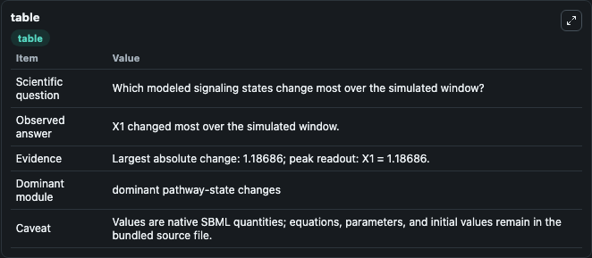
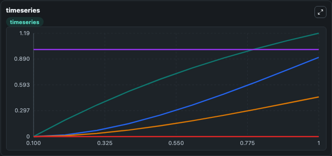
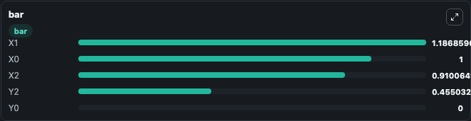

# Komarova2005_TheoreticalFramework_BasicArchitecture

This Biosimulant lab wraps `Komarova2005_TheoreticalFramework_BasicArchitecture` as a runnable signaling model with a companion visualization module.
Clean Biosimulant lab for systems signaling model: Komarova2005_TheoreticalFramework_BasicArchitecture. It can be used to explore second-messenger and pathway-signaling dynamics and compare scenario outcomes across configurations.

## What You'll See

The lab asks: How does Komarova2005 TheoreticalFramework BasicArchitecture express its source-modeled signaling motif over the baseline run? It runs for 1.0 time units with a communication step of 0.1. The run uses the model defaults declared by the curated SBML wrapper. The generated visualizations focus on Source Defined X1 State, Source Defined X2 State, Source Defined Y2 State, Source Defined X0 State, and Source Defined Y0 State, combining trajectory, endpoint-comparison, and summary-table views from one completed dark-mode run.

In this captured run, **X1** moved from 0 to 1.187 across 1.0 simulation windows.

<!-- BIOSIMULANT_VISUALS_START -->
### Output Visualizations



*Summary table for Komarova2005_TheoreticalFramework_BasicArchitecture, reporting the scientific question, observed answer, dominant module, and caveat.*



*Trajectories of X1, X2, Y2, X0, and Y0 across the 1.0 simulation. In this run **X1** climbed from 0 to 1.187 — the largest movements among the focused observables.*



*Largest-excursion ranking of the focused observables — the absolute movement magnitude during the run. Top 3: **X1** = 1.187, **X0** = 1.000, **X2** = 0.9101, with 2 more observables below.*

<!-- BIOSIMULANT_VISUALS_END -->

## Model Context

- Core model: `models/core`
- Visualization model: `models/visualisation`
- Standard: `other`
- Upstream source: `biomodels_ebi:BIOMD0000000125`
- License: `CC0`
- Visual scope: phosphorylation and regulatory motif dynamics
- Caveat: Values are native SBML quantities; equations, parameters, units, and initial values remain in the bundled source file.

## Inputs

| Input | Maps To | Default | Notes |
|---|---|---|---|
| Initial source-defined X1 state | `signaling_sbml_komarova2005_theoreticalframework_basicarchitect_biomd0000000125_model.initial_source_defined_x1_state` |  | Initial level of source-defined X1 state. Maps to SBML symbol `x1`; exposed as a traceable initial-condition perturbation. |

## Outputs

| Output | Maps To | Role |
|---|---|---|
| `source_defined_x1_state` | `signaling_sbml_komarova2005_theoreticalframework_basicarchitect_biomd0000000125_model.source_defined_x1_state` | Source Defined X1 State. |
| `source_defined_x2_state` | `signaling_sbml_komarova2005_theoreticalframework_basicarchitect_biomd0000000125_model.source_defined_x2_state` | Source Defined X2 State. |
| `source_defined_y2_state` | `signaling_sbml_komarova2005_theoreticalframework_basicarchitect_biomd0000000125_model.source_defined_y2_state` | Source Defined Y2 State. |
| `state` | `signaling_sbml_komarova2005_theoreticalframework_basicarchitect_biomd0000000125_model.state` | Available to the visualization model and downstream workflows. |
| `summary` | `signaling_sbml_komarova2005_theoreticalframework_basicarchitect_biomd0000000125_model.summary` | Available to the visualization model and downstream workflows. |
| `species_labels` | `signaling_sbml_komarova2005_theoreticalframework_basicarchitect_biomd0000000125_model.species_labels` | Available to the visualization model and downstream workflows. |

## Runtime

- Duration: `1.0`
- Communication step: `0.1`

## Running Locally

```bash
biosimulant labs serve .
```
