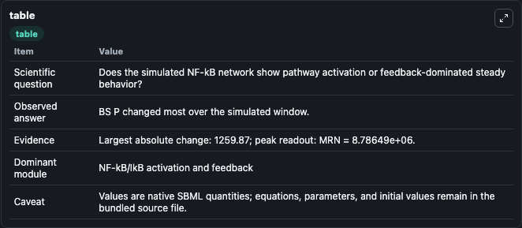
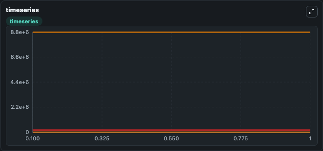
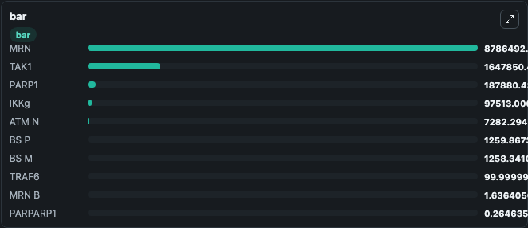

# Konrath2023_genotoxic_stress_induced_IKK_NFkB_signaling

This Biosimulant lab wraps `Konrath2023_genotoxic_stress_induced_IKK_NFkB_signaling` as a runnable signaling model with a companion visualization module.
Clean Biosimulant lab for NF-kB pathway signaling. It can be used to explore second-messenger and pathway-signaling dynamics and compare scenario outcomes across configurations.

## What You'll See

The lab asks: How does Konrath2023 genotoxic stress induced IKK NFkB signaling move NF-kB and inhibitor-linked signaling states? It runs for 1.0 time units with a communication step of 0.1. The run uses the model defaults declared by the curated SBML wrapper. The generated visualizations focus on Source Defined BS P State, Source Defined PARP1 State, PARP1DSB B, PARP1 B, PARPARP1 B, and PARPARP1, and related outputs, combining trajectory, endpoint-comparison, and summary-table views from one completed dark-mode run.

In this captured run, **BS P** moved from 0 to 1259.9 across 1.0 simulation windows.

<!-- BIOSIMULANT_VISUALS_START -->
### Output Visualizations



*Summary table for Konrath2023_genotoxic_stress_induced_IKK_NFkB_signaling, reporting the scientific question, observed answer, dominant module, and caveat.*



*Trajectories of BS P, BS M, MRN, MRN B, PARP1, and PARPARP1 across the 1.0 simulation. In this run **BS P** climbed from 0 to 1259.9 and **MRN** fell from 8.79e+06 to 8.79e+06 — the largest movements among the focused observables.*



*Largest-excursion ranking of the focused observables — the absolute movement magnitude during the run. Top 3: **MRN** = 8.79e+06, **TAK1** = 1.65e+06, **PARP1** = 1.88e+05, with 7 more observables below.*

<!-- BIOSIMULANT_VISUALS_END -->

## Model Context

- Core model: `models/core`
- Visualization model: `models/visualisation`
- Standard: `other`
- Upstream source: `biomodels_ebi:MODEL2307130001`
- License: `CC0`
- Visual scope: NF-kB activation and feedback signaling
- Caveat: Values are native SBML quantities; equations, parameters, units, and initial values remain in the bundled source file.

## Inputs

| Input | Maps To | Default | Notes |
|---|---|---|---|
| Initial source-defined BS_P state | `signaling_sbml_konrath2023_genotoxic_stress_induced_ikk_nfkb_si_model2307130001_model.initial_source_defined_bs_p_state` |  | Initial level of source-defined BS_P state. Maps to SBML symbol `BS_P`; exposed as a traceable initial-condition perturbation. |

## Outputs

| Output | Maps To | Role |
|---|---|---|
| `source_defined_bs_p_state` | `signaling_sbml_konrath2023_genotoxic_stress_induced_ikk_nfkb_si_model2307130001_model.source_defined_bs_p_state` | Source Defined BS P State. |
| `source_defined_parp1_state` | `signaling_sbml_konrath2023_genotoxic_stress_induced_ikk_nfkb_si_model2307130001_model.source_defined_parp1_state` | Source Defined PARP1 State. |
| `parp1dsb_b` | `signaling_sbml_konrath2023_genotoxic_stress_induced_ikk_nfkb_si_model2307130001_model.parp1dsb_b` | PARP1DSB B. |
| `state` | `signaling_sbml_konrath2023_genotoxic_stress_induced_ikk_nfkb_si_model2307130001_model.state` | Available to the visualization model and downstream workflows. |
| `summary` | `signaling_sbml_konrath2023_genotoxic_stress_induced_ikk_nfkb_si_model2307130001_model.summary` | Available to the visualization model and downstream workflows. |
| `species_labels` | `signaling_sbml_konrath2023_genotoxic_stress_induced_ikk_nfkb_si_model2307130001_model.species_labels` | Available to the visualization model and downstream workflows. |

## Runtime

- Duration: `1.0`
- Communication step: `0.1`

## Running Locally

```bash
biosimulant labs serve .
```
