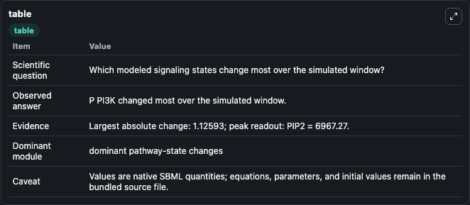
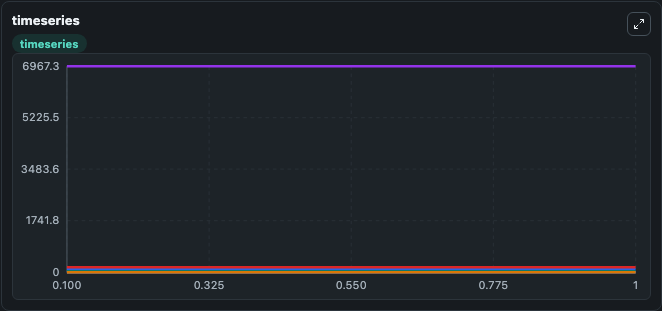
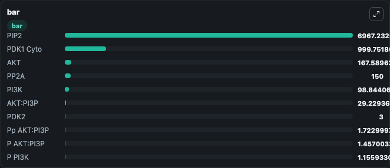

# Koo2013 - Shear stress induced AKT and eNOS phosphorylation - Model 2

This Biosimulant lab wraps `Koo2013 - Shear stress induced AKT and eNOS phosphorylation - Model 2` as a runnable signaling model with a companion visualization module.
Clean Biosimulant lab for systems signaling model: Koo2013 - Shear stress induced AKT and eNOS phosphorylation - Model 2. It can be used to explore second-messenger and pathway-signaling dynamics and compare scenario outcomes across configurations.

## What You'll See

The lab asks: How does Koo2013 - Shear stress induced AKT and eNOS phosphorylation - Model 2 propagate receptor or RAS/ERK pathway activity? It runs for 1.0 time units with a communication step of 0.1. The run uses the model defaults declared by the curated SBML wrapper. The generated visualizations focus on source-defined PDK1 state, PP2A, AKT, PI3P, source-defined PTEN state, and source-defined PIP2 state, and related outputs, combining trajectory, endpoint-comparison, and summary-table views from one completed dark-mode run.

In this captured run, **P PI3K** moved from 0.0300 to 1.156 across 1.0 simulation windows.

<!-- BIOSIMULANT_VISUALS_START -->
### Output Visualizations



*Summary table for Koo2013 - Shear stress induced AKT and eNOS phosphorylation - Model 2, reporting the scientific question, observed answer, dominant module, and caveat.*



*Trajectories of P PI3K, PI3K, Time, PIP2, AKT, and AKT:PI3P across the 1.0 simulation. In this run **P PI3K** climbed from 0.0300 to 1.156 and **PI3K** fell from 99.970 to 98.844 — the largest movements among the focused observables.*



*Largest-excursion ranking of the focused observables — the absolute movement magnitude during the run. Top 3: **PIP2** = 6967.2, **PDK1 Cyto** = 999.8, **AKT** = 167.6, with 7 more observables below.*

<!-- BIOSIMULANT_VISUALS_END -->

## Model Context

- Core model: `models/core`
- Visualization model: `models/visualisation`
- Standard: `other`
- Upstream source: `biomodels_ebi:BIOMD0000000465`
- License: `CC0`
- Visual scope: receptor-to-MAPK cascade signaling
- Caveat: Values are native SBML quantities; equations, parameters, units, and initial values remain in the bundled source file.

## Inputs

| Input | Maps To | Default | Notes |
|---|---|---|---|
| Initial Shear Stress | `signaling_sbml_koo2013_shear_stress_induced_akt_and_enos_phosph_biomd0000000465_model.initial_shear_stress` |  | Initial level of Shear Stress. Maps to SBML symbol `s119`; exposed as a traceable initial-condition perturbation. |

## Outputs

| Output | Maps To | Role |
|---|---|---|
| `akt` | `signaling_sbml_koo2013_shear_stress_induced_akt_and_enos_phosph_biomd0000000465_model.akt` | AKT. |
| `p_akt_pi3p` | `signaling_sbml_koo2013_shear_stress_induced_akt_and_enos_phosph_biomd0000000465_model.p_akt_pi3p` | P AKT PI3P. |
| `pp_akt_pi3p` | `signaling_sbml_koo2013_shear_stress_induced_akt_and_enos_phosph_biomd0000000465_model.pp_akt_pi3p` | Pp AKT PI3P. |
| `state` | `signaling_sbml_koo2013_shear_stress_induced_akt_and_enos_phosph_biomd0000000465_model.state` | Available to the visualization model and downstream workflows. |
| `summary` | `signaling_sbml_koo2013_shear_stress_induced_akt_and_enos_phosph_biomd0000000465_model.summary` | Available to the visualization model and downstream workflows. |
| `species_labels` | `signaling_sbml_koo2013_shear_stress_induced_akt_and_enos_phosph_biomd0000000465_model.species_labels` | Available to the visualization model and downstream workflows. |

## Runtime

- Duration: `1.0`
- Communication step: `0.1`

## Running Locally

```bash
biosimulant labs serve .
```
