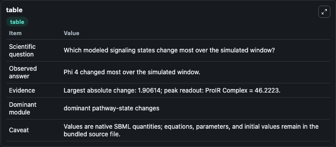
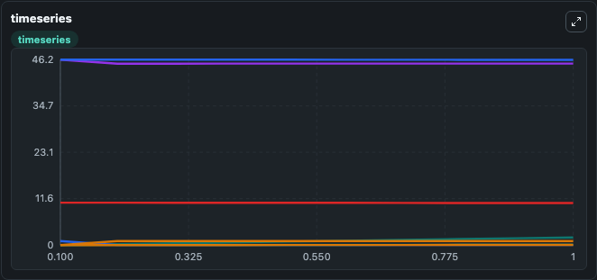
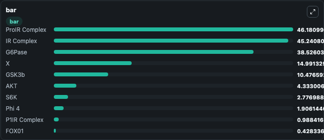

# Kubota2012_InsulinAction_AKTpathway

This Biosimulant lab wraps `Kubota2012_InsulinAction_AKTpathway` as a runnable signaling model with a companion visualization module.
Clean Biosimulant lab for metabolic and hormone-linked signaling. It can be used to explore second-messenger and pathway-signaling dynamics and compare scenario outcomes across configurations.

## What You'll See

The lab asks: How does Kubota2012 InsulinAction AKTpathway propagate receptor or RAS/ERK pathway activity? It runs for 1.0 time units with a communication step of 0.1. The run uses the model defaults declared by the curated SBML wrapper. The generated visualizations focus on Pro insulin receptor Complex, insulin receptor Complex, P2ir Complex, P1p2ir Complex, P1ir Complex, and source-defined PAKT state, and related outputs, combining trajectory, endpoint-comparison, and summary-table views from one completed dark-mode run.

In this captured run, **Phi 4** moved from 0 to 1.906 across 1.0 simulation windows.

<!-- BIOSIMULANT_VISUALS_START -->
### Output Visualizations



*Summary table for Kubota2012_InsulinAction_AKTpathway, reporting the scientific question, observed answer, dominant module, and caveat.*



*Trajectories of Phi 4, Insulin, P1IR Complex, IR Complex, GSK3b, and phospho-GSK3b across the 1.0 simulation. In this run **Phi 4** climbed from 0 to 1.906 and **Insulin** fell from 1.000 to 0.00452 — the largest movements among the focused observables.*



*Largest-excursion ranking of the focused observables — the absolute movement magnitude during the run. Top 3: **ProIR Complex** = 46.181, **IR Complex** = 45.241, **G6Pase** = 38.526, with 7 more observables below.*

<!-- BIOSIMULANT_VISUALS_END -->

## Model Context

- Core model: `models/core`
- Visualization model: `models/visualisation`
- Standard: `other`
- Upstream source: `biomodels_ebi:MODEL1204060000`
- License: `CC0`
- Visual scope: receptor-to-MAPK cascade signaling
- Caveat: Values are native SBML quantities; equations, parameters, units, and initial values remain in the bundled source file.

## Inputs

| Input | Maps To | Default | Notes |
|---|---|---|---|
| Initial Insulin | `signaling_sbml_kubota2012_insulinaction_aktpathway_model1204060000_model.initial_insulin` |  | Initial level of Insulin. Maps to SBML symbol `insulin`; exposed as a traceable initial-condition perturbation. |

## Outputs

| Output | Maps To | Role |
|---|---|---|
| `pro_insulin_receptor_complex` | `signaling_sbml_kubota2012_insulinaction_aktpathway_model1204060000_model.pro_insulin_receptor_complex` | Pro insulin receptor Complex. |
| `insulin_receptor_complex` | `signaling_sbml_kubota2012_insulinaction_aktpathway_model1204060000_model.insulin_receptor_complex` | insulin receptor Complex. |
| `p2ir_complex` | `signaling_sbml_kubota2012_insulinaction_aktpathway_model1204060000_model.p2ir_complex` | P2ir Complex. |
| `state` | `signaling_sbml_kubota2012_insulinaction_aktpathway_model1204060000_model.state` | Available to the visualization model and downstream workflows. |
| `summary` | `signaling_sbml_kubota2012_insulinaction_aktpathway_model1204060000_model.summary` | Available to the visualization model and downstream workflows. |
| `species_labels` | `signaling_sbml_kubota2012_insulinaction_aktpathway_model1204060000_model.species_labels` | Available to the visualization model and downstream workflows. |

## Runtime

- Duration: `1.0`
- Communication step: `0.1`

## Running Locally

```bash
biosimulant labs serve .
```
