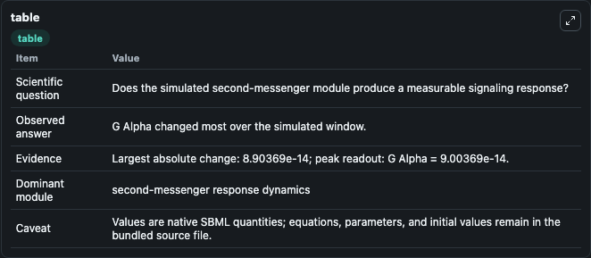
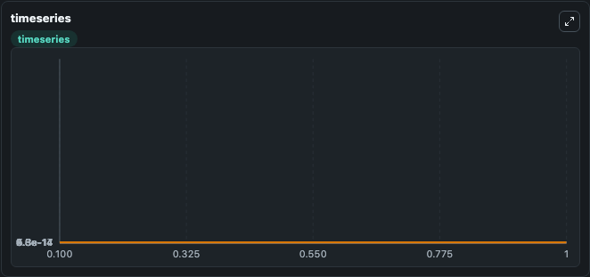
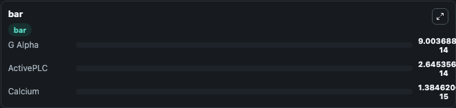

# Kummer2000 - Oscillations in Calcium Signalling

This Biosimulant lab wraps `Kummer2000 - Oscillations in Calcium Signalling` as a runnable signaling model with a companion visualization module.
Clean Biosimulant lab for calcium and second-messenger signaling. It can be used to explore second-messenger and pathway-signaling dynamics and compare scenario outcomes across configurations.

## What You'll See

The lab asks: How do calcium-linked states respond in Kummer2000 - Oscillations in Calcium Signalling? It runs for 1.0 time units with a communication step of 0.1. The run uses the model defaults declared by the curated SBML wrapper. The generated visualizations focus on G Alpha, active PLC, and Calcium, combining trajectory, endpoint-comparison, and summary-table views from one completed dark-mode run.

In this captured run, **G Alpha** moved from 1e-15 to 9e-14 across 1.0 simulation windows.

<!-- BIOSIMULANT_VISUALS_START -->
### Output Visualizations



*Summary table for Kummer2000 - Oscillations in Calcium Signalling, reporting the scientific question, observed answer, dominant module, and caveat.*



*Trajectories of G Alpha, ActivePLC, and Calcium across the 1.0 simulation. In this run **G Alpha** climbed from 1e-15 to 9e-14 — the largest movements among the focused observables.*



*Largest-excursion ranking of the focused observables — the absolute movement magnitude during the run. Top 3: **G Alpha** = 9e-14, **ActivePLC** = 2.65e-14, **Calcium** = 1.38e-15.*

<!-- BIOSIMULANT_VISUALS_END -->

## Model Context

- Core model: `models/core`
- Visualization model: `models/visualisation`
- Standard: `other`
- Upstream source: `biomodels_ebi:BIOMD0000000329`
- License: `CC0`
- Visual scope: calcium second-messenger signaling
- Caveat: Values are native SBML quantities; equations, parameters, units, and initial values remain in the bundled source file.

## Inputs

| Input | Maps To | Default | Notes |
|---|---|---|---|
| Initial Calcium | `signaling_sbml_kummer2000_oscillations_in_calcium_signalling_biomd0000000329_model.initial_calcium` |  | Initial level of Calcium. Maps to SBML symbol `c`; exposed as a traceable initial-condition perturbation. |

## Outputs

| Output | Maps To | Role |
|---|---|---|
| `active_plc` | `signaling_sbml_kummer2000_oscillations_in_calcium_signalling_biomd0000000329_model.active_plc` | active PLC. |
| `calcium` | `signaling_sbml_kummer2000_oscillations_in_calcium_signalling_biomd0000000329_model.calcium` | Calcium. |
| `g_alpha` | `signaling_sbml_kummer2000_oscillations_in_calcium_signalling_biomd0000000329_model.g_alpha` | G Alpha. |
| `state` | `signaling_sbml_kummer2000_oscillations_in_calcium_signalling_biomd0000000329_model.state` | Available to the visualization model and downstream workflows. |
| `summary` | `signaling_sbml_kummer2000_oscillations_in_calcium_signalling_biomd0000000329_model.summary` | Available to the visualization model and downstream workflows. |
| `species_labels` | `signaling_sbml_kummer2000_oscillations_in_calcium_signalling_biomd0000000329_model.species_labels` | Available to the visualization model and downstream workflows. |

## Runtime

- Duration: `1.0`
- Communication step: `0.1`

## Running Locally

```bash
biosimulant labs serve .
```
