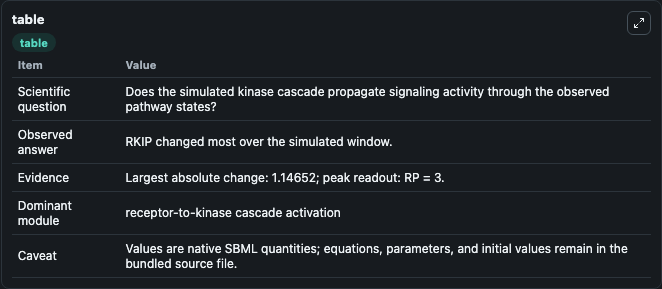
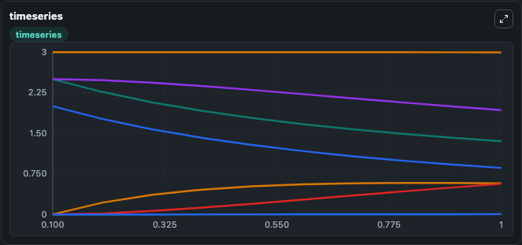
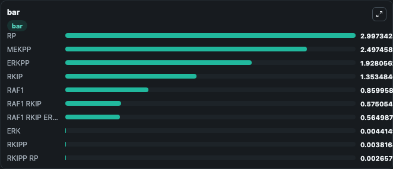

# Kwang2003 - The influence of RKIP on the ERK signaling pathway

This Biosimulant lab wraps `Kwang2003 - The influence of RKIP on the ERK signaling pathway` as a runnable signaling model with a companion visualization module.
Clean Biosimulant lab for MAPK/ERK receptor signaling. It can be used to explore second-messenger and pathway-signaling dynamics and compare scenario outcomes across configurations.

## What You'll See

The lab asks: How does Kwang2003 - The influence of RKIP on the ERK signaling pathway propagate receptor or RAS/ERK pathway activity? It runs for 1.0 time units with a communication step of 0.1. The run uses the model defaults declared by the curated SBML wrapper. The generated visualizations focus on RAF1, source-defined RKIP state, RAF1 RKIP, RAF1 RKIP ERKPP, ERK, and RKIPP, and related outputs, combining trajectory, endpoint-comparison, and summary-table views from one completed dark-mode run.

In this captured run, **RKIP** moved from 2.500 to 1.353 across 1.0 simulation windows.

<!-- BIOSIMULANT_VISUALS_START -->
### Output Visualizations



*Summary table for Kwang2003 - The influence of RKIP on the ERK signaling pathway, reporting the scientific question, observed answer, dominant module, and caveat.*



*Trajectories of RKIP, RAF1, RAF1 RKIP, ERKPP, RAF1 RKIP ERKPP, and ERK across the 1.0 simulation. In this run **RAF1 RKIP** climbed from 0 to 0.5751 and **RKIP** fell from 2.500 to 1.353 — the largest movements among the focused observables.*



*Largest-excursion ranking of the focused observables — the absolute movement magnitude during the run. Top 3: **RP** = 2.997, **MEKPP** = 2.497, **ERKPP** = 1.928, with 7 more observables below.*

<!-- BIOSIMULANT_VISUALS_END -->

## Model Context

- Core model: `models/core`
- Visualization model: `models/visualisation`
- Standard: `other`
- Upstream source: `biomodels_ebi:BIOMD0000000647`
- License: `CC0`
- Visual scope: receptor-to-MAPK cascade signaling
- Caveat: Values are native SBML quantities; equations, parameters, units, and initial values remain in the bundled source file.

## Inputs

| Input | Maps To | Default | Notes |
|---|---|---|---|
| Initial RAF1 | `signaling_sbml_kwang2003_the_influence_of_rkip_on_the_erk_signa_biomd0000000647_model.initial_raf1` |  | Initial level of RAF1. Maps to SBML symbol `Raf1`; exposed as a traceable initial-condition perturbation. |

## Outputs

| Output | Maps To | Role |
|---|---|---|
| `raf1_rkip_erkpp` | `signaling_sbml_kwang2003_the_influence_of_rkip_on_the_erk_signa_biomd0000000647_model.raf1_rkip_erkpp` | RAF1 RKIP ERKPP. |
| `erk` | `signaling_sbml_kwang2003_the_influence_of_rkip_on_the_erk_signa_biomd0000000647_model.erk` | ERK. |
| `mekpp_erk` | `signaling_sbml_kwang2003_the_influence_of_rkip_on_the_erk_signa_biomd0000000647_model.mekpp_erk` | MEKPP ERK. |
| `state` | `signaling_sbml_kwang2003_the_influence_of_rkip_on_the_erk_signa_biomd0000000647_model.state` | Available to the visualization model and downstream workflows. |
| `summary` | `signaling_sbml_kwang2003_the_influence_of_rkip_on_the_erk_signa_biomd0000000647_model.summary` | Available to the visualization model and downstream workflows. |
| `species_labels` | `signaling_sbml_kwang2003_the_influence_of_rkip_on_the_erk_signa_biomd0000000647_model.species_labels` | Available to the visualization model and downstream workflows. |

## Runtime

- Duration: `1.0`
- Communication step: `0.1`

## Running Locally

```bash
biosimulant labs serve .
```
