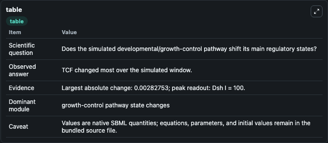
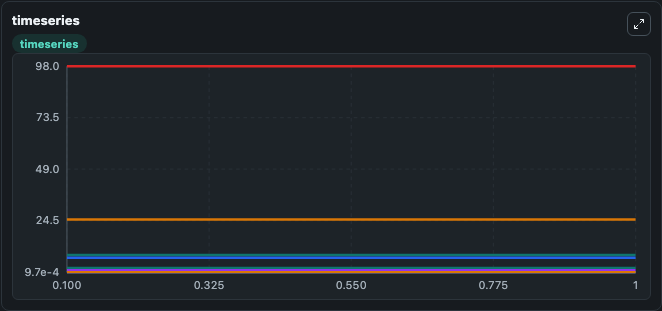
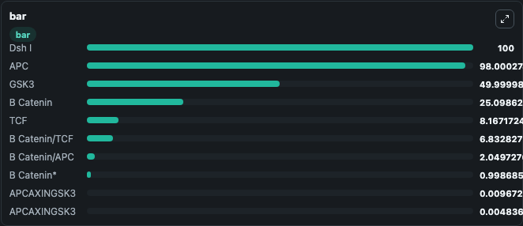

# Lee2003 - Roles of APC and Axin in Wnt Pathway (without regulatory loop)

This Biosimulant lab wraps `Lee2003 - Roles of APC and Axin in Wnt Pathway (without regulatory loop)` as a runnable signaling model with a companion visualization module.
Clean Biosimulant lab for developmental and growth-control signaling. It can be used to explore second-messenger and pathway-signaling dynamics and compare scenario outcomes across configurations.

## What You'll See

The lab asks: How does Lee2003 - Roles of APC and Axin in Wnt Pathway (without regulatory loop) shift hormone-linked signaling readouts? It runs for 1.0 time units with a communication step of 0.1. The run uses the model defaults declared by the curated SBML wrapper. The generated visualizations focus on source-defined DSH_I state, source-defined DSH_A state, APC Axin GSK3, source-defined GSK3 state, APC Axin, and source-defined APC state, and related outputs, combining trajectory, endpoint-comparison, and summary-table views from one completed dark-mode run.

In this captured run, **TCF** moved from 8.170 to 8.167 across 1.0 simulation windows.

<!-- BIOSIMULANT_VISUALS_START -->
### Output Visualizations



*Summary table for Lee2003 - Roles of APC and Axin in Wnt Pathway (without regulatory loop), reporting the scientific question, observed answer, dominant module, and caveat.*



*Trajectories of TCF, B Catenin/TCF, B Catenin, B Catenin*, APC, and B Catenin/APC across the 1.0 simulation. In this run **B Catenin/TCF** climbed from 6.830 to 6.833 and **TCF** fell from 8.170 to 8.167 — the largest movements among the focused observables.*



*Largest-excursion ranking of the focused observables — the absolute movement magnitude during the run. Top 3: **Dsh I** = 100.0, **APC** = 98.000, **GSK3** = 50.000, with 7 more observables below.*

<!-- BIOSIMULANT_VISUALS_END -->

## Model Context

- Core model: `models/core`
- Visualization model: `models/visualisation`
- Standard: `other`
- Upstream source: `biomodels_ebi:BIOMD0000000658`
- License: `CC0`
- Visual scope: metabolic and hormone signaling response
- Caveat: Values are native SBML quantities; equations, parameters, units, and initial values remain in the bundled source file.

## Inputs

| Input | Maps To | Default | Notes |
|---|---|---|---|
| Initial source-defined W state | `signaling_sbml_lee2003_roles_of_apc_and_axin_in_wnt_pathway_wit_biomd0000000658_model.initial_source_defined_w_state` |  | Initial level of source-defined W state. Maps to SBML symbol `W`; exposed as a traceable initial-condition perturbation. |

## Outputs

| Output | Maps To | Role |
|---|---|---|
| `b_catenin_apc_axin_gsk3` | `signaling_sbml_lee2003_roles_of_apc_and_axin_in_wnt_pathway_wit_biomd0000000658_model.b_catenin_apc_axin_gsk3` | B Catenin APC Axin GSK3. |
| `b_catenin_apc_axin_gsk3_2` | `signaling_sbml_lee2003_roles_of_apc_and_axin_in_wnt_pathway_wit_biomd0000000658_model.b_catenin_apc_axin_gsk3_2` | B Catenin APC Axin GSK3. |
| `b_catenin` | `signaling_sbml_lee2003_roles_of_apc_and_axin_in_wnt_pathway_wit_biomd0000000658_model.b_catenin` | B Catenin. |
| `state` | `signaling_sbml_lee2003_roles_of_apc_and_axin_in_wnt_pathway_wit_biomd0000000658_model.state` | Available to the visualization model and downstream workflows. |
| `summary` | `signaling_sbml_lee2003_roles_of_apc_and_axin_in_wnt_pathway_wit_biomd0000000658_model.summary` | Available to the visualization model and downstream workflows. |
| `species_labels` | `signaling_sbml_lee2003_roles_of_apc_and_axin_in_wnt_pathway_wit_biomd0000000658_model.species_labels` | Available to the visualization model and downstream workflows. |

## Runtime

- Duration: `1.0`
- Communication step: `0.1`

## Running Locally

```bash
biosimulant labs serve .
```
