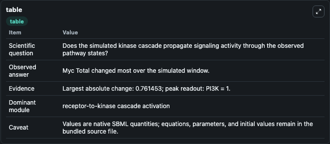
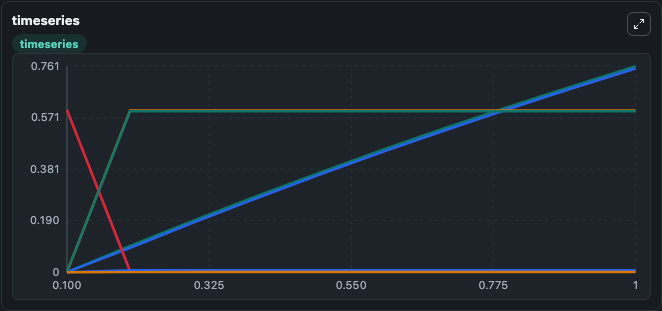
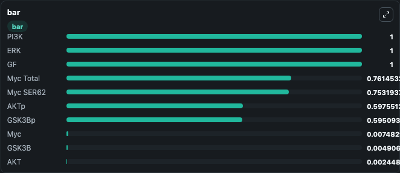

# Lee2008 - ERK and PI3K signal integration by Myc

This Biosimulant lab wraps `Lee2008 - ERK and PI3K signal integration by Myc` as a runnable signaling model with a companion visualization module.
Clean Biosimulant lab for MAPK/ERK receptor signaling. It can be used to explore second-messenger and pathway-signaling dynamics and compare scenario outcomes across configurations.

## What You'll See

The lab asks: How does Lee2008 - ERK and PI3K signal integration by Myc propagate receptor or RAS/ERK pathway activity? It runs for 1.0 time units with a communication step of 0.1. The run uses the model defaults declared by the curated SBML wrapper. The generated visualizations focus on MYC transcription factor, AKT, phosphorylated AKT, PI3K, GSK3B, and Gsk3bp, and related outputs, combining trajectory, endpoint-comparison, and summary-table views from one completed dark-mode run.

In this captured run, **Myc Total** moved from 0 to 0.7615 across 1.0 simulation windows.

<!-- BIOSIMULANT_VISUALS_START -->
### Output Visualizations



*Summary table for Lee2008 - ERK and PI3K signal integration by Myc, reporting the scientific question, observed answer, dominant module, and caveat.*



*Trajectories of Myc Total, Myc SER62, AKTp, AKT, GSK3B, and GSK3Bp across the 1.0 simulation. In this run **Myc Total** climbed from 0 to 0.7615 and **AKT** fell from 0.6000 to 0.00245 — the largest movements among the focused observables.*



*Largest-excursion ranking of the focused observables — the absolute movement magnitude during the run. Top 3: **PI3K** = 1.000, **ERK** = 1.000, **GF** = 1.000, with 7 more observables below.*

<!-- BIOSIMULANT_VISUALS_END -->

## Model Context

- Core model: `models/core`
- Visualization model: `models/visualisation`
- Standard: `other`
- Upstream source: `biomodels_ebi:BIOMD0000000818`
- License: `CC0`
- Visual scope: receptor-to-MAPK cascade signaling
- Caveat: Values are native SBML quantities; equations, parameters, units, and initial values remain in the bundled source file.

## Inputs

| Input | Maps To | Default | Notes |
|---|---|---|---|
| Initial MYC transcription factor Total | `signaling_sbml_lee2008_erk_and_pi3k_signal_integration_by_myc_biomd0000000818_model.initial_myc_transcription_factor_total` |  | Initial level of MYC transcription factor Total. Maps to SBML symbol `Myc_total`; exposed as a traceable initial-condition perturbation. |

## Outputs

| Output | Maps To | Role |
|---|---|---|
| `akt` | `signaling_sbml_lee2008_erk_and_pi3k_signal_integration_by_myc_biomd0000000818_model.akt` | AKT. |
| `phosphorylated_akt` | `signaling_sbml_lee2008_erk_and_pi3k_signal_integration_by_myc_biomd0000000818_model.phosphorylated_akt` | phosphorylated AKT. |
| `erk` | `signaling_sbml_lee2008_erk_and_pi3k_signal_integration_by_myc_biomd0000000818_model.erk` | ERK. |
| `state` | `signaling_sbml_lee2008_erk_and_pi3k_signal_integration_by_myc_biomd0000000818_model.state` | Available to the visualization model and downstream workflows. |
| `summary` | `signaling_sbml_lee2008_erk_and_pi3k_signal_integration_by_myc_biomd0000000818_model.summary` | Available to the visualization model and downstream workflows. |
| `species_labels` | `signaling_sbml_lee2008_erk_and_pi3k_signal_integration_by_myc_biomd0000000818_model.species_labels` | Available to the visualization model and downstream workflows. |

## Runtime

- Duration: `1.0`
- Communication step: `0.1`

## Running Locally

```bash
biosimulant labs serve .
```
