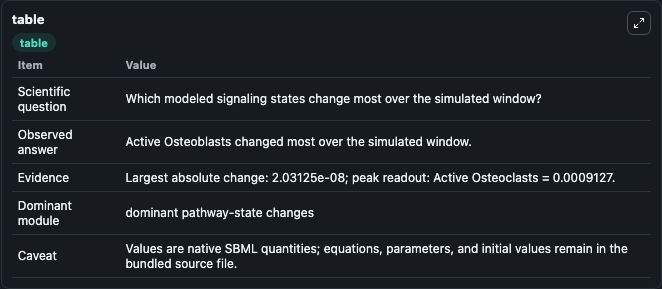
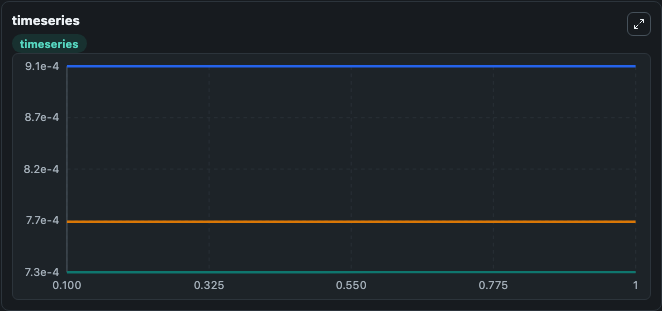
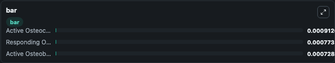

# Lemaire2004 - Role of RANK/RANKL/OPG pathway in bone remodelling process

This Biosimulant lab wraps `Lemaire2004 - Role of RANK/RANKL/OPG pathway in bone remodelling process` as a runnable signaling model with a companion visualization module.
Clean Biosimulant lab for systems signaling model: Lemaire2004 - Role of RANK/RANKL/OPG pathway in bone remodelling process. It can be used to explore second-messenger and pathway-signaling dynamics and compare scenario outcomes across configurations.

## What You'll See

The lab asks: How does Lemaire2004 - Role of RANK/RANKL/OPG pathway in bone remodelling process shift hormone-linked signaling readouts? It runs for 1.0 time units with a communication step of 0.1. The run uses the model defaults declared by the curated SBML wrapper. The generated visualizations focus on Responding Osteoblasts, active Osteoblasts, and active Osteoclasts, combining trajectory, endpoint-comparison, and summary-table views from one completed dark-mode run.

In this captured run, **Active Osteoblasts** moved from 0.000728 to 0.000728 across 1.0 simulation windows.

<!-- BIOSIMULANT_VISUALS_START -->
### Output Visualizations



*Summary table for Lemaire2004 - Role of RANK/RANKL/OPG pathway in bone remodelling process, reporting the scientific question, observed answer, dominant module, and caveat.*



*Trajectories of Active Osteoblasts, Active Osteoclasts, and Responding Osteoblasts across the 1.0 simulation. In this run **Active Osteoblasts** climbed from 0.000728 to 0.000728 and **Active Osteoclasts** fell from 0.000913 to 0.000913 — the largest movements among the focused observables.*



*Largest-excursion ranking of the focused observables — the absolute movement magnitude during the run. Top 3: **Active Osteoclasts** = 0.000913, **Responding Osteoblasts** = 0.000773, **Active Osteoblasts** = 0.000728.*

<!-- BIOSIMULANT_VISUALS_END -->

## Model Context

- Core model: `models/core`
- Visualization model: `models/visualisation`
- Standard: `other`
- Upstream source: `biomodels_ebi:BIOMD0000000278`
- License: `CC0`
- Visual scope: metabolic and hormone signaling response
- Caveat: Values are native SBML quantities; equations, parameters, units, and initial values remain in the bundled source file.

## Inputs

| Input | Maps To | Default | Notes |
|---|---|---|---|
| Initial Responding Osteoblasts | `signaling_sbml_lemaire2004_role_of_rank_rankl_opg_pathway_in_bo_biomd0000000278_model.initial_responding_osteoblasts` |  | Initial level of Responding Osteoblasts. Maps to SBML symbol `R`; exposed as a traceable initial-condition perturbation. |

## Outputs

| Output | Maps To | Role |
|---|---|---|
| `active_osteoblasts` | `signaling_sbml_lemaire2004_role_of_rank_rankl_opg_pathway_in_bo_biomd0000000278_model.active_osteoblasts` | active Osteoblasts. |
| `active_osteoclasts` | `signaling_sbml_lemaire2004_role_of_rank_rankl_opg_pathway_in_bo_biomd0000000278_model.active_osteoclasts` | active Osteoclasts. |
| `responding_osteoblasts` | `signaling_sbml_lemaire2004_role_of_rank_rankl_opg_pathway_in_bo_biomd0000000278_model.responding_osteoblasts` | Responding Osteoblasts. |
| `state` | `signaling_sbml_lemaire2004_role_of_rank_rankl_opg_pathway_in_bo_biomd0000000278_model.state` | Available to the visualization model and downstream workflows. |
| `summary` | `signaling_sbml_lemaire2004_role_of_rank_rankl_opg_pathway_in_bo_biomd0000000278_model.summary` | Available to the visualization model and downstream workflows. |
| `species_labels` | `signaling_sbml_lemaire2004_role_of_rank_rankl_opg_pathway_in_bo_biomd0000000278_model.species_labels` | Available to the visualization model and downstream workflows. |

## Runtime

- Duration: `1.0`
- Communication step: `0.1`

## Running Locally

```bash
biosimulant labs serve .
```
