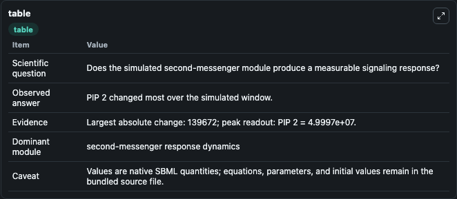
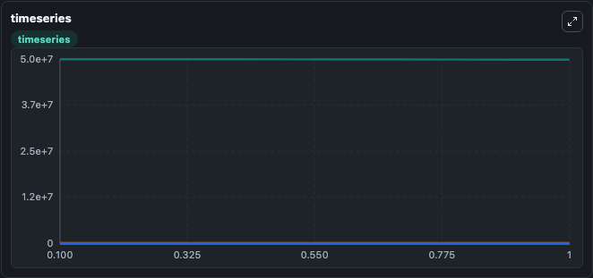
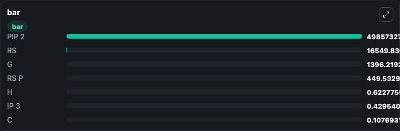

# Lemon2003_Ca2Dynamics

This Biosimulant lab wraps `Lemon2003_Ca2Dynamics` as a runnable signaling model with a companion visualization module.
Clean Biosimulant lab for calcium and second-messenger signaling. It can be used to explore second-messenger and pathway-signaling dynamics and compare scenario outcomes across configurations.

## What You'll See

The lab asks: How do calcium-linked states respond in Lemon2003 Ca2Dynamics? It runs for 1.0 time units with a communication step of 0.1. The run uses the model defaults declared by the curated SBML wrapper. The generated visualizations focus on Source Defined RS State, Source Defined RS P State, Source Defined G State, IP3, Source Defined PIP 2 State, and Source Defined C State, and related outputs, combining trajectory, endpoint-comparison, and summary-table views from one completed dark-mode run.

In this captured run, **PIP 2** moved from 5e+07 to 4.99e+07 across 1.0 simulation windows.

<!-- BIOSIMULANT_VISUALS_START -->
### Output Visualizations



*Summary table for Lemon2003_Ca2Dynamics, reporting the scientific question, observed answer, dominant module, and caveat.*



*Trajectories of PIP 2, G, RS, RS P, IP 3, and C across the 1.0 simulation. In this run **G** climbed from 0 to 1396.2 and **PIP 2** fell from 5e+07 to 4.99e+07 — the largest movements among the focused observables.*



*Largest-excursion ranking of the focused observables — the absolute movement magnitude during the run. Top 3: **PIP 2** = 4.99e+07, **RS** = 1.65e+04, **G** = 1396.2, with 4 more observables below.*

<!-- BIOSIMULANT_VISUALS_END -->

## Model Context

- Core model: `models/core`
- Visualization model: `models/visualisation`
- Standard: `other`
- Upstream source: `biomodels_ebi:MODEL1006230039`
- License: `CC0`
- Visual scope: calcium second-messenger signaling
- Caveat: Values are native SBML quantities; equations, parameters, units, and initial values remain in the bundled source file.

## Inputs

| Input | Maps To | Default | Notes |
|---|---|---|---|
| Initial source-defined RS state | `signaling_sbml_lemon2003_ca2dynamics_model1006230039_model.initial_source_defined_rs_state` |  | Initial level of source-defined RS state. Maps to SBML symbol `RS`; exposed as a traceable initial-condition perturbation. |

## Outputs

| Output | Maps To | Role |
|---|---|---|
| `source_defined_rs_p_state` | `signaling_sbml_lemon2003_ca2dynamics_model1006230039_model.source_defined_rs_p_state` | source-defined RS_P state. |
| `ip3` | `signaling_sbml_lemon2003_ca2dynamics_model1006230039_model.ip3` | IP3. |
| `source_defined_pip_2_state` | `signaling_sbml_lemon2003_ca2dynamics_model1006230039_model.source_defined_pip_2_state` | source-defined PIP_2 state. |
| `state` | `signaling_sbml_lemon2003_ca2dynamics_model1006230039_model.state` | Available to the visualization model and downstream workflows. |
| `summary` | `signaling_sbml_lemon2003_ca2dynamics_model1006230039_model.summary` | Available to the visualization model and downstream workflows. |
| `species_labels` | `signaling_sbml_lemon2003_ca2dynamics_model1006230039_model.species_labels` | Available to the visualization model and downstream workflows. |

## Runtime

- Duration: `1.0`
- Communication step: `0.1`

## Running Locally

```bash
biosimulant labs serve .
```
