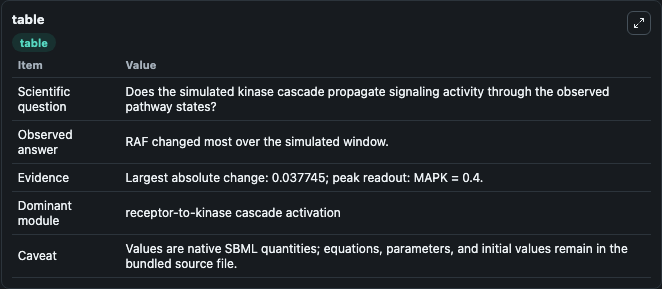
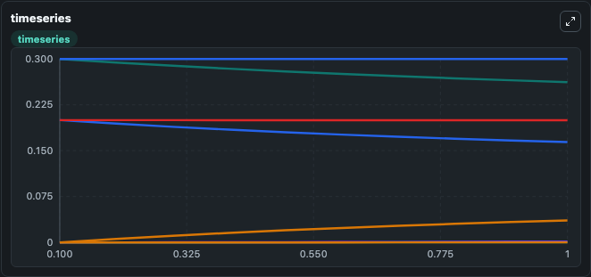
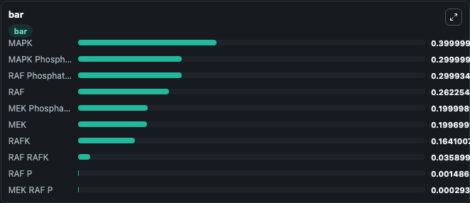

# Levchenko2000_MAPK_noScaffold

This Biosimulant lab wraps `Levchenko2000_MAPK_noScaffold` as a runnable signaling model with a companion visualization module.
Clean Biosimulant lab for MAPK/ERK receptor signaling. It can be used to explore second-messenger and pathway-signaling dynamics and compare scenario outcomes across configurations.

## What You'll See

The lab asks: How does Levchenko2000 MAPK noScaffold propagate receptor or RAS/ERK pathway activity? It runs for 1.0 time units with a communication step of 0.1. The run uses the model defaults declared by the curated SBML wrapper. The generated visualizations focus on MAPK, MAPK MEK PP, MAPK P, MAPK Phosphatase, MAPK P Mapkpase, and MAPK P MEK PP, and related outputs, combining trajectory, endpoint-comparison, and summary-table views from one completed dark-mode run.

In this captured run, **RAF** moved from 0.3000 to 0.2623 across 1.0 simulation windows.

<!-- BIOSIMULANT_VISUALS_START -->
### Output Visualizations



*Summary table for Levchenko2000_MAPK_noScaffold, reporting the scientific question, observed answer, dominant module, and caveat.*



*Trajectories of RAF, RAFK, RAF RAFK, RAF P, MEK, and MEK RAF P across the 1.0 simulation. In this run **RAF RAFK** climbed from 0 to 0.0359 and **RAF** fell from 0.3000 to 0.2623 — the largest movements among the focused observables.*



*Largest-excursion ranking of the focused observables — the absolute movement magnitude during the run. Top 3: **MAPK** = 0.4000, **MAPK Phosphatase** = 0.3000, **RAF Phosphatase** = 0.2999, with 7 more observables below.*

<!-- BIOSIMULANT_VISUALS_END -->

## Model Context

- Core model: `models/core`
- Visualization model: `models/visualisation`
- Standard: `other`
- Upstream source: `biomodels_ebi:BIOMD0000000011`
- License: `CC0`
- Visual scope: receptor-to-MAPK cascade signaling
- Caveat: Values are native SBML quantities; equations, parameters, units, and initial values remain in the bundled source file.

## Inputs

| Input | Maps To | Default | Notes |
|---|---|---|---|
| Initial MAPK | `signaling_sbml_levchenko2000_mapk_noscaffold_biomd0000000011_model.initial_mapk` |  | Initial level of MAPK. Maps to SBML symbol `MAPK`; exposed as a traceable initial-condition perturbation. |

## Outputs

| Output | Maps To | Role |
|---|---|---|
| `mapk` | `signaling_sbml_levchenko2000_mapk_noscaffold_biomd0000000011_model.mapk` | MAPK. |
| `mapk_mek_pp` | `signaling_sbml_levchenko2000_mapk_noscaffold_biomd0000000011_model.mapk_mek_pp` | MAPK MEK PP. |
| `mapk_p` | `signaling_sbml_levchenko2000_mapk_noscaffold_biomd0000000011_model.mapk_p` | MAPK P. |
| `state` | `signaling_sbml_levchenko2000_mapk_noscaffold_biomd0000000011_model.state` | Available to the visualization model and downstream workflows. |
| `summary` | `signaling_sbml_levchenko2000_mapk_noscaffold_biomd0000000011_model.summary` | Available to the visualization model and downstream workflows. |
| `species_labels` | `signaling_sbml_levchenko2000_mapk_noscaffold_biomd0000000011_model.species_labels` | Available to the visualization model and downstream workflows. |

## Runtime

- Duration: `1.0`
- Communication step: `0.1`

## Running Locally

```bash
biosimulant labs serve .
```
