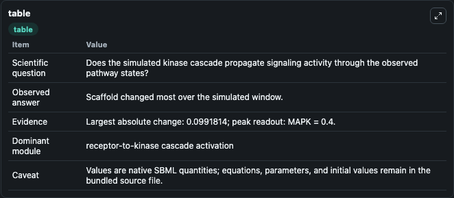
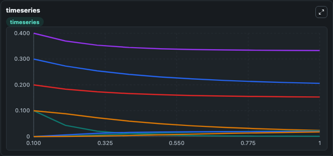
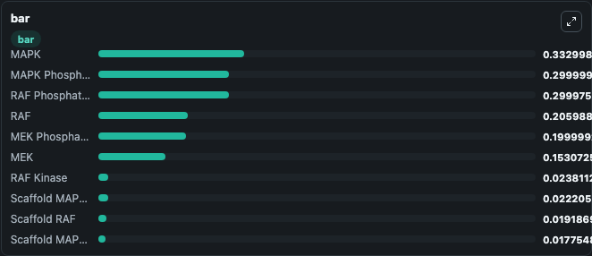

# Levchenko2000_MAPK_Scaffold

This Biosimulant lab wraps `Levchenko2000_MAPK_Scaffold` as a runnable signaling model with a companion visualization module.
Clean Biosimulant lab for MAPK/ERK receptor signaling. It can be used to explore second-messenger and pathway-signaling dynamics and compare scenario outcomes across configurations.

## What You'll See

The lab asks: How does Levchenko2000 MAPK Scaffold propagate receptor or RAS/ERK pathway activity? It runs for 1.0 time units with a communication step of 0.1. The run uses the model defaults declared by the curated SBML wrapper. The generated visualizations focus on MAPK Phosphatase, MEK Phosphatase, RAF Kinase, RAF Phosphatase, MAPK, and MAPK P, and related outputs, combining trajectory, endpoint-comparison, and summary-table views from one completed dark-mode run.

In this captured run, **Scaffold** moved from 0.1000 to 0.000819 across 1.0 simulation windows.

<!-- BIOSIMULANT_VISUALS_START -->
### Output Visualizations



*Summary table for Levchenko2000_MAPK_Scaffold, reporting the scientific question, observed answer, dominant module, and caveat.*



*Trajectories of Scaffold, RAF, RAF Kinase, MAPK, MEK, and Scaffold MAPK RAF across the 1.0 simulation. In this run **Scaffold MAPK RAF** climbed from 0 to 0.0222 and **Scaffold** fell from 0.1000 to 0.000819 — the largest movements among the focused observables.*



*Largest-excursion ranking of the focused observables — the absolute movement magnitude during the run. Top 3: **MAPK** = 0.3330, **MAPK Phosphatase** = 0.3000, **RAF Phosphatase** = 0.3000, with 7 more observables below.*

<!-- BIOSIMULANT_VISUALS_END -->

## Model Context

- Core model: `models/core`
- Visualization model: `models/visualisation`
- Standard: `other`
- Upstream source: `biomodels_ebi:BIOMD0000000014`
- License: `CC0`
- Visual scope: receptor-to-MAPK cascade signaling
- Caveat: Values are native SBML quantities; equations, parameters, units, and initial values remain in the bundled source file.

## Inputs

| Input | Maps To | Default | Notes |
|---|---|---|---|
| Initial MAPK Phosphatase | `signaling_sbml_levchenko2000_mapk_scaffold_biomd0000000014_model.initial_mapk_phosphatase` |  | Initial level of MAPK Phosphatase. Maps to SBML symbol `MAPKP`; exposed as a traceable initial-condition perturbation. |

## Outputs

| Output | Maps To | Role |
|---|---|---|
| `mapk_phosphatase` | `signaling_sbml_levchenko2000_mapk_scaffold_biomd0000000014_model.mapk_phosphatase` | MAPK Phosphatase. |
| `mek_phosphatase` | `signaling_sbml_levchenko2000_mapk_scaffold_biomd0000000014_model.mek_phosphatase` | MEK Phosphatase. |
| `raf_phosphatase` | `signaling_sbml_levchenko2000_mapk_scaffold_biomd0000000014_model.raf_phosphatase` | RAF Phosphatase. |
| `state` | `signaling_sbml_levchenko2000_mapk_scaffold_biomd0000000014_model.state` | Available to the visualization model and downstream workflows. |
| `summary` | `signaling_sbml_levchenko2000_mapk_scaffold_biomd0000000014_model.summary` | Available to the visualization model and downstream workflows. |
| `species_labels` | `signaling_sbml_levchenko2000_mapk_scaffold_biomd0000000014_model.species_labels` | Available to the visualization model and downstream workflows. |

## Runtime

- Duration: `1.0`
- Communication step: `0.1`

## Running Locally

```bash
biosimulant labs serve .
```
