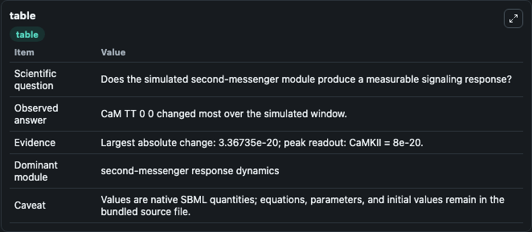
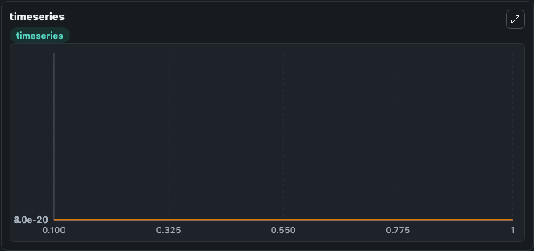
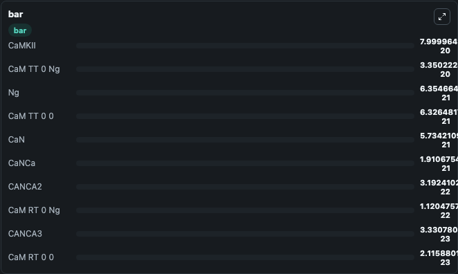

# Li2019 - Neurogranin stimulates Ca/calmodulin-dependent kinase II by inhibiting Calcineurin

This Biosimulant lab wraps `Li2019 - Neurogranin stimulates Ca/calmodulin-dependent kinase II by inhibiting Calcineurin` as a runnable signaling model with a companion visualization module.
Clean Biosimulant lab for calcium and second-messenger signaling. It can be used to explore second-messenger and pathway-signaling dynamics and compare scenario outcomes across configurations.

## What You'll See

The lab asks: How do calcium-linked states respond in Li2019 - Neurogranin stimulates Ca/calmodulin-dependent kinase II by inhibiting Calcineurin? It runs for 1.0 time units with a communication step of 0.1. The run uses the model defaults declared by the curated SBML wrapper. The generated visualizations focus on calcium M RR 0 0, calcium M RR 0 calcium Nca4, calcium M RR 0 calcium MKII, calcium M RR 0 calcium Mkiip, calcium M RR A 0, and calcium M RR A calcium Nca4, and related outputs, combining trajectory, endpoint-comparison, and summary-table views from one completed dark-mode run.

In this captured run, **CaM TT 0 0** moved from 4e-20 to 6.33e-21 across 1.0 simulation windows.

<!-- BIOSIMULANT_VISUALS_START -->
### Output Visualizations



*Summary table for Li2019 - Neurogranin stimulates Ca/calmodulin-dependent kinase II by inhibiting Calcineurin, reporting the scientific question, observed answer, dominant module, and caveat.*



*Trajectories of CaM TT 0 0, Ng, CaM TT 0 Ng, CaN, CaNCa, and CANCA2 across the 1.0 simulation. In this run **CaM TT 0 Ng** climbed from 0 to 3.35e-20 and **CaM TT 0 0** fell from 4e-20 to 6.33e-21 — the largest movements among the focused observables.*



*Largest-excursion ranking of the focused observables — the absolute movement magnitude during the run. Top 3: **CaMKII** = 8e-20, **CaM TT 0 Ng** = 3.35e-20, **Ng** = 6.35e-21, with 7 more observables below.*

<!-- BIOSIMULANT_VISUALS_END -->

## Model Context

- Core model: `models/core`
- Visualization model: `models/visualisation`
- Standard: `other`
- Upstream source: `biomodels_ebi:MODEL1903010001`
- License: `CC0`
- Visual scope: calcium second-messenger signaling
- Caveat: Values are native SBML quantities; equations, parameters, units, and initial values remain in the bundled source file.

## Inputs

| Input | Maps To | Default | Notes |
|---|---|---|---|
| Kd calcium N Ca2 calcium | `signaling_sbml_li2019_neurogranin_stimulates_ca_calmodulin_depe_model1903010001_model.initial_kd_calcium_n_ca2_calcium_level` |  | Kd calcium N Ca2 calcium source parameter. Maps to SBML symbol `parameter_6` and preserves the bundled default. |
| Kd calcium N RR | `signaling_sbml_li2019_neurogranin_stimulates_ca_calmodulin_depe_model1903010001_model.initial_kd_calcium_n_rr_level` |  | Kd calcium N RR source parameter. Maps to SBML symbol `Kd_PP2BCa2_RR` and preserves the bundled default. |
| Kon calcium N RR | `signaling_sbml_li2019_neurogranin_stimulates_ca_calmodulin_depe_model1903010001_model.initial_kon_calcium_n_rr_level` |  | Kon calcium N RR source parameter. Maps to SBML symbol `kon_PP2BCa2` and preserves the bundled default. |

## Outputs

| Output | Maps To | Role |
|---|---|---|
| `calcium_m_rr_0_0` | `signaling_sbml_li2019_neurogranin_stimulates_ca_calmodulin_depe_model1903010001_model.calcium_m_rr_0_0` | calcium M RR 0 0. |
| `calcium_m_rr_0_calcium_nca4` | `signaling_sbml_li2019_neurogranin_stimulates_ca_calmodulin_depe_model1903010001_model.calcium_m_rr_0_calcium_nca4` | calcium M RR 0 calcium Nca4. |
| `calcium_m_rr_0_calcium_mkii` | `signaling_sbml_li2019_neurogranin_stimulates_ca_calmodulin_depe_model1903010001_model.calcium_m_rr_0_calcium_mkii` | calcium M RR 0 calcium MKII. |
| `state` | `signaling_sbml_li2019_neurogranin_stimulates_ca_calmodulin_depe_model1903010001_model.state` | Available to the visualization model and downstream workflows. |
| `summary` | `signaling_sbml_li2019_neurogranin_stimulates_ca_calmodulin_depe_model1903010001_model.summary` | Available to the visualization model and downstream workflows. |
| `species_labels` | `signaling_sbml_li2019_neurogranin_stimulates_ca_calmodulin_depe_model1903010001_model.species_labels` | Available to the visualization model and downstream workflows. |

## Runtime

- Duration: `1.0`
- Communication step: `0.1`

## Running Locally

```bash
biosimulant labs serve .
```
