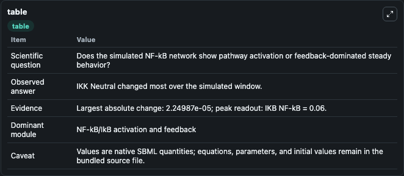
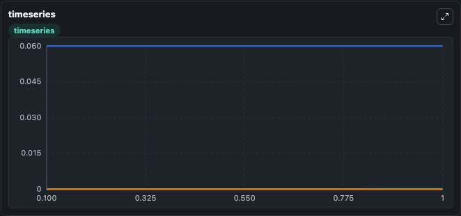
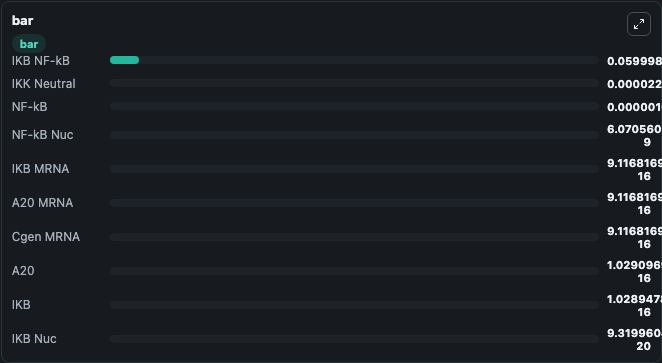

# Lipniacki2004 - Mathematical model of NFKB regulatory module

This Biosimulant lab wraps `Lipniacki2004 - Mathematical model of NFKB regulatory module` as a runnable signaling model with a companion visualization module.
Clean Biosimulant lab for NF-kB pathway signaling. It can be used to explore second-messenger and pathway-signaling dynamics and compare scenario outcomes across configurations.

## What You'll See

The lab asks: How does Lipniacki2004 - Mathematical model of NFKB regulatory module move NF-kB and inhibitor-linked signaling states? It runs for 1.0 time units with a communication step of 0.1. The run uses the model defaults declared by the curated SBML wrapper. The generated visualizations focus on IKK Neutral, IKK active, IKK Inact, Ikkactive Ik B, IkB, and Ikkactive Ik B NF-kB, and related outputs, combining trajectory, endpoint-comparison, and summary-table views from one completed dark-mode run.

In this captured run, **IKK Neutral** moved from 0 to 2.25e-05 across 1.0 simulation windows.

<!-- BIOSIMULANT_VISUALS_START -->
### Output Visualizations



*Summary table for Lipniacki2004 - Mathematical model of NFKB regulatory module, reporting the scientific question, observed answer, dominant module, and caveat.*



*Trajectories of IKK Neutral, IKB NF-kB, NF-kB, NF-kB Nuc, IKB MRNA, and A20 MRNA across the 1.0 simulation. In this run **IKK Neutral** climbed from 0 to 2.25e-05 and **IKB NF-kB** fell from 0.0600 to 0.0600 — the largest movements among the focused observables.*



*Largest-excursion ranking of the focused observables — the absolute movement magnitude during the run. Top 3: **IKB NF-kB** = 0.0600, **IKK Neutral** = 2.25e-05, **NF-kB** = 1.08e-06, with 7 more observables below.*

<!-- BIOSIMULANT_VISUALS_END -->

## Model Context

- Core model: `models/core`
- Visualization model: `models/visualisation`
- Standard: `other`
- Upstream source: `biomodels_ebi:BIOMD0000000786`
- License: `CC0`
- Visual scope: NF-kB activation and feedback signaling
- Caveat: Values are native SBML quantities; equations, parameters, units, and initial values remain in the bundled source file.

## Inputs

| Input | Maps To | Default | Notes |
|---|---|---|---|
| TNF receptor | `signaling_sbml_lipniacki2004_mathematical_model_of_nfkb_regulat_biomd0000000786_model.initial_tnf_receptor_level` |  | TNF receptor source parameter. Maps to SBML symbol `TNF_R` and preserves the bundled default. |
| Initial TNF | `signaling_sbml_lipniacki2004_mathematical_model_of_nfkb_regulat_biomd0000000786_model.initial_tnf` |  | Initial level of TNF. Maps to SBML symbol `TNF`; exposed as a traceable initial-condition perturbation. |

## Outputs

| Output | Maps To | Role |
|---|---|---|
| `ikk_active` | `signaling_sbml_lipniacki2004_mathematical_model_of_nfkb_regulat_biomd0000000786_model.ikk_active` | IKK active. |
| `ikkactive_ik_b` | `signaling_sbml_lipniacki2004_mathematical_model_of_nfkb_regulat_biomd0000000786_model.ikkactive_ik_b` | Ikkactive Ik B. |
| `ikkactive_ik_b_nfkb` | `signaling_sbml_lipniacki2004_mathematical_model_of_nfkb_regulat_biomd0000000786_model.ikkactive_ik_b_nfkb` | Ikkactive Ik B NF-kB. |
| `state` | `signaling_sbml_lipniacki2004_mathematical_model_of_nfkb_regulat_biomd0000000786_model.state` | Available to the visualization model and downstream workflows. |
| `summary` | `signaling_sbml_lipniacki2004_mathematical_model_of_nfkb_regulat_biomd0000000786_model.summary` | Available to the visualization model and downstream workflows. |
| `species_labels` | `signaling_sbml_lipniacki2004_mathematical_model_of_nfkb_regulat_biomd0000000786_model.species_labels` | Available to the visualization model and downstream workflows. |

## Runtime

- Duration: `1.0`
- Communication step: `0.1`

## Running Locally

```bash
biosimulant labs serve .
```
