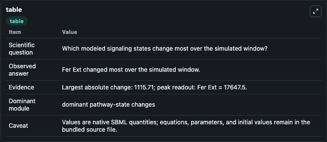
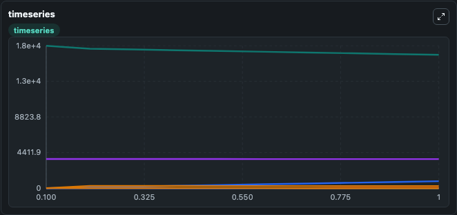
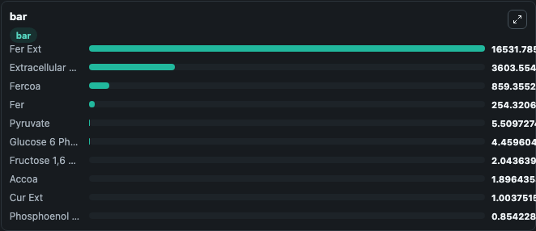

# Machado2014 - Curcumin production pathway in Escherichia coli

This Biosimulant lab wraps `Machado2014 - Curcumin production pathway in Escherichia coli` as a runnable signaling model with a companion visualization module.
Clean Biosimulant lab for systems signaling model: Machado2014 - Curcumin production pathway in Escherichia coli. It can be used to explore second-messenger and pathway-signaling dynamics and compare scenario outcomes across configurations.

## What You'll See

The lab asks: How does Machado2014 - Curcumin production pathway in Escherichia coli shift hormone-linked signaling readouts? It runs for 1.0 time units with a communication step of 0.1. The run uses the model defaults declared by the curated SBML wrapper. The generated visualizations focus on Phosphoenol Pyruvate, Extracellular Glucose, Glucose 6 Phosphate, Pyruvate, Fructose 6 Phosphate, and Glucose 1 Phosphate, and related outputs, combining trajectory, endpoint-comparison, and summary-table views from one completed dark-mode run.

In this captured run, **Fer Ext** moved from 1.76e+04 to 1.65e+04 across 1.0 simulation windows.

<!-- BIOSIMULANT_VISUALS_START -->
### Output Visualizations



*Summary table for Machado2014 - Curcumin production pathway in Escherichia coli, reporting the scientific question, observed answer, dominant module, and caveat.*



*Trajectories of Fer Ext, Fercoa, Fer, Extracellular Glucose, Pyruvate, and Phosphoenol Pyruvate across the 1.0 simulation. In this run **Fercoa** climbed from 0 to 859.4 and **Fer Ext** fell from 1.76e+04 to 1.65e+04 — the largest movements among the focused observables.*



*Largest-excursion ranking of the focused observables — the absolute movement magnitude during the run. Top 3: **Fer Ext** = 1.65e+04, **Extracellular Glucose** = 3603.6, **Fercoa** = 859.4, with 7 more observables below.*

<!-- BIOSIMULANT_VISUALS_END -->

## Model Context

- Core model: `models/core`
- Visualization model: `models/visualisation`
- Standard: `other`
- Upstream source: `biomodels_ebi:BIOMD0000000565`
- License: `CC0`
- Visual scope: metabolic and hormone signaling response
- Caveat: Values are native SBML quantities; equations, parameters, units, and initial values remain in the bundled source file.

## Inputs

| Input | Maps To | Default | Notes |
|---|---|---|---|
| cAMP | `signaling_sbml_machado2014_curcumin_production_pathway_in_esche_biomd0000000565_model.initial_camp_level` |  | cAMP source parameter. Maps to SBML symbol `camp` and preserves the bundled default. |
| Initial Extracellular Glucose | `signaling_sbml_machado2014_curcumin_production_pathway_in_esche_biomd0000000565_model.initial_extracellular_glucose` |  | Initial level of Extracellular Glucose. Maps to SBML symbol `cglcex`; exposed as a traceable initial-condition perturbation. |
| Initial Glucose 1 Phosphate | `signaling_sbml_machado2014_curcumin_production_pathway_in_esche_biomd0000000565_model.initial_glucose_1_phosphate` |  | Initial level of Glucose 1 Phosphate. Maps to SBML symbol `cg1p`; exposed as a traceable initial-condition perturbation. |

## Outputs

| Output | Maps To | Role |
|---|---|---|
| `phosphoenol_pyruvate` | `signaling_sbml_machado2014_curcumin_production_pathway_in_esche_biomd0000000565_model.phosphoenol_pyruvate` | Phosphoenol Pyruvate. |
| `glucose_6_phosphate` | `signaling_sbml_machado2014_curcumin_production_pathway_in_esche_biomd0000000565_model.glucose_6_phosphate` | Glucose 6 Phosphate. |
| `fructose_6_phosphate` | `signaling_sbml_machado2014_curcumin_production_pathway_in_esche_biomd0000000565_model.fructose_6_phosphate` | Fructose 6 Phosphate. |
| `state` | `signaling_sbml_machado2014_curcumin_production_pathway_in_esche_biomd0000000565_model.state` | Available to the visualization model and downstream workflows. |
| `summary` | `signaling_sbml_machado2014_curcumin_production_pathway_in_esche_biomd0000000565_model.summary` | Available to the visualization model and downstream workflows. |
| `species_labels` | `signaling_sbml_machado2014_curcumin_production_pathway_in_esche_biomd0000000565_model.species_labels` | Available to the visualization model and downstream workflows. |

## Runtime

- Duration: `1.0`
- Communication step: `0.1`

## Running Locally

```bash
biosimulant labs serve .
```
