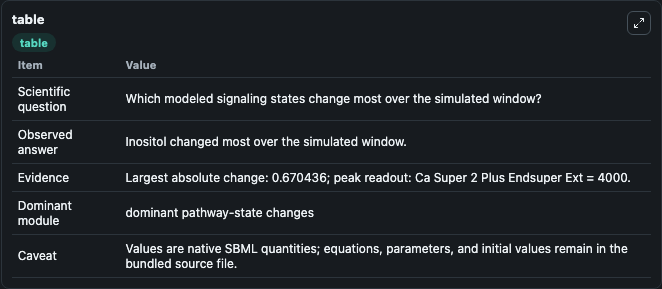
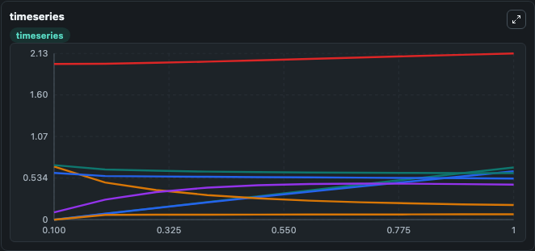
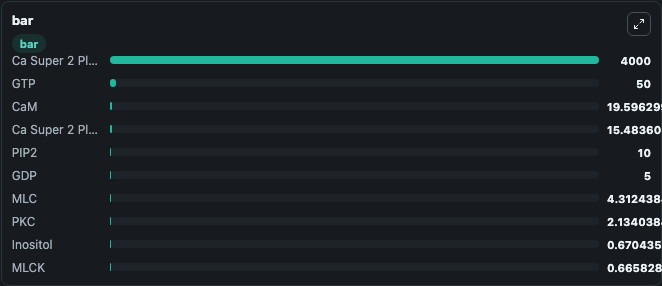

# Maeda2006_MyosinPhosphorylation

This Biosimulant lab wraps `Maeda2006_MyosinPhosphorylation` as a runnable signaling model with a companion visualization module.
Clean Biosimulant lab for systems signaling model: Maeda2006_MyosinPhosphorylation. It can be used to explore second-messenger and pathway-signaling dynamics and compare scenario outcomes across configurations.

## What You'll See

The lab asks: How does Maeda2006 MyosinPhosphorylation redistribute cascade activity across source-defined species? It runs for 1.0 time units with a communication step of 0.1. The run uses the model defaults declared by the curated SBML wrapper. The generated visualizations focus on Thrombin, Thrombin R, Pro Thrombin R, Thrombin Ligand, Thrombin R active, and source-defined RGS state, and related outputs, combining trajectory, endpoint-comparison, and summary-table views from one completed dark-mode run.

In this captured run, **Inositol** moved from 0 to 0.6704 across 1.0 simulation windows.

<!-- BIOSIMULANT_VISUALS_START -->
### Output Visualizations



*Summary table for Maeda2006_MyosinPhosphorylation, reporting the scientific question, observed answer, dominant module, and caveat.*



*Trajectories of Inositol, DAG, PKC Active 2, PKC.Ca Super 2 Plus Endsuper, PKC, and MYPT1 PPase across the 1.0 simulation. In this run **Inositol** climbed from 0 to 0.6704 and **PKC Active 2** fell from 0.6819 to 0.1877 — the largest movements among the focused observables.*



*Largest-excursion ranking of the focused observables — the absolute movement magnitude during the run. Top 3: **Ca Super 2 Plus Endsuper Ext** = 4000.0, **GTP** = 50.000, **CaM** = 19.596, with 7 more observables below.*

<!-- BIOSIMULANT_VISUALS_END -->

## Model Context

- Core model: `models/core`
- Visualization model: `models/visualisation`
- Standard: `other`
- Upstream source: `biomodels_ebi:BIOMD0000000088`
- License: `CC0`
- Visual scope: blood and immune cascade signaling
- Caveat: Values are native SBML quantities; equations, parameters, units, and initial values remain in the bundled source file.

## Inputs

| Input | Maps To | Default | Notes |
|---|---|---|---|
| Initial calcium Super 2 Endsuper Ext | `signaling_sbml_maeda2006_myosinphosphorylation_biomd0000000088_model.initial_calcium_super_2_endsuper_ext` |  | Initial level of calcium Super 2 Endsuper Ext. Maps to SBML symbol `s267`; exposed as a traceable initial-condition perturbation. |
| Initial GDP | `signaling_sbml_maeda2006_myosinphosphorylation_biomd0000000088_model.initial_gdp` |  | Initial level of GDP. Maps to SBML symbol `s50`; exposed as a traceable initial-condition perturbation. |
| Initial GTP | `signaling_sbml_maeda2006_myosinphosphorylation_biomd0000000088_model.initial_gtp` |  | Initial level of GTP. Maps to SBML symbol `s48`; exposed as a traceable initial-condition perturbation. |

## Outputs

| Output | Maps To | Role |
|---|---|---|
| `thrombin_r_active` | `signaling_sbml_maeda2006_myosinphosphorylation_biomd0000000088_model.thrombin_r_active` | Thrombin R active. |
| `rho_gef_active` | `signaling_sbml_maeda2006_myosinphosphorylation_biomd0000000088_model.rho_gef_active` | Rho GEF active. |
| `calcium_super_2_endsuper_calcium_m` | `signaling_sbml_maeda2006_myosinphosphorylation_biomd0000000088_model.calcium_super_2_endsuper_calcium_m` | calcium Super 2 Endsuper calcium M. |
| `state` | `signaling_sbml_maeda2006_myosinphosphorylation_biomd0000000088_model.state` | Available to the visualization model and downstream workflows. |
| `summary` | `signaling_sbml_maeda2006_myosinphosphorylation_biomd0000000088_model.summary` | Available to the visualization model and downstream workflows. |
| `species_labels` | `signaling_sbml_maeda2006_myosinphosphorylation_biomd0000000088_model.species_labels` | Available to the visualization model and downstream workflows. |

## Runtime

- Duration: `1.0`
- Communication step: `0.1`

## Running Locally

```bash
biosimulant labs serve .
```
