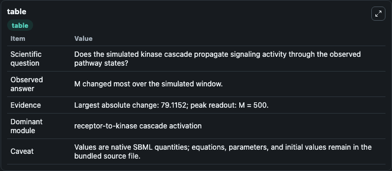
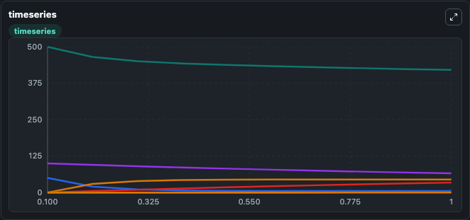
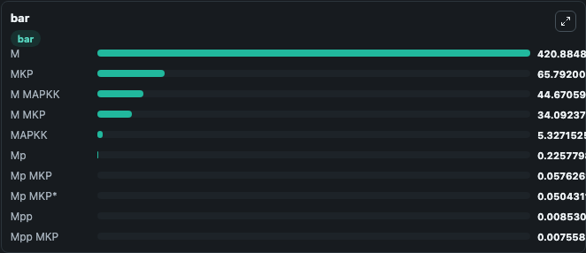

# Markevich2004_MAPK_orderedElementary

This Biosimulant lab wraps `Markevich2004_MAPK_orderedElementary` as a runnable signaling model with a companion visualization module.
Clean Biosimulant lab for MAPK/ERK receptor signaling. It can be used to explore second-messenger and pathway-signaling dynamics and compare scenario outcomes across configurations.

## What You'll See

The lab asks: How does Markevich2004 MAPK orderedElementary propagate receptor or RAS/ERK pathway activity? It runs for 1.0 time units with a communication step of 0.1. The run uses the model defaults declared by the curated SBML wrapper. The generated visualizations focus on Source Defined M State, Source Defined MP State, Dual Phosphorylated MAPK, MAPKK, source-defined MKP state, and M MAPKK, and related outputs, combining trajectory, endpoint-comparison, and summary-table views from one completed dark-mode run.

In this captured run, **M** moved from 500.0 to 420.9 across 1.0 simulation windows.

<!-- BIOSIMULANT_VISUALS_START -->
### Output Visualizations



*Summary table for Markevich2004_MAPK_orderedElementary, reporting the scientific question, observed answer, dominant module, and caveat.*



*Trajectories of M, MAPKK, M MAPKK, MKP, M MKP, and Mp across the 1.0 simulation. In this run **M MAPKK** climbed from 0 to 44.671 and **M** fell from 500.0 to 420.9 — the largest movements among the focused observables.*



*Largest-excursion ranking of the focused observables — the absolute movement magnitude during the run. Top 3: **M** = 420.9, **MKP** = 65.792, **M MAPKK** = 44.671, with 7 more observables below.*

<!-- BIOSIMULANT_VISUALS_END -->

## Model Context

- Core model: `models/core`
- Visualization model: `models/visualisation`
- Standard: `other`
- Upstream source: `biomodels_ebi:BIOMD0000000026`
- License: `CC0`
- Visual scope: receptor-to-MAPK cascade signaling
- Caveat: Values are native SBML quantities; equations, parameters, units, and initial values remain in the bundled source file.

## Inputs

| Input | Maps To | Default | Notes |
|---|---|---|---|
| Initial source-defined M state | `signaling_sbml_markevich2004_mapk_orderedelementary_biomd0000000026_model.initial_source_defined_m_state` |  | Initial level of source-defined M state. Maps to SBML symbol `M`; exposed as a traceable initial-condition perturbation. |

## Outputs

| Output | Maps To | Role |
|---|---|---|
| `mapkk` | `signaling_sbml_markevich2004_mapk_orderedelementary_biomd0000000026_model.mapkk` | MAPKK. |
| `m_mapkk` | `signaling_sbml_markevich2004_mapk_orderedelementary_biomd0000000026_model.m_mapkk` | M MAPKK. |
| `mp_mapkk` | `signaling_sbml_markevich2004_mapk_orderedelementary_biomd0000000026_model.mp_mapkk` | Mp MAPKK. |
| `state` | `signaling_sbml_markevich2004_mapk_orderedelementary_biomd0000000026_model.state` | Available to the visualization model and downstream workflows. |
| `summary` | `signaling_sbml_markevich2004_mapk_orderedelementary_biomd0000000026_model.summary` | Available to the visualization model and downstream workflows. |
| `species_labels` | `signaling_sbml_markevich2004_mapk_orderedelementary_biomd0000000026_model.species_labels` | Available to the visualization model and downstream workflows. |

## Runtime

- Duration: `1.0`
- Communication step: `0.1`

## Running Locally

```bash
biosimulant labs serve .
```
