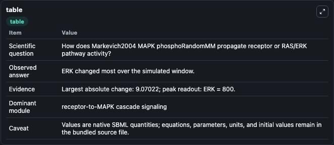
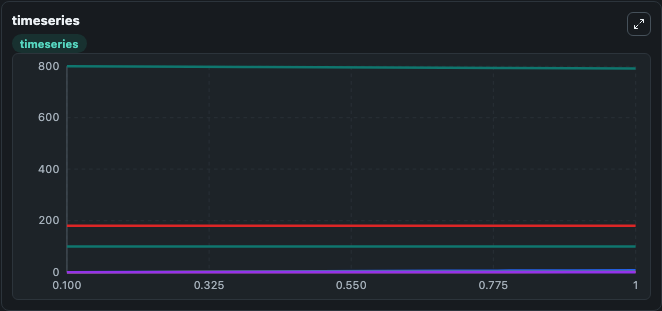
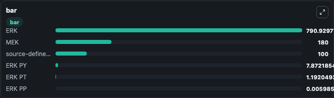

# Markevich2004_MAPK_phosphoRandomMM

This Biosimulant lab wraps `Markevich2004_MAPK_phosphoRandomMM` as a runnable signaling model with a companion visualization module.
Clean Biosimulant lab for MAPK/ERK receptor signaling. It can be used to explore second-messenger and pathway-signaling dynamics and compare scenario outcomes across configurations.

## What You'll See

The lab asks: How does Markevich2004 MAPK phosphoRandomMM propagate receptor or RAS/ERK pathway activity? It runs for 1.0 time units with a communication step of 0.1. The run uses the model defaults declared by the curated SBML wrapper. The generated visualizations focus on ERK, ERK PY, ERK PT, ERK PP, MEK, and source-defined MKP3 state, combining trajectory, endpoint-comparison, and summary-table views from one completed dark-mode run.

In this captured run, **ERK** moved from 800.0 to 790.9 across 1.0 simulation windows.

<!-- BIOSIMULANT_VISUALS_START -->
### Output Visualizations



*Summary table for Markevich2004_MAPK_phosphoRandomMM, reporting the scientific question, observed answer, dominant module, and caveat.*



*Trajectories of ERK, ERK PY, ERK PT, ERK PP, MEK, and source-defined MKP3 state across the 1.0 simulation. In this run **ERK PY** climbed from 0 to 7.872 and **ERK** fell from 800.0 to 790.9 — the largest movements among the focused observables.*



*Largest-excursion ranking of the focused observables — the absolute movement magnitude during the run. Top 3: **ERK** = 790.9, **MEK** = 180.0, **source-defined MKP3 state** = 100.0, with 3 more observables below.*

<!-- BIOSIMULANT_VISUALS_END -->

## Model Context

- Core model: `models/core`
- Visualization model: `models/visualisation`
- Standard: `other`
- Upstream source: `biomodels_ebi:BIOMD0000000029`
- License: `CC0`
- Visual scope: receptor-to-MAPK cascade signaling
- Caveat: Values are native SBML quantities; equations, parameters, units, and initial values remain in the bundled source file.

## Inputs

| Input | Maps To | Default | Notes |
|---|---|---|---|
| Initial ERK | `signaling_sbml_markevich2004_mapk_phosphorandommm_biomd0000000029_model.initial_erk` |  | Initial level of ERK. Maps to SBML symbol `M`; exposed as a traceable initial-condition perturbation. |

## Outputs

| Output | Maps To | Role |
|---|---|---|
| `erk` | `signaling_sbml_markevich2004_mapk_phosphorandommm_biomd0000000029_model.erk` | ERK. |
| `erk_py` | `signaling_sbml_markevich2004_mapk_phosphorandommm_biomd0000000029_model.erk_py` | ERK PY. |
| `erk_pt` | `signaling_sbml_markevich2004_mapk_phosphorandommm_biomd0000000029_model.erk_pt` | ERK PT. |
| `state` | `signaling_sbml_markevich2004_mapk_phosphorandommm_biomd0000000029_model.state` | Available to the visualization model and downstream workflows. |
| `summary` | `signaling_sbml_markevich2004_mapk_phosphorandommm_biomd0000000029_model.summary` | Available to the visualization model and downstream workflows. |
| `species_labels` | `signaling_sbml_markevich2004_mapk_phosphorandommm_biomd0000000029_model.species_labels` | Available to the visualization model and downstream workflows. |

## Runtime

- Duration: `1.0`
- Communication step: `0.1`

## Running Locally

```bash
biosimulant labs serve .
```
