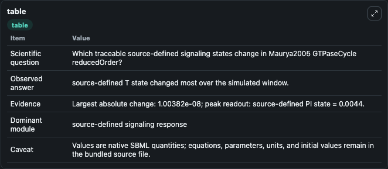
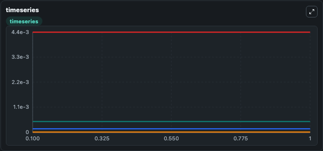
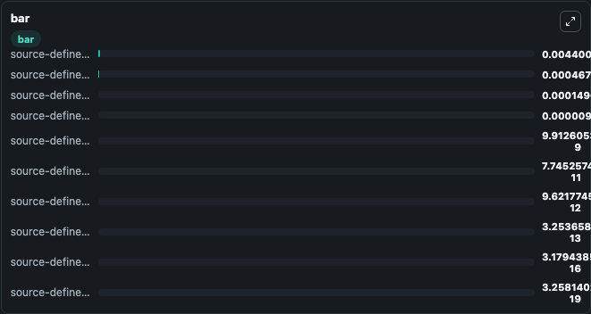

# Maurya2005_GTPaseCycle_reducedOrder

This Biosimulant lab wraps `Maurya2005_GTPaseCycle_reducedOrder` as a runnable signaling model with a companion visualization module.
Clean Biosimulant lab for systems signaling model: Maurya2005_GTPaseCycle_reducedOrder. It can be used to explore second-messenger and pathway-signaling dynamics and compare scenario outcomes across configurations.

## What You'll See

The lab asks: How does Maurya2005 GTPaseCycle reducedOrder express its source-modeled signaling motif over the baseline run? It runs for 1.0 time units with a communication step of 0.1. The run uses the model defaults declared by the curated SBML wrapper. The generated visualizations focus on source-defined A state, source-defined G state, source-defined GA state, source-defined T state, source-defined R state, and source-defined G*T state, and related outputs, combining trajectory, endpoint-comparison, and summary-table views from one completed dark-mode run.

In this captured run, **source-defined T state** moved from 0.000468 to 0.000468 across 1.0 simulation windows.

<!-- BIOSIMULANT_VISUALS_START -->
### Output Visualizations



*Summary table for Maurya2005_GTPaseCycle_reducedOrder, reporting the scientific question, observed answer, dominant module, and caveat.*



*Trajectories of source-defined T state, source-defined G state, source-defined R state, source-defined RG*T state, source-defined PI state, and source-defined RGD state across the 1.0 simulation. In this run **source-defined RG*T state** climbed from 0 to 9.91e-09 and **source-defined T state** fell from 0.000468 to 0.000468 — the largest movements among the focused observables.*



*Largest-excursion ranking of the focused observables — the absolute movement magnitude during the run. Top 3: **source-defined PI state** = 0.0044, **source-defined T state** = 0.000468, **source-defined D state** = 0.000149, with 7 more observables below.*

<!-- BIOSIMULANT_VISUALS_END -->

## Model Context

- Core model: `models/core`
- Visualization model: `models/visualisation`
- Standard: `other`
- Upstream source: `biomodels_ebi:BIOMD0000000085`
- License: `CC0`
- Visual scope: phosphorylation and regulatory motif dynamics
- Caveat: Values are native SBML quantities; equations, parameters, units, and initial values remain in the bundled source file.

## Inputs

| Input | Maps To | Default | Notes |
|---|---|---|---|
| Initial source-defined A state | `signaling_sbml_maurya2005_gtpasecycle_reducedorder_biomd0000000085_model.initial_source_defined_a_state` |  | Initial level of source-defined A state. Maps to SBML symbol `species_0`; exposed as a traceable initial-condition perturbation. |

## Outputs

| Output | Maps To | Role |
|---|---|---|
| `source_defined_g_t_state` | `signaling_sbml_maurya2005_gtpasecycle_reducedorder_biomd0000000085_model.source_defined_g_t_state` | source-defined G*T state. |
| `source_defined_rg_t_state` | `signaling_sbml_maurya2005_gtpasecycle_reducedorder_biomd0000000085_model.source_defined_rg_t_state` | source-defined RG*T state. |
| `source_defined_g_at_state` | `signaling_sbml_maurya2005_gtpasecycle_reducedorder_biomd0000000085_model.source_defined_g_at_state` | source-defined G*AT state. |
| `state` | `signaling_sbml_maurya2005_gtpasecycle_reducedorder_biomd0000000085_model.state` | Available to the visualization model and downstream workflows. |
| `summary` | `signaling_sbml_maurya2005_gtpasecycle_reducedorder_biomd0000000085_model.summary` | Available to the visualization model and downstream workflows. |
| `species_labels` | `signaling_sbml_maurya2005_gtpasecycle_reducedorder_biomd0000000085_model.species_labels` | Available to the visualization model and downstream workflows. |

## Runtime

- Duration: `1.0`
- Communication step: `0.1`

## Running Locally

```bash
biosimulant labs serve .
```
