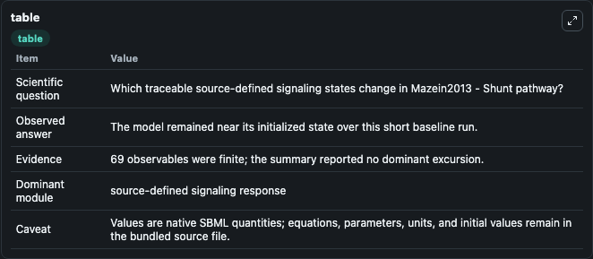
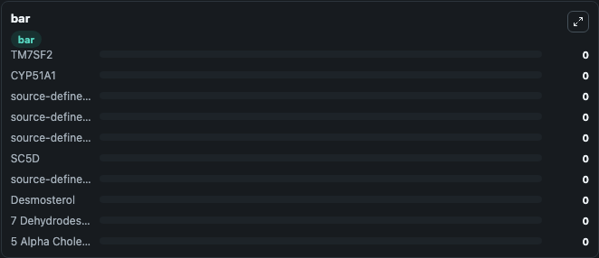

# Mazein2013 - Shunt pathway

This Biosimulant lab wraps `Mazein2013 - Shunt pathway` as a runnable signaling model with a companion visualization module.
Clean Biosimulant lab for systems signaling model: Mazein2013 - Shunt pathway. It can be used to explore second-messenger and pathway-signaling dynamics and compare scenario outcomes across configurations.

## What You'll See

The lab asks: How does Mazein2013 - Shunt pathway shift hormone-linked signaling readouts? It runs for 1.0 time units with a communication step of 0.1. The run uses the model defaults declared by the curated SBML wrapper. The generated visualizations focus on TM7SF2, CYP51A1, source-defined LSS state, source-defined SQLE state, source-defined EBP state, and SC5D, and related outputs, combining trajectory, endpoint-comparison, and summary-table views from one completed dark-mode run.

In this captured run, **TM7SF2** moved from 0 to 0 across 1.0 simulation windows.

<!-- BIOSIMULANT_VISUALS_START -->
### Output Visualizations



*Summary table for Mazein2013 - Shunt pathway, reporting the scientific question, observed answer, dominant module, and caveat.*


*Trajectories of TM7SF2, CYP51A1, source-defined LSS state, source-defined SQLE state, source-defined EBP state, and SC5D across the 1.0 simulation. In this run TM7SF2, CYP51A1, source-defined LSS state, source-defined SQLE state stayed near their initial values — no observable moved appreciably.*



*Largest-excursion ranking of the focused observables — the absolute movement magnitude during the run. Top 3: **TM7SF2** = 0, **CYP51A1** = 0, **source-defined LSS state** = 0, with 7 more observables below.*

<!-- BIOSIMULANT_VISUALS_END -->

## Model Context

- Core model: `models/core`
- Visualization model: `models/visualisation`
- Standard: `other`
- Upstream source: `biomodels_ebi:MODEL1409170003`
- License: `CC0`
- Visual scope: metabolic and hormone signaling response
- Caveat: Values are native SBML quantities; equations, parameters, units, and initial values remain in the bundled source file.

## Inputs

| Input | Maps To | Default | Notes |
|---|---|---|---|
| Initial TM7SF2 | `signaling_sbml_mazein2013_shunt_pathway_model1409170003_model.initial_tm7sf2` |  | Initial level of TM7SF2. Maps to SBML symbol `s54`; exposed as a traceable initial-condition perturbation. |

## Outputs

| Output | Maps To | Role |
|---|---|---|
| `source_4_alpha_carboxyzymosterol` | `signaling_sbml_mazein2013_shunt_pathway_model1409170003_model.source_4_alpha_carboxyzymosterol` | 4 Alpha Carboxyzymosterol. |
| `source_4_alpha_carboxy_4_beta_response_parameter_methylzymosterol` | `signaling_sbml_mazein2013_shunt_pathway_model1409170003_model.source_4_alpha_carboxy_4_beta_response_parameter_methylzymosterol` | 4 Alpha Carboxy 4 beta response parameter Methylzymosterol. |
| `source_4_alpha_carboxy_4_beta_response_parameter_methyl_5_alpha_cholest_8_en_3_beta_response_parameter_ol` | `signaling_sbml_mazein2013_shunt_pathway_model1409170003_model.source_4_alpha_carboxy_4_beta_response_parameter_methyl_5_alpha_cholest_8_en_3_beta_response_parameter_ol` | 4 Alpha Carboxy 4 beta response parameter Methyl 5 Alpha Cholest 8 En 3 beta response parameter Ol. |
| `state` | `signaling_sbml_mazein2013_shunt_pathway_model1409170003_model.state` | Available to the visualization model and downstream workflows. |
| `summary` | `signaling_sbml_mazein2013_shunt_pathway_model1409170003_model.summary` | Available to the visualization model and downstream workflows. |
| `species_labels` | `signaling_sbml_mazein2013_shunt_pathway_model1409170003_model.species_labels` | Available to the visualization model and downstream workflows. |

## Runtime

- Duration: `1.0`
- Communication step: `0.1`

## Running Locally

```bash
biosimulant labs serve .
```
