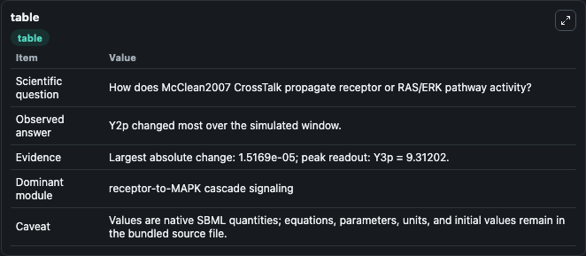
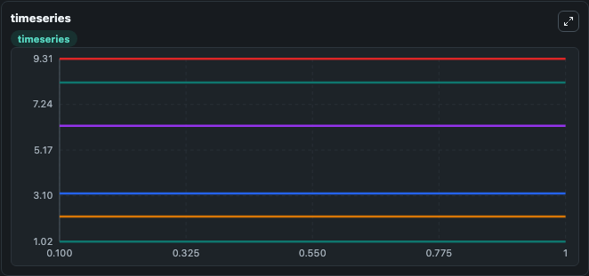
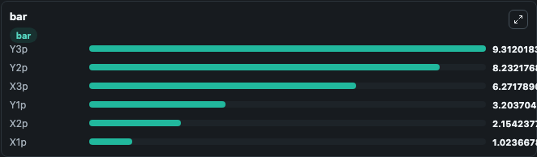

# McClean2007_CrossTalk

This Biosimulant lab wraps `McClean2007_CrossTalk` as a runnable signaling model with a companion visualization module.
Clean Biosimulant lab for MAPK/ERK receptor signaling. It can be used to explore second-messenger and pathway-signaling dynamics and compare scenario outcomes across configurations.

## What You'll See

The lab asks: How does McClean2007 CrossTalk propagate receptor or RAS/ERK pathway activity? It runs for 1.0 time units with a communication step of 0.1. The run uses the model defaults declared by the curated SBML wrapper. The generated visualizations focus on X1p, X2p, X3p, Y1p, Y2p, and Y3p, combining trajectory, endpoint-comparison, and summary-table views from one completed dark-mode run.

In this captured run, **Y2p** moved from 8.232 to 8.232 across 1.0 simulation windows.

<!-- BIOSIMULANT_VISUALS_START -->
### Output Visualizations



*Summary table for McClean2007_CrossTalk, reporting the scientific question, observed answer, dominant module, and caveat.*



*Trajectories of Y2p, Y1p, X2p, X3p, Y3p, and X1p across the 1.0 simulation. In this run **Y1p** climbed from 3.204 to 3.204 and **Y2p** fell from 8.232 to 8.232 — the largest movements among the focused observables.*



*Largest-excursion ranking of the focused observables — the absolute movement magnitude during the run. Top 3: **Y3p** = 9.312, **Y2p** = 8.232, **X3p** = 6.272, with 3 more observables below.*

<!-- BIOSIMULANT_VISUALS_END -->

## Model Context

- Core model: `models/core`
- Visualization model: `models/visualisation`
- Standard: `other`
- Upstream source: `biomodels_ebi:BIOMD0000000116`
- License: `CC0`
- Visual scope: receptor-to-MAPK cascade signaling
- Caveat: Values are native SBML quantities; equations, parameters, units, and initial values remain in the bundled source file.

## Inputs

| Input | Maps To | Default | Notes |
|---|---|---|---|
| Initial X1p | `signaling_sbml_mcclean2007_crosstalk_biomd0000000116_model.initial_x1p` |  | Initial level of X1p. Maps to SBML symbol `species_0`; exposed as a traceable initial-condition perturbation. |

## Outputs

| Output | Maps To | Role |
|---|---|---|
| `x1p` | `signaling_sbml_mcclean2007_crosstalk_biomd0000000116_model.x1p` | X1p. |
| `x2p` | `signaling_sbml_mcclean2007_crosstalk_biomd0000000116_model.x2p` | X2p. |
| `x3p` | `signaling_sbml_mcclean2007_crosstalk_biomd0000000116_model.x3p` | X3p. |
| `state` | `signaling_sbml_mcclean2007_crosstalk_biomd0000000116_model.state` | Available to the visualization model and downstream workflows. |
| `summary` | `signaling_sbml_mcclean2007_crosstalk_biomd0000000116_model.summary` | Available to the visualization model and downstream workflows. |
| `species_labels` | `signaling_sbml_mcclean2007_crosstalk_biomd0000000116_model.species_labels` | Available to the visualization model and downstream workflows. |

## Runtime

- Duration: `1.0`
- Communication step: `0.1`

## Running Locally

```bash
biosimulant labs serve .
```
