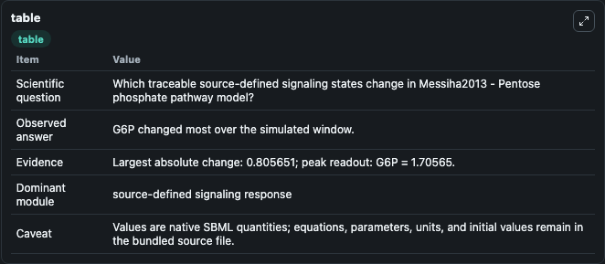
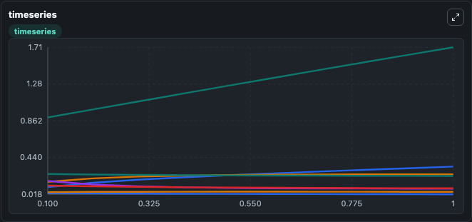
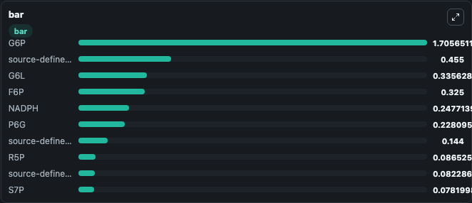

# Messiha2013 - Pentose phosphate pathway model

This Biosimulant lab wraps `Messiha2013 - Pentose phosphate pathway model` as a runnable signaling model with a companion visualization module.
Clean Biosimulant lab for systems signaling model: Messiha2013 - Pentose phosphate pathway model. It can be used to explore second-messenger and pathway-signaling dynamics and compare scenario outcomes across configurations.

## What You'll See

The lab asks: How does Messiha2013 - Pentose phosphate pathway model shift hormone-linked signaling readouts? It runs for 1.0 time units with a communication step of 0.1. The run uses the model defaults declared by the curated SBML wrapper. The generated visualizations focus on E4P, G6L, NADPH, P6G, R5P, and Ru5p, and related outputs, combining trajectory, endpoint-comparison, and summary-table views from one completed dark-mode run.

In this captured run, **G6P** moved from 0.9000 to 1.706 across 1.0 simulation windows.

<!-- BIOSIMULANT_VISUALS_START -->
### Output Visualizations



*Summary table for Messiha2013 - Pentose phosphate pathway model, reporting the scientific question, observed answer, dominant module, and caveat.*



*Trajectories of G6P, G6L, NADPH, source-defined NADP state, R5P, and P6G across the 1.0 simulation. In this run **G6P** climbed from 0.9000 to 1.706 and **source-defined NADP state** fell from 0.1700 to 0.0823 — the largest movements among the focused observables.*



*Largest-excursion ranking of the focused observables — the absolute movement magnitude during the run. Top 3: **G6P** = 1.706, **source-defined TKL1 state** = 0.4550, **G6L** = 0.3356, with 7 more observables below.*

<!-- BIOSIMULANT_VISUALS_END -->

## Model Context

- Core model: `models/core`
- Visualization model: `models/visualisation`
- Standard: `other`
- Upstream source: `biomodels_ebi:BIOMD0000000502`
- License: `CC0`
- Visual scope: metabolic and hormone signaling response
- Caveat: Values are native SBML quantities; equations, parameters, units, and initial values remain in the bundled source file.

## Inputs

| Input | Maps To | Default | Notes |
|---|---|---|---|
| Initial F6P | `signaling_sbml_messiha2013_pentose_phosphate_pathway_model_biomd0000000502_model.initial_f6p` |  | Initial level of F6P. Maps to SBML symbol `F6P`; exposed as a traceable initial-condition perturbation. |
| Initial G6P | `signaling_sbml_messiha2013_pentose_phosphate_pathway_model_biomd0000000502_model.initial_g6p` |  | Initial level of G6P. Maps to SBML symbol `G6P`; exposed as a traceable initial-condition perturbation. |
| Initial source-defined GAP state | `signaling_sbml_messiha2013_pentose_phosphate_pathway_model_biomd0000000502_model.initial_source_defined_gap_state` |  | Initial level of source-defined GAP state. Maps to SBML symbol `GAP`; exposed as a traceable initial-condition perturbation. |

## Outputs

| Output | Maps To | Role |
|---|---|---|
| `e4p` | `signaling_sbml_messiha2013_pentose_phosphate_pathway_model_biomd0000000502_model.e4p` | E4P. |
| `g6l` | `signaling_sbml_messiha2013_pentose_phosphate_pathway_model_biomd0000000502_model.g6l` | G6L. |
| `nadph` | `signaling_sbml_messiha2013_pentose_phosphate_pathway_model_biomd0000000502_model.nadph` | NADPH. |
| `state` | `signaling_sbml_messiha2013_pentose_phosphate_pathway_model_biomd0000000502_model.state` | Available to the visualization model and downstream workflows. |
| `summary` | `signaling_sbml_messiha2013_pentose_phosphate_pathway_model_biomd0000000502_model.summary` | Available to the visualization model and downstream workflows. |
| `species_labels` | `signaling_sbml_messiha2013_pentose_phosphate_pathway_model_biomd0000000502_model.species_labels` | Available to the visualization model and downstream workflows. |

## Runtime

- Duration: `1.0`
- Communication step: `0.1`

## Running Locally

```bash
biosimulant labs serve .
```
