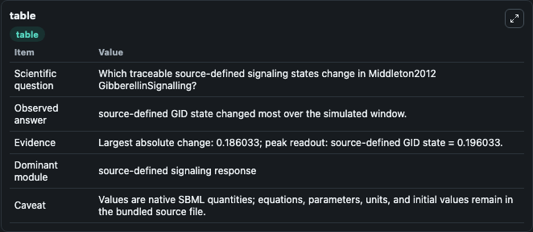
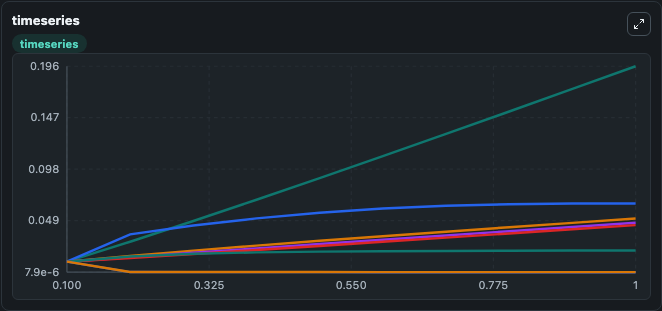
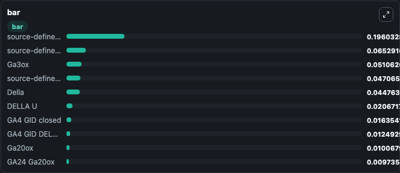

# Middleton2012_GibberellinSignalling

This Biosimulant lab wraps `Middleton2012_GibberellinSignalling` as a runnable signaling model with a companion visualization module.
Clean Biosimulant lab for systems signaling model: Middleton2012_GibberellinSignalling. It can be used to explore second-messenger and pathway-signaling dynamics and compare scenario outcomes across configurations.

## What You'll See

The lab asks: How does Middleton2012 GibberellinSignalling respond through its source-defined plant signaling states? It runs for 1.0 time units with a communication step of 0.1. The run uses the model defaults declared by the curated SBML wrapper. The generated visualizations focus on source-defined GA4 state, source-defined GID state, DELLA, DELLA U, GA12, and GA15, and related outputs, combining trajectory, endpoint-comparison, and summary-table views from one completed dark-mode run.

In this captured run, **source-defined GID state** moved from 0.0100 to 0.1960 across 1.0 simulation windows.

<!-- BIOSIMULANT_VISUALS_START -->
### Output Visualizations



*Summary table for Middleton2012_GibberellinSignalling, reporting the scientific question, observed answer, dominant module, and caveat.*



*Trajectories of source-defined GID state, source-defined GA4 state, Ga3ox, source-defined GID state, Della, and DELLA U across the 1.0 simulation. In this run **source-defined GID state** climbed from 0.0100 to 0.1960 and **GA15 Ga20ox** fell from 0.0100 to 7.86e-06 — the largest movements among the focused observables.*



*Largest-excursion ranking of the focused observables — the absolute movement magnitude during the run. Top 3: **source-defined GID state** = 0.1960, **source-defined GA4 state** = 0.0653, **Ga3ox** = 0.0511, with 7 more observables below.*

<!-- BIOSIMULANT_VISUALS_END -->

## Model Context

- Core model: `models/core`
- Visualization model: `models/visualisation`
- Standard: `other`
- Upstream source: `biomodels_ebi:BIOMD0000000422`
- License: `CC0`
- Visual scope: plant signaling response
- Caveat: Values are native SBML quantities; equations, parameters, units, and initial values remain in the bundled source file.

## Inputs

| Input | Maps To | Default | Notes |
|---|---|---|---|
| Initial DELLA Source | `signaling_sbml_middleton2012_gibberellinsignalling_biomd0000000422_model.initial_della_source` |  | Initial level of DELLA Source. Maps to SBML symbol `s7`; exposed as a traceable initial-condition perturbation. |
| Initial Della Source | `signaling_sbml_middleton2012_gibberellinsignalling_biomd0000000422_model.initial_della_source_2` |  | Initial level of Della Source. Maps to SBML symbol `s34`; exposed as a traceable initial-condition perturbation. |
| Initial GA12 Source | `signaling_sbml_middleton2012_gibberellinsignalling_biomd0000000422_model.initial_ga12_source` |  | Initial level of GA12 Source. Maps to SBML symbol `s3`; exposed as a traceable initial-condition perturbation. |

## Outputs

| Output | Maps To | Role |
|---|---|---|
| `source_defined_ga4_state` | `signaling_sbml_middleton2012_gibberellinsignalling_biomd0000000422_model.source_defined_ga4_state` | source-defined GA4 state. |
| `source_defined_gid_state` | `signaling_sbml_middleton2012_gibberellinsignalling_biomd0000000422_model.source_defined_gid_state` | source-defined GID state. |
| `della` | `signaling_sbml_middleton2012_gibberellinsignalling_biomd0000000422_model.della` | DELLA. |
| `state` | `signaling_sbml_middleton2012_gibberellinsignalling_biomd0000000422_model.state` | Available to the visualization model and downstream workflows. |
| `summary` | `signaling_sbml_middleton2012_gibberellinsignalling_biomd0000000422_model.summary` | Available to the visualization model and downstream workflows. |
| `species_labels` | `signaling_sbml_middleton2012_gibberellinsignalling_biomd0000000422_model.species_labels` | Available to the visualization model and downstream workflows. |

## Runtime

- Duration: `1.0`
- Communication step: `0.1`

## Running Locally

```bash
biosimulant labs serve .
```
