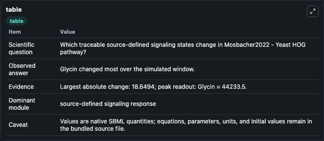
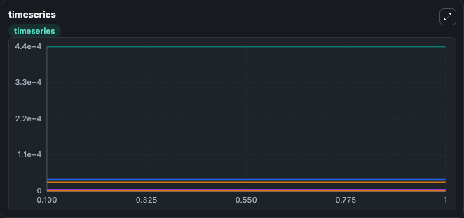
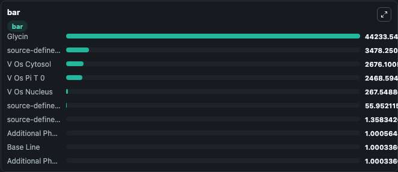

# Mosbacher2022 - Yeast HOG pathway

This Biosimulant lab wraps `Mosbacher2022 - Yeast HOG pathway` as a runnable signaling model with a companion visualization module.
Clean Biosimulant lab for systems signaling model: Mosbacher2022 - Yeast HOG pathway. It can be used to explore second-messenger and pathway-signaling dynamics and compare scenario outcomes across configurations.

## What You'll See

The lab asks: How does Mosbacher2022 - Yeast HOG pathway shift hormone-linked signaling readouts? It runs for 1.0 time units with a communication step of 0.1. The run uses the model defaults declared by the curated SBML wrapper. The generated visualizations focus on V Os Cytosol, V Os Nucleus, source-defined V_OS state, source-defined NACL state, V Os Pi T 0, and source-defined PI_T_0 state, and related outputs, combining trajectory, endpoint-comparison, and summary-table views from one completed dark-mode run.

In this captured run, **Glycin** moved from 4.42e+04 to 4.42e+04 across 1.0 simulation windows.

<!-- BIOSIMULANT_VISUALS_START -->
### Output Visualizations



*Summary table for Mosbacher2022 - Yeast HOG pathway, reporting the scientific question, observed answer, dominant module, and caveat.*



*Trajectories of Glycin, source-defined V_OS state, V Os Cytosol, V Os Nucleus, Ste11, and source-defined SLN1 state across the 1.0 simulation. In this run **Glycin** climbed from 4.42e+04 to 4.42e+04 and **source-defined V_OS state** fell from 3480.0 to 3478.3 — the largest movements among the focused observables.*



*Largest-excursion ranking of the focused observables — the absolute movement magnitude during the run. Top 3: **Glycin** = 4.42e+04, **source-defined V_OS state** = 3478.3, **V Os Cytosol** = 2676.1, with 7 more observables below.*

<!-- BIOSIMULANT_VISUALS_END -->

## Model Context

- Core model: `models/core`
- Visualization model: `models/visualisation`
- Standard: `other`
- Upstream source: `biomodels_ebi:MODEL2206230001`
- License: `CC0`
- Visual scope: metabolic and hormone signaling response
- Caveat: Values are native SBML quantities; equations, parameters, units, and initial values remain in the bundled source file.

## Inputs

| Input | Maps To | Default | Notes |
|---|---|---|---|
| Heximide Factor | `signaling_sbml_mosbacher2022_yeast_hog_pathway_model2206230001_model.initial_heximide_factor_level` |  | Heximide Factor source parameter. Maps to SBML symbol `heximide_factor` and preserves the bundled default. |
| Macia Factor | `signaling_sbml_mosbacher2022_yeast_hog_pathway_model2206230001_model.initial_macia_factor_level` |  | Macia Factor source parameter. Maps to SBML symbol `macia_factor` and preserves the bundled default. |
| Ptp2 Factor | `signaling_sbml_mosbacher2022_yeast_hog_pathway_model2206230001_model.initial_ptp2_factor_level` |  | Ptp2 Factor source parameter. Maps to SBML symbol `Ptp2_factor` and preserves the bundled default. |

## Outputs

| Output | Maps To | Role |
|---|---|---|
| `sln1_phosphorylated` | `signaling_sbml_mosbacher2022_yeast_hog_pathway_model2206230001_model.sln1_phosphorylated` | Sln1 Phosphorylated. |
| `sln1p_phosphorylated` | `signaling_sbml_mosbacher2022_yeast_hog_pathway_model2206230001_model.sln1p_phosphorylated` | Sln1p Phosphorylated. |
| `ssk1_phosphorylated` | `signaling_sbml_mosbacher2022_yeast_hog_pathway_model2206230001_model.ssk1_phosphorylated` | Ssk1 Phosphorylated. |
| `state` | `signaling_sbml_mosbacher2022_yeast_hog_pathway_model2206230001_model.state` | Available to the visualization model and downstream workflows. |
| `summary` | `signaling_sbml_mosbacher2022_yeast_hog_pathway_model2206230001_model.summary` | Available to the visualization model and downstream workflows. |
| `species_labels` | `signaling_sbml_mosbacher2022_yeast_hog_pathway_model2206230001_model.species_labels` | Available to the visualization model and downstream workflows. |

## Runtime

- Duration: `1.0`
- Communication step: `0.1`

## Running Locally

```bash
biosimulant labs serve .
```
