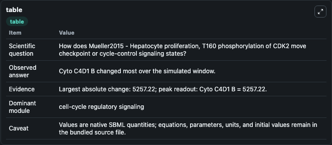
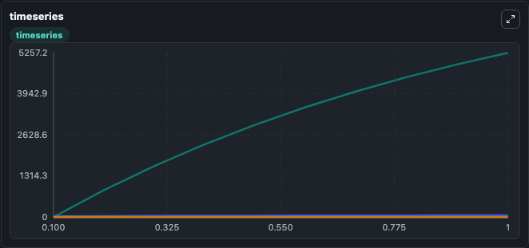
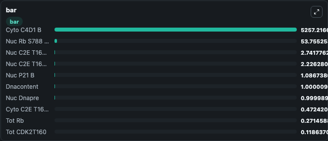

# Mueller2015 - Hepatocyte proliferation, T160 phosphorylation of CDK2

This Biosimulant lab wraps `Mueller2015 - Hepatocyte proliferation, T160 phosphorylation of CDK2` as a runnable signaling model with a companion visualization module.
Clean Biosimulant lab for cell-cycle regulatory signaling. It can be used to explore second-messenger and pathway-signaling dynamics and compare scenario outcomes across configurations.

## What You'll See

The lab asks: How does Mueller2015 - Hepatocyte proliferation, T160 phosphorylation of CDK2 move checkpoint or cycle-control signaling states? It runs for 1.0 time units with a communication step of 0.1. The run uses the model defaults declared by the curated SBML wrapper. The generated visualizations focus on Cyto C2E T160 U B, Cyto C4D1 B, Cyto P21 B, Cyto C4D1 B 1 P21 B 1, Cyto C2E T160 U B 1 P21 B 1, and source-defined HGF state, and related outputs, combining trajectory, endpoint-comparison, and summary-table views from one completed dark-mode run.

In this captured run, **Cyto C4D1 B** moved from 0 to 5257.2 across 1.0 simulation windows.

<!-- BIOSIMULANT_VISUALS_START -->
### Output Visualizations



*Summary table for Mueller2015 - Hepatocyte proliferation, T160 phosphorylation of CDK2, reporting the scientific question, observed answer, dominant module, and caveat.*



*Trajectories of Cyto C4D1 B, Nuc Rb S788 U S800 U B, Nuc C2E T160 U B 1 P21 B 1, Nuc C2E T160 P B 1 P21 B 1, Nuc P21 B, and Tot Rb across the 1.0 simulation. In this run **Cyto C4D1 B** climbed from 0 to 5257.2 and **Nuc C2E T160 U B 1 P21 B 1** fell from 6.222 to 2.742 — the largest movements among the focused observables.*



*Largest-excursion ranking of the focused observables — the absolute movement magnitude during the run. Top 3: **Cyto C4D1 B** = 5257.2, **Nuc Rb S788 U S800 U B** = 53.755, **Nuc C2E T160 U B 1 P21 B 1** = 2.742, with 7 more observables below.*

<!-- BIOSIMULANT_VISUALS_END -->

## Model Context

- Core model: `models/core`
- Visualization model: `models/visualisation`
- Standard: `other`
- Upstream source: `biomodels_ebi:BIOMD0000000568`
- License: `CC0`
- Visual scope: cell-cycle regulatory signaling
- Caveat: Values are native SBML quantities; equations, parameters, units, and initial values remain in the bundled source file.

## Inputs

| Input | Maps To | Default | Notes |
|---|---|---|---|
| Initial CDK2P21 | `signaling_sbml_mueller2015_hepatocyte_proliferation_t160_phosph_biomd0000000568_model.initial_cdk2p21` |  | Initial level of CDK2P21. Maps to SBML symbol `ObsCDK2P21_obs`; exposed as a traceable initial-condition perturbation. |
| Initial Dnacontent | `signaling_sbml_mueller2015_hepatocyte_proliferation_t160_phosph_biomd0000000568_model.initial_dnacontent` |  | Initial level of Dnacontent. Maps to SBML symbol `ObsDNAContent_obs`; exposed as a traceable initial-condition perturbation. |
| Initial source-defined HGF state | `signaling_sbml_mueller2015_hepatocyte_proliferation_t160_phosph_biomd0000000568_model.initial_source_defined_hgf_state` |  | Initial level of source-defined HGF state. Maps to SBML symbol `hgf`; exposed as a traceable initial-condition perturbation. |

## Outputs

| Output | Maps To | Role |
|---|---|---|
| `inh_erk` | `signaling_sbml_mueller2015_hepatocyte_proliferation_t160_phosph_biomd0000000568_model.inh_erk` | Inh ERK. |
| `inh_akt` | `signaling_sbml_mueller2015_hepatocyte_proliferation_t160_phosph_biomd0000000568_model.inh_akt` | Inh AKT. |
| `cyto_c2e_t160_u_b` | `signaling_sbml_mueller2015_hepatocyte_proliferation_t160_phosph_biomd0000000568_model.cyto_c2e_t160_u_b` | Cyto C2E T160 U B. |
| `state` | `signaling_sbml_mueller2015_hepatocyte_proliferation_t160_phosph_biomd0000000568_model.state` | Available to the visualization model and downstream workflows. |
| `summary` | `signaling_sbml_mueller2015_hepatocyte_proliferation_t160_phosph_biomd0000000568_model.summary` | Available to the visualization model and downstream workflows. |
| `species_labels` | `signaling_sbml_mueller2015_hepatocyte_proliferation_t160_phosph_biomd0000000568_model.species_labels` | Available to the visualization model and downstream workflows. |

## Runtime

- Duration: `1.0`
- Communication step: `0.1`

## Running Locally

```bash
biosimulant labs serve .
```
