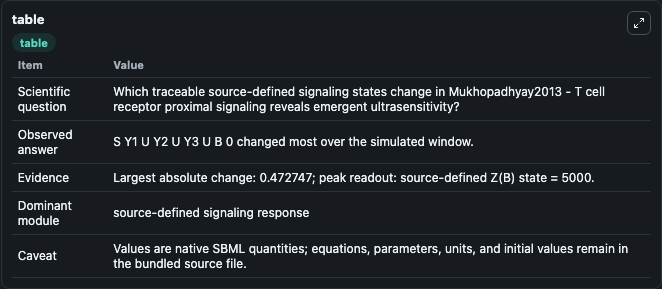
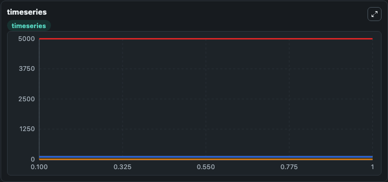
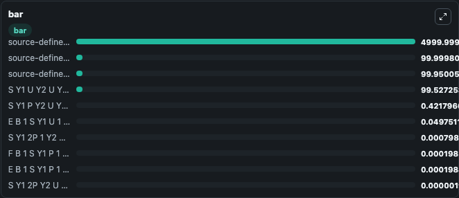

# Mukhopadhyay2013 - T cell receptor proximal signaling reveals emergent ultrasensitivity

This Biosimulant lab wraps `Mukhopadhyay2013 - T cell receptor proximal signaling reveals emergent ultrasensitivity` as a runnable signaling model with a companion visualization module.
Clean Biosimulant lab for immune signaling. It can be used to explore second-messenger and pathway-signaling dynamics and compare scenario outcomes across configurations.

## What You'll See

The lab asks: How does Mukhopadhyay2013 - T cell receptor proximal signaling reveals emergent ultrasensitivity propagate receptor or RAS/ERK pathway activity? It runs for 1.0 time units with a communication step of 0.1. The run uses the model defaults declared by the curated SBML wrapper. The generated visualizations focus on S Y1 U Y2 U Y3 U B 0, source-defined E(B) state, source-defined F(B) state, source-defined Z(B) state, E B 1 S Y1 U 1 Y2 U Y3 U B 1, and S Y1 P Y2 U Y3 U B 0, and related outputs, combining trajectory, endpoint-comparison, and summary-table views from one completed dark-mode run.

In this captured run, **S Y1 U Y2 U Y3 U B 0** moved from 100.0 to 99.527 across 1.0 simulation windows.

<!-- BIOSIMULANT_VISUALS_START -->
### Output Visualizations



*Summary table for Mukhopadhyay2013 - T cell receptor proximal signaling reveals emergent ultrasensitivity, reporting the scientific question, observed answer, dominant module, and caveat.*



*Trajectories of S Y1 U Y2 U Y3 U B 0, S Y1 P Y2 U Y3 U B 0, source-defined E(B) state, E B 1 S Y1 U 1 Y2 U Y3 U B 1, source-defined Z(B) state, and S Y1 2P 1 Y2 U Y3 U B 0 Z B 1 across the 1.0 simulation. In this run **S Y1 P Y2 U Y3 U B 0** climbed from 0 to 0.4218 and **S Y1 U Y2 U Y3 U B 0** fell from 100.0 to 99.527 — the largest movements among the focused observables.*



*Largest-excursion ranking of the focused observables — the absolute movement magnitude during the run. Top 3: **source-defined Z(B) state** = 5000.0, **source-defined F(B) state** = 100.000, **source-defined E(B) state** = 99.950, with 7 more observables below.*

<!-- BIOSIMULANT_VISUALS_END -->

## Model Context

- Core model: `models/core`
- Visualization model: `models/visualisation`
- Standard: `other`
- Upstream source: `biomodels_ebi:MODEL1604100000`
- License: `CC0`
- Visual scope: receptor-to-MAPK cascade signaling
- Caveat: Values are native SBML quantities; equations, parameters, units, and initial values remain in the bundled source file.

## Inputs

| Input | Maps To | Default | Notes |
|---|---|---|---|
| Initial S Y1 U Y2 U Y3 U B 0 | `signaling_sbml_mukhopadhyay2013_t_cell_receptor_proximal_signal_model1604100000_model.initial_s_y1_u_y2_u_y3_u_b_0` |  | Initial level of S Y1 U Y2 U Y3 U B 0. Maps to SBML symbol `S1`; exposed as a traceable initial-condition perturbation. |

## Outputs

| Output | Maps To | Role |
|---|---|---|
| `s_y1_u_y2_u_y3_u_b_0` | `signaling_sbml_mukhopadhyay2013_t_cell_receptor_proximal_signal_model1604100000_model.s_y1_u_y2_u_y3_u_b_0` | S Y1 U Y2 U Y3 U B 0. |
| `source_defined_e_b_state` | `signaling_sbml_mukhopadhyay2013_t_cell_receptor_proximal_signal_model1604100000_model.source_defined_e_b_state` | source-defined E(B) state. |
| `source_defined_f_b_state` | `signaling_sbml_mukhopadhyay2013_t_cell_receptor_proximal_signal_model1604100000_model.source_defined_f_b_state` | source-defined F(B) state. |
| `state` | `signaling_sbml_mukhopadhyay2013_t_cell_receptor_proximal_signal_model1604100000_model.state` | Available to the visualization model and downstream workflows. |
| `summary` | `signaling_sbml_mukhopadhyay2013_t_cell_receptor_proximal_signal_model1604100000_model.summary` | Available to the visualization model and downstream workflows. |
| `species_labels` | `signaling_sbml_mukhopadhyay2013_t_cell_receptor_proximal_signal_model1604100000_model.species_labels` | Available to the visualization model and downstream workflows. |

## Runtime

- Duration: `1.0`
- Communication step: `0.1`

## Running Locally

```bash
biosimulant labs serve .
```
