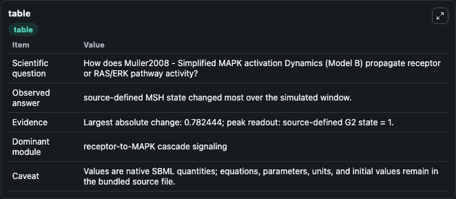
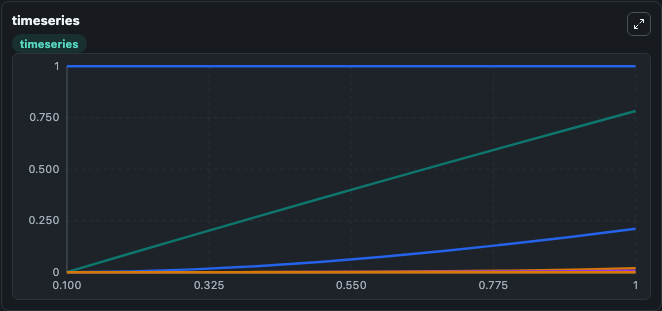
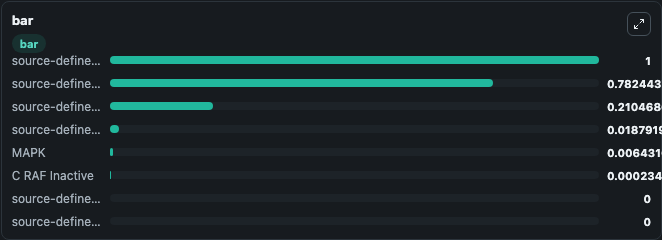

# Muller2008 - Simplified MAPK activation Dynamics (Model B)

This Biosimulant lab wraps `Muller2008 - Simplified MAPK activation Dynamics (Model B)` as a runnable signaling model with a companion visualization module.
Clean Biosimulant lab for MAPK/ERK receptor signaling. It can be used to explore second-messenger and pathway-signaling dynamics and compare scenario outcomes across configurations.

## What You'll See

The lab asks: How does Muller2008 - Simplified MAPK activation Dynamics (Model B) propagate receptor or RAS/ERK pathway activity? It runs for 1.0 time units with a communication step of 0.1. The run uses the model defaults declared by the curated SBML wrapper. The generated visualizations focus on source-defined FGFR state, source-defined MSH state, source-defined B-RAF state, MAPK, C RAF Inactive, and source-defined G2 state, and related outputs, combining trajectory, endpoint-comparison, and summary-table views from one completed dark-mode run.

In this captured run, **source-defined MSH state** moved from 0 to 0.7824 across 1.0 simulation windows.

<!-- BIOSIMULANT_VISUALS_START -->
### Output Visualizations



*Summary table for Muller2008 - Simplified MAPK activation Dynamics (Model B), reporting the scientific question, observed answer, dominant module, and caveat.*



*Trajectories of source-defined MSH state, source-defined B-RAF state, source-defined C-RAF state, MAPK, C RAF Inactive, and source-defined FGFR state across the 1.0 simulation. In this run **source-defined MSH state** climbed from 0 to 0.7824 — the largest movements among the focused observables.*



*Largest-excursion ranking of the focused observables — the absolute movement magnitude during the run. Top 3: **source-defined G2 state** = 1.000, **source-defined MSH state** = 0.7824, **source-defined B-RAF state** = 0.2105, with 5 more observables below.*

<!-- BIOSIMULANT_VISUALS_END -->

## Model Context

- Core model: `models/core`
- Visualization model: `models/visualisation`
- Standard: `other`
- Upstream source: `biomodels_ebi:BIOMD0000000664`
- License: `CC0`
- Visual scope: receptor-to-MAPK cascade signaling
- Caveat: Values are native SBML quantities; equations, parameters, units, and initial values remain in the bundled source file.

## Inputs

| Input | Maps To | Default | Notes |
|---|---|---|---|
| Initial source-defined G1 state | `signaling_sbml_muller2008_simplified_mapk_activation_dynamics_m_biomd0000000664_model.initial_source_defined_g1_state` |  | Initial level of source-defined G1 state. Maps to SBML symbol `g1_0`; exposed as a traceable initial-condition perturbation. |
| Initial source-defined G2 state | `signaling_sbml_muller2008_simplified_mapk_activation_dynamics_m_biomd0000000664_model.initial_source_defined_g2_state` |  | Initial level of source-defined G2 state. Maps to SBML symbol `g2_0`; exposed as a traceable initial-condition perturbation. |

## Outputs

| Output | Maps To | Role |
|---|---|---|
| `mapk` | `signaling_sbml_muller2008_simplified_mapk_activation_dynamics_m_biomd0000000664_model.mapk` | MAPK. |
| `c_raf_inactive` | `signaling_sbml_muller2008_simplified_mapk_activation_dynamics_m_biomd0000000664_model.c_raf_inactive` | C RAF Inactive. |
| `source_defined_fgfr_state` | `signaling_sbml_muller2008_simplified_mapk_activation_dynamics_m_biomd0000000664_model.source_defined_fgfr_state` | source-defined FGFR state. |
| `state` | `signaling_sbml_muller2008_simplified_mapk_activation_dynamics_m_biomd0000000664_model.state` | Available to the visualization model and downstream workflows. |
| `summary` | `signaling_sbml_muller2008_simplified_mapk_activation_dynamics_m_biomd0000000664_model.summary` | Available to the visualization model and downstream workflows. |
| `species_labels` | `signaling_sbml_muller2008_simplified_mapk_activation_dynamics_m_biomd0000000664_model.species_labels` | Available to the visualization model and downstream workflows. |

## Runtime

- Duration: `1.0`
- Communication step: `0.1`

## Running Locally

```bash
biosimulant labs serve .
```
