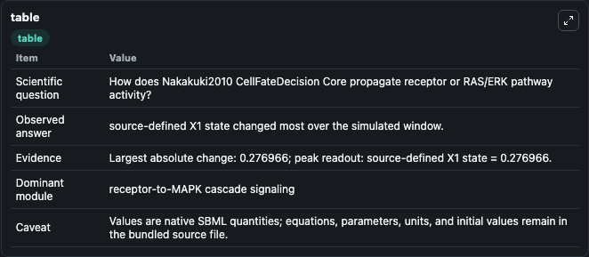
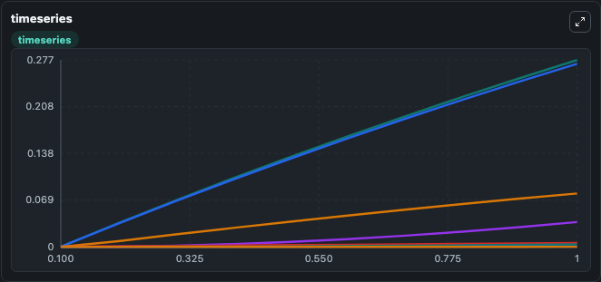
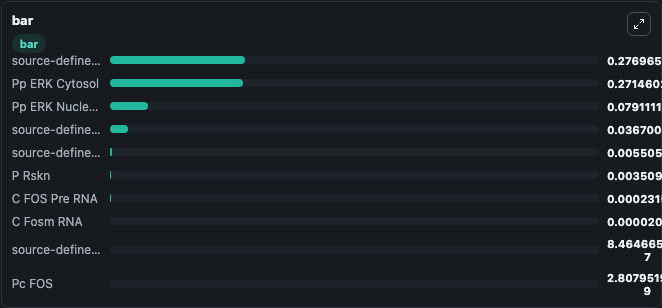

# Nakakuki2010_CellFateDecision_Core

This Biosimulant lab wraps `Nakakuki2010_CellFateDecision_Core` as a runnable signaling model with a companion visualization module.
Clean Biosimulant lab for MAPK/ERK receptor signaling. It can be used to explore second-messenger and pathway-signaling dynamics and compare scenario outcomes across configurations.

## What You'll See

The lab asks: How does Nakakuki2010 CellFateDecision Core propagate receptor or RAS/ERK pathway activity? It runs for 1.0 time units with a communication step of 0.1. The run uses the model defaults declared by the curated SBML wrapper. The generated visualizations focus on source-defined X1 state, source-defined X2 state, Pp ERK Nucleus, source-defined DUSP state, P Rskn, and C FOS Pre RNA, and related outputs, combining trajectory, endpoint-comparison, and summary-table views from one completed dark-mode run.

In this captured run, **source-defined X1 state** moved from 0 to 0.2770 across 1.0 simulation windows.

<!-- BIOSIMULANT_VISUALS_START -->
### Output Visualizations



*Summary table for Nakakuki2010_CellFateDecision_Core, reporting the scientific question, observed answer, dominant module, and caveat.*



*Trajectories of source-defined X1 state, Pp ERK Cytosol, Pp ERK Nucleus, source-defined DUSP state, source-defined X2 state, and P Rskn across the 1.0 simulation. In this run **source-defined X1 state** climbed from 0 to 0.2770 — the largest movements among the focused observables.*



*Largest-excursion ranking of the focused observables — the absolute movement magnitude during the run. Top 3: **source-defined X1 state** = 0.2770, **Pp ERK Cytosol** = 0.2715, **Pp ERK Nucleus** = 0.0791, with 7 more observables below.*

<!-- BIOSIMULANT_VISUALS_END -->

## Model Context

- Core model: `models/core`
- Visualization model: `models/visualisation`
- Standard: `other`
- Upstream source: `biomodels_ebi:BIOMD0000000251`
- License: `CC0`
- Visual scope: receptor-to-MAPK cascade signaling
- Caveat: Values are native SBML quantities; equations, parameters, units, and initial values remain in the bundled source file.

## Inputs

| Input | Maps To | Default | Notes |
|---|---|---|---|
| Initial Pp ERK Cytosol | `signaling_sbml_nakakuki2010_cellfatedecision_core_biomd0000000251_model.initial_pp_erk_cytosol` |  | Initial level of Pp ERK Cytosol. Maps to SBML symbol `ppERKc`; exposed as a traceable initial-condition perturbation. |

## Outputs

| Output | Maps To | Role |
|---|---|---|
| `pp_erk_nucleus` | `signaling_sbml_nakakuki2010_cellfatedecision_core_biomd0000000251_model.pp_erk_nucleus` | Pp ERK Nucleus. |
| `pp_erk_cytosol` | `signaling_sbml_nakakuki2010_cellfatedecision_core_biomd0000000251_model.pp_erk_cytosol` | Pp ERK Cytosol. |
| `source_defined_dusp_state` | `signaling_sbml_nakakuki2010_cellfatedecision_core_biomd0000000251_model.source_defined_dusp_state` | source-defined DUSP state. |
| `state` | `signaling_sbml_nakakuki2010_cellfatedecision_core_biomd0000000251_model.state` | Available to the visualization model and downstream workflows. |
| `summary` | `signaling_sbml_nakakuki2010_cellfatedecision_core_biomd0000000251_model.summary` | Available to the visualization model and downstream workflows. |
| `species_labels` | `signaling_sbml_nakakuki2010_cellfatedecision_core_biomd0000000251_model.species_labels` | Available to the visualization model and downstream workflows. |

## Runtime

- Duration: `1.0`
- Communication step: `0.1`

## Running Locally

```bash
biosimulant labs serve .
```
