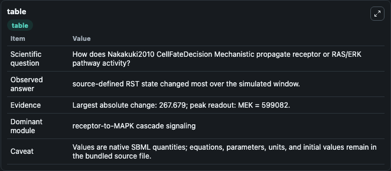
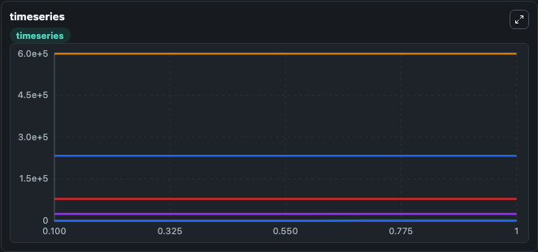
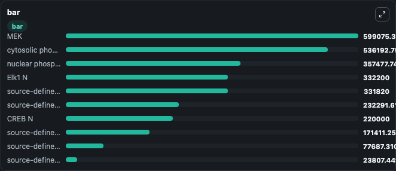

# Nakakuki2010_CellFateDecision_Mechanistic

This Biosimulant lab wraps `Nakakuki2010_CellFateDecision_Mechanistic` as a runnable signaling model with a companion visualization module.
Clean Biosimulant lab for MAPK/ERK receptor signaling. It can be used to explore second-messenger and pathway-signaling dynamics and compare scenario outcomes across configurations.

## What You'll See

The lab asks: How does Nakakuki2010 CellFateDecision Mechanistic propagate receptor or RAS/ERK pathway activity? It runs for 1.0 time units with a communication step of 0.1. The run uses the model defaults declared by the curated SBML wrapper. The generated visualizations focus on EGF, heregulin, source-defined A1 state, A1 2, source-defined A2 state, and A2 2, and related outputs, combining trajectory, endpoint-comparison, and summary-table views from one completed dark-mode run.

In this captured run, **source-defined RST state** moved from 0 to 267.7 across 1.0 simulation windows.

<!-- BIOSIMULANT_VISUALS_START -->
### Output Visualizations



*Summary table for Nakakuki2010_CellFateDecision_Mechanistic, reporting the scientific question, observed answer, dominant module, and caveat.*



*Trajectories of source-defined RST state, source-defined RSD state, A2 2, source-defined A2 state, source-defined KIN state, and source-defined KIN_2 state across the 1.0 simulation. In this run **source-defined RST state** climbed from 0 to 267.7 and **source-defined RSD state** fell from 2.33e+05 to 2.32e+05 — the largest movements among the focused observables.*



*Largest-excursion ranking of the focused observables — the absolute movement magnitude during the run. Top 3: **MEK** = 5.99e+05, **cytosolic phosphorylated ERK** = 5.36e+05, **nuclear phosphorylated ERK** = 3.57e+05, with 7 more observables below.*

<!-- BIOSIMULANT_VISUALS_END -->

## Model Context

- Core model: `models/core`
- Visualization model: `models/visualisation`
- Standard: `other`
- Upstream source: `biomodels_ebi:BIOMD0000000250`
- License: `CC0`
- Visual scope: receptor-to-MAPK cascade signaling
- Caveat: Values are native SBML quantities; equations, parameters, units, and initial values remain in the bundled source file.

## Inputs

| Input | Maps To | Default | Notes |
|---|---|---|---|
| Initial EGF | `signaling_sbml_nakakuki2010_cellfatedecision_mechanistic_biomd0000000250_model.initial_egf` |  | Initial level of EGF. Maps to SBML symbol `EGF`; exposed as a traceable initial-condition perturbation. |
| Initial heregulin | `signaling_sbml_nakakuki2010_cellfatedecision_mechanistic_biomd0000000250_model.initial_heregulin` |  | Initial level of heregulin. Maps to SBML symbol `HRG`; exposed as a traceable initial-condition perturbation. |

## Outputs

| Output | Maps To | Role |
|---|---|---|
| `cytosolic_phosphorylated_erk` | `signaling_sbml_nakakuki2010_cellfatedecision_mechanistic_biomd0000000250_model.cytosolic_phosphorylated_erk` | cytosolic phosphorylated ERK. |
| `p_erk_c` | `signaling_sbml_nakakuki2010_cellfatedecision_mechanistic_biomd0000000250_model.p_erk_c` | P ERK C. |
| `pp_erk_c` | `signaling_sbml_nakakuki2010_cellfatedecision_mechanistic_biomd0000000250_model.pp_erk_c` | Pp ERK C. |
| `state` | `signaling_sbml_nakakuki2010_cellfatedecision_mechanistic_biomd0000000250_model.state` | Available to the visualization model and downstream workflows. |
| `summary` | `signaling_sbml_nakakuki2010_cellfatedecision_mechanistic_biomd0000000250_model.summary` | Available to the visualization model and downstream workflows. |
| `species_labels` | `signaling_sbml_nakakuki2010_cellfatedecision_mechanistic_biomd0000000250_model.species_labels` | Available to the visualization model and downstream workflows. |

## Runtime

- Duration: `1.0`
- Communication step: `0.1`

## Running Locally

```bash
biosimulant labs serve .
```
