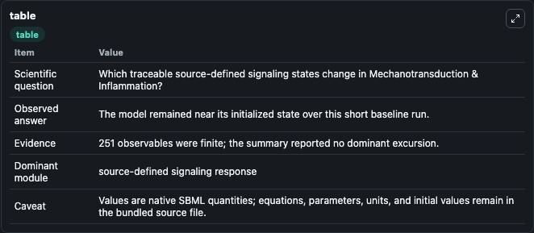
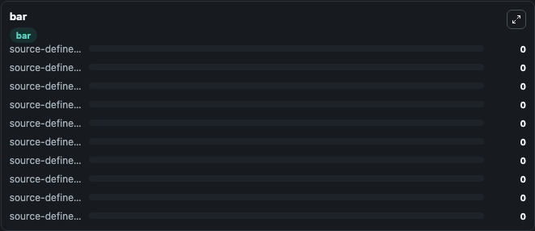

# Mechanotransduction & Inflammation

This Biosimulant lab wraps `Mechanotransduction & Inflammation` as a runnable signaling model with a companion visualization module.
Clean Biosimulant lab for immune signaling. It can be used to explore second-messenger and pathway-signaling dynamics and compare scenario outcomes across configurations.

## What You'll See

The lab asks: What baseline signaling response is generated by Mechanotransduction & Inflammation? It runs for 1.0 time units with a communication step of 0.1. The run uses the model defaults declared by the curated SBML wrapper. The generated visualizations focus on source-defined NFKB1 state, source-defined AAPK2 state, source-defined ACTB state, source-defined ACTN2 state, source-defined AGTR1 state, and source-defined AHR state, and related outputs, combining trajectory, endpoint-comparison, and summary-table views from one completed dark-mode run.

In this captured run, **source-defined NFKB1 state** moved from 0 to 0 across 1.0 simulation windows.

<!-- BIOSIMULANT_VISUALS_START -->
### Output Visualizations



*Summary table for Mechanotransduction & Inflammation, reporting the scientific question, observed answer, dominant module, and caveat.*


*Trajectories of source-defined NFKB1 state, source-defined AAPK2 state, source-defined ACTB state, source-defined ACTN2 state, source-defined AGTR1 state, and source-defined AHR state across the 1.0 simulation. In this run source-defined NFKB1 state, source-defined AAPK2 state, source-defined ACTB state, source-defined ACTN2 state stayed near their initial values — no observable moved appreciably.*



*Largest-excursion ranking of the focused observables — the absolute movement magnitude during the run. Top 3: **source-defined NFKB1 state** = 0, **source-defined AAPK2 state** = 0, **source-defined ACTB state** = 0, with 7 more observables below.*

<!-- BIOSIMULANT_VISUALS_END -->

## Model Context

- Core model: `models/core`
- Visualization model: `models/visualisation`
- Standard: `other`
- Upstream source: `biomodels_ebi:MODEL2406110001`
- License: `CC0`
- Visual scope: curated source-model signaling response
- Caveat: Values are native SBML quantities; equations, parameters, units, and initial values remain in the bundled source file.

## Inputs

| Input | Maps To | Default | Notes |
|---|---|---|---|
| Initial source-defined CA2+ state | `signaling_sbml_mechanotransduction_and_inflammation_model2406110001_model.initial_source_defined_calcium_state` |  | Initial level of source-defined CA2+ state. Maps to SBML symbol `s423`; exposed as a traceable initial-condition perturbation. |
| Initial source-defined CA2+ state | `signaling_sbml_mechanotransduction_and_inflammation_model2406110001_model.initial_source_defined_calcium_state_2` |  | Initial level of source-defined CA2+ state. Maps to SBML symbol `s425`; exposed as a traceable initial-condition perturbation. |
| Initial cAMP | `signaling_sbml_mechanotransduction_and_inflammation_model2406110001_model.initial_camp` |  | Initial level of cAMP. Maps to SBML symbol `s859`; exposed as a traceable initial-condition perturbation. |

## Outputs

| Output | Maps To | Role |
|---|---|---|
| `source_defined_nfkb1_state` | `signaling_sbml_mechanotransduction_and_inflammation_model2406110001_model.source_defined_nfkb1_state` | source-defined NFKB1 state. |
| `source_defined_akt1_state` | `signaling_sbml_mechanotransduction_and_inflammation_model2406110001_model.source_defined_akt1_state` | source-defined AKT1 state. |
| `arp2_3_complex` | `signaling_sbml_mechanotransduction_and_inflammation_model2406110001_model.arp2_3_complex` | ARP2 3 Complex. |
| `state` | `signaling_sbml_mechanotransduction_and_inflammation_model2406110001_model.state` | Available to the visualization model and downstream workflows. |
| `summary` | `signaling_sbml_mechanotransduction_and_inflammation_model2406110001_model.summary` | Available to the visualization model and downstream workflows. |
| `species_labels` | `signaling_sbml_mechanotransduction_and_inflammation_model2406110001_model.species_labels` | Available to the visualization model and downstream workflows. |

## Runtime

- Duration: `1.0`
- Communication step: `0.1`

## Running Locally

```bash
biosimulant labs serve .
```
