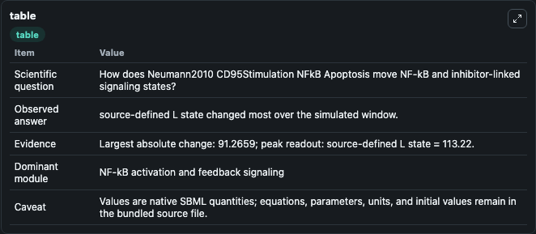
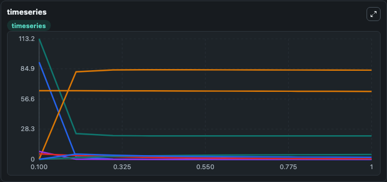
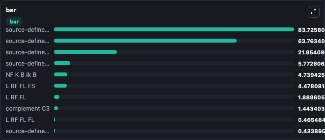

# Neumann2010_CD95Stimulation_NFkB_Apoptosis

This Biosimulant lab wraps `Neumann2010_CD95Stimulation_NFkB_Apoptosis` as a runnable signaling model with a companion visualization module.
Clean Biosimulant lab for NF-kB pathway signaling. It can be used to explore second-messenger and pathway-signaling dynamics and compare scenario outcomes across configurations.

## What You'll See

The lab asks: How does Neumann2010 CD95Stimulation NFkB Apoptosis move NF-kB and inhibitor-linked signaling states? It runs for 1.0 time units with a communication step of 0.1. The run uses the model defaults declared by the curated SBML wrapper. The generated visualizations focus on source-defined L state, source-defined L_RF state, source-defined L_RF_C8 state, L RF FL, L RF FS, and P43 P41, and related outputs, combining trajectory, endpoint-comparison, and summary-table views from one completed dark-mode run.

In this captured run, **source-defined L state** moved from 113.2 to 21.954 across 1.0 simulation windows.

<!-- BIOSIMULANT_VISUALS_START -->
### Output Visualizations



*Summary table for Neumann2010_CD95Stimulation_NFkB_Apoptosis, reporting the scientific question, observed answer, dominant module, and caveat.*



*Trajectories of source-defined L state, source-defined RF state, source-defined L:RF state, source-defined FL state, source-defined FS state, and L RF FL FS across the 1.0 simulation. In this run **source-defined L:RF state** climbed from 0 to 83.726 and **source-defined L state** fell from 113.2 to 21.954 — the largest movements among the focused observables.*



*Largest-excursion ranking of the focused observables — the absolute movement magnitude during the run. Top 3: **source-defined L:RF state** = 83.726, **source-defined C8 state** = 63.763, **source-defined L state** = 21.954, with 7 more observables below.*

<!-- BIOSIMULANT_VISUALS_END -->

## Model Context

- Core model: `models/core`
- Visualization model: `models/visualisation`
- Standard: `other`
- Upstream source: `biomodels_ebi:BIOMD0000000243`
- License: `CC0`
- Visual scope: NF-kB activation and feedback signaling
- Caveat: Values are native SBML quantities; equations, parameters, units, and initial values remain in the bundled source file.

## Inputs

| Input | Maps To | Default | Notes |
|---|---|---|---|
| Initial source-defined L state | `signaling_sbml_neumann2010_cd95stimulation_nfkb_apoptosis_biomd0000000243_model.initial_source_defined_l_state` |  | Initial level of source-defined L state. Maps to SBML symbol `L`; exposed as a traceable initial-condition perturbation. |

## Outputs

| Output | Maps To | Role |
|---|---|---|
| `nf_k_b_ik_b` | `signaling_sbml_neumann2010_cd95stimulation_nfkb_apoptosis_biomd0000000243_model.nf_k_b_ik_b` | NF K B Ik B. |
| `nf_k_b_ik_b_p` | `signaling_sbml_neumann2010_cd95stimulation_nfkb_apoptosis_biomd0000000243_model.nf_k_b_ik_b_p` | NF K B Ik B P. |
| `nfkb` | `signaling_sbml_neumann2010_cd95stimulation_nfkb_apoptosis_biomd0000000243_model.nfkb` | NF-kB. |
| `state` | `signaling_sbml_neumann2010_cd95stimulation_nfkb_apoptosis_biomd0000000243_model.state` | Available to the visualization model and downstream workflows. |
| `summary` | `signaling_sbml_neumann2010_cd95stimulation_nfkb_apoptosis_biomd0000000243_model.summary` | Available to the visualization model and downstream workflows. |
| `species_labels` | `signaling_sbml_neumann2010_cd95stimulation_nfkb_apoptosis_biomd0000000243_model.species_labels` | Available to the visualization model and downstream workflows. |

## Runtime

- Duration: `1.0`
- Communication step: `0.1`

## Running Locally

```bash
biosimulant labs serve .
```
