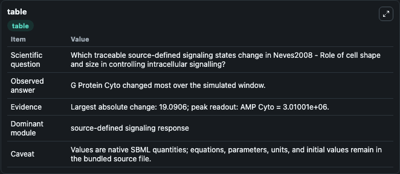
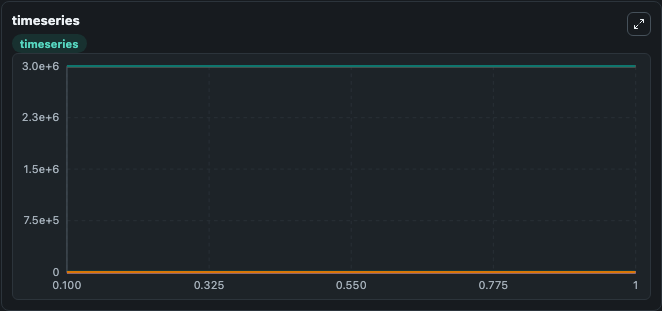
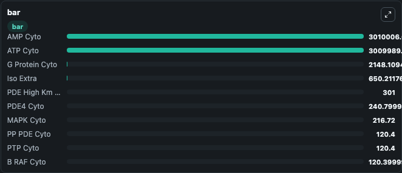

# Neves2008 - Role of cell shape and size in controlling intracellular signalling

This Biosimulant lab wraps `Neves2008 - Role of cell shape and size in controlling intracellular signalling` as a runnable signaling model with a companion visualization module.
Clean Biosimulant lab for systems signaling model: Neves2008 - Role of cell shape and size in controlling intracellular signalling. It can be used to explore second-messenger and pathway-signaling dynamics and compare scenario outcomes across configurations.

## What You'll See

The lab asks: How does Neves2008 - Role of cell shape and size in controlling intracellular signalling route receptor activity into cAMP/PKA-linked readouts? It runs for 1.0 time units with a communication step of 0.1. The run uses the model defaults declared by the curated SBML wrapper. The generated visualizations focus on AC active Cyto Mem, G GDP Cyto, G Protein Cyto, G A S Cyto, GRK Bg Cyto, and Iso BAR P Cyto Mem, and related outputs, combining trajectory, endpoint-comparison, and summary-table views from one completed dark-mode run.

In this captured run, **G Protein Cyto** moved from 2167.2 to 2148.1 across 1.0 simulation windows.

<!-- BIOSIMULANT_VISUALS_START -->
### Output Visualizations



*Summary table for Neves2008 - Role of cell shape and size in controlling intracellular signalling, reporting the scientific question, observed answer, dominant module, and caveat.*



*Trajectories of G Protein Cyto, BAR Cyto Mem, Iso Extra, Iso BAR G Cyto Mem, ATP Cyto, and AMP Cyto across the 1.0 simulation. In this run **Iso BAR G Cyto Mem** climbed from 0 to 18.611 and **G Protein Cyto** fell from 2167.2 to 2148.1 — the largest movements among the focused observables.*



*Largest-excursion ranking of the focused observables — the absolute movement magnitude during the run. Top 3: **AMP Cyto** = 3.01e+06, **ATP Cyto** = 3.01e+06, **G Protein Cyto** = 2148.1, with 7 more observables below.*

<!-- BIOSIMULANT_VISUALS_END -->

## Model Context

- Core model: `models/core`
- Visualization model: `models/visualisation`
- Standard: `other`
- Upstream source: `biomodels_ebi:BIOMD0000000182`
- License: `CC0`
- Visual scope: GPCR and cAMP/PKA signaling
- Caveat: Values are native SBML quantities; equations, parameters, units, and initial values remain in the bundled source file.

## Inputs

| Input | Maps To | Default | Notes |
|---|---|---|---|
| Initial C AMP Cyto | `signaling_sbml_neves2008_role_of_cell_shape_and_size_in_control_biomd0000000182_model.initial_c_amp_cyto` |  | Initial level of C AMP Cyto. Maps to SBML symbol `cAMP_cyto`; exposed as a traceable initial-condition perturbation. |

## Outputs

| Output | Maps To | Role |
|---|---|---|
| `ac_active_cyto_mem` | `signaling_sbml_neves2008_role_of_cell_shape_and_size_in_control_biomd0000000182_model.ac_active_cyto_mem` | AC active Cyto Mem. |
| `mapk_active_cyto` | `signaling_sbml_neves2008_role_of_cell_shape_and_size_in_control_biomd0000000182_model.mapk_active_cyto` | MAPK active Cyto. |
| `mek_active_cyto` | `signaling_sbml_neves2008_role_of_cell_shape_and_size_in_control_biomd0000000182_model.mek_active_cyto` | MEK active Cyto. |
| `state` | `signaling_sbml_neves2008_role_of_cell_shape_and_size_in_control_biomd0000000182_model.state` | Available to the visualization model and downstream workflows. |
| `summary` | `signaling_sbml_neves2008_role_of_cell_shape_and_size_in_control_biomd0000000182_model.summary` | Available to the visualization model and downstream workflows. |
| `species_labels` | `signaling_sbml_neves2008_role_of_cell_shape_and_size_in_control_biomd0000000182_model.species_labels` | Available to the visualization model and downstream workflows. |

## Runtime

- Duration: `1.0`
- Communication step: `0.1`

## Running Locally

```bash
biosimulant labs serve .
```
