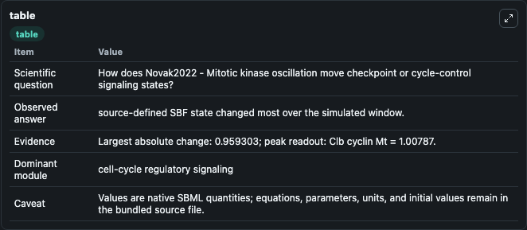
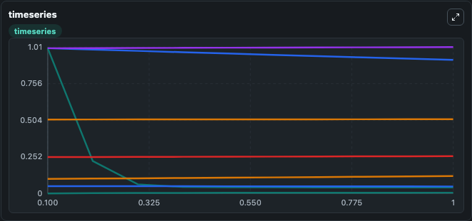
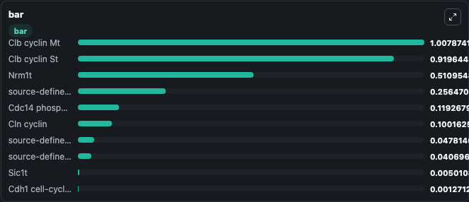

# Novak2022 - Mitotic kinase oscillation

This Biosimulant lab wraps `Novak2022 - Mitotic kinase oscillation` as a runnable signaling model with a companion visualization module.
Clean Biosimulant lab for cell-cycle regulatory signaling. It can be used to explore second-messenger and pathway-signaling dynamics and compare scenario outcomes across configurations.

## What You'll See

The lab asks: How does Novak2022 - Mitotic kinase oscillation move checkpoint or cycle-control signaling states? It runs for 1.0 time units with a communication step of 0.1. The run uses the model defaults declared by the curated SBML wrapper. The generated visualizations focus on Cln cyclin, Clb cyclin St, source-defined MBF state, Nrm1t, Clb cyclin Mt, and source-defined POLO state, and related outputs, combining trajectory, endpoint-comparison, and summary-table views from one completed dark-mode run.

In this captured run, **source-defined SBF state** moved from 1.0000 to 0.0407 across 1.0 simulation windows.

<!-- BIOSIMULANT_VISUALS_START -->
### Output Visualizations



*Summary table for Novak2022 - Mitotic kinase oscillation, reporting the scientific question, observed answer, dominant module, and caveat.*



*Trajectories of source-defined SBF state, Clb cyclin St, Cdc14 phosphatase, Clb cyclin Mt, source-defined POLO state, and Sic1t across the 1.0 simulation. In this run **Cdc14 phosphatase** climbed from 0.1000 to 0.1193 and **source-defined SBF state** fell from 1.0000 to 0.0407 — the largest movements among the focused observables.*



*Largest-excursion ranking of the focused observables — the absolute movement magnitude during the run. Top 3: **Clb cyclin Mt** = 1.008, **Clb cyclin St** = 0.9196, **Nrm1t** = 0.5110, with 7 more observables below.*

<!-- BIOSIMULANT_VISUALS_END -->

## Model Context

- Core model: `models/core`
- Visualization model: `models/visualisation`
- Standard: `other`
- Upstream source: `biomodels_ebi:BIOMD0000001058`
- License: `CC0`
- Visual scope: cell-cycle regulatory signaling
- Caveat: Values are native SBML quantities; equations, parameters, units, and initial values remain in the bundled source file.

## Inputs

| Input | Maps To | Default | Notes |
|---|---|---|---|
| Initial Cln cyclin | `signaling_sbml_novak2022_mitotic_kinase_oscillation_biomd0000001058_model.initial_cln_cyclin` |  | Initial level of Cln cyclin. Maps to SBML symbol `Cln`; exposed as a traceable initial-condition perturbation. |

## Outputs

| Output | Maps To | Role |
|---|---|---|
| `cln_cyclin` | `signaling_sbml_novak2022_mitotic_kinase_oscillation_biomd0000001058_model.cln_cyclin` | Cln cyclin. |
| `clb_cyclin_st` | `signaling_sbml_novak2022_mitotic_kinase_oscillation_biomd0000001058_model.clb_cyclin_st` | Clb cyclin St. |
| `source_defined_mbf_state` | `signaling_sbml_novak2022_mitotic_kinase_oscillation_biomd0000001058_model.source_defined_mbf_state` | source-defined MBF state. |
| `state` | `signaling_sbml_novak2022_mitotic_kinase_oscillation_biomd0000001058_model.state` | Available to the visualization model and downstream workflows. |
| `summary` | `signaling_sbml_novak2022_mitotic_kinase_oscillation_biomd0000001058_model.summary` | Available to the visualization model and downstream workflows. |
| `species_labels` | `signaling_sbml_novak2022_mitotic_kinase_oscillation_biomd0000001058_model.species_labels` | Available to the visualization model and downstream workflows. |

## Runtime

- Duration: `1.0`
- Communication step: `0.1`

## Running Locally

```bash
biosimulant labs serve .
```
