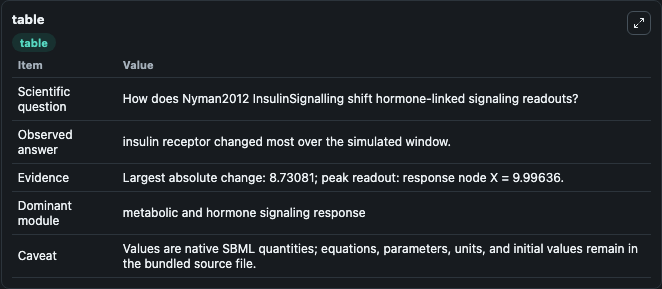
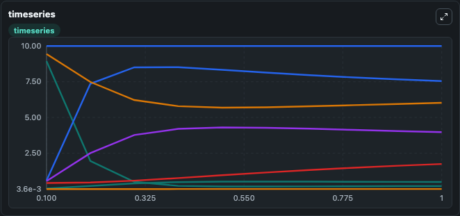
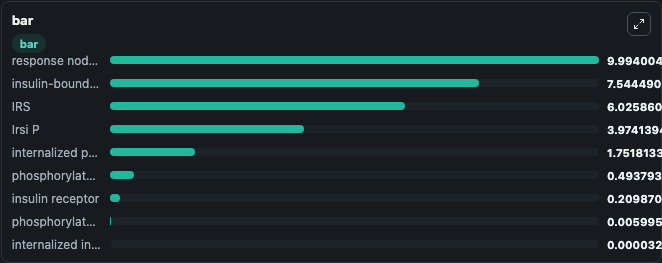

# Nyman2012_InsulinSignalling

This Biosimulant lab wraps `Nyman2012_InsulinSignalling` as a runnable signaling model with a companion visualization module.
Clean Biosimulant lab for metabolic and hormone-linked signaling. It can be used to explore second-messenger and pathway-signaling dynamics and compare scenario outcomes across configurations.

## What You'll See

The lab asks: How does Nyman2012 InsulinSignalling route receptor activity into cAMP/PKA-linked readouts? It runs for 1.0 time units with a communication step of 0.1. The run uses the model defaults declared by the curated SBML wrapper. The generated visualizations focus on insulin receptor, insulin-bound insulin receptor, phosphorylated insulin receptor, internalized phosphorylated insulin receptor, internalized insulin receptor, and IRS, and related outputs, combining trajectory, endpoint-comparison, and summary-table views from one completed dark-mode run.

In this captured run, **insulin receptor** moved from 8.941 to 0.2099 across 1.0 simulation windows.

<!-- BIOSIMULANT_VISUALS_START -->
### Output Visualizations



*Summary table for Nyman2012_InsulinSignalling, reporting the scientific question, observed answer, dominant module, and caveat.*



*Trajectories of insulin receptor, insulin-bound insulin receptor, IRS, Irsi P, internalized phosphorylated insulin receptor, and phosphorylated insulin receptor across the 1.0 simulation. In this run **insulin-bound insulin receptor** climbed from 0.5969 to 7.544 and **insulin receptor** fell from 8.941 to 0.2099 — the largest movements among the focused observables.*



*Largest-excursion ranking of the focused observables — the absolute movement magnitude during the run. Top 3: **response node X** = 9.994, **insulin-bound insulin receptor** = 7.544, **IRS** = 6.026, with 6 more observables below.*

<!-- BIOSIMULANT_VISUALS_END -->

## Model Context

- Core model: `models/core`
- Visualization model: `models/visualisation`
- Standard: `other`
- Upstream source: `biomodels_ebi:BIOMD0000000423`
- License: `CC0`
- Visual scope: GPCR and cAMP/PKA signaling
- Caveat: Values are native SBML quantities; equations, parameters, units, and initial values remain in the bundled source file.

## Inputs

| Input | Maps To | Default | Notes |
|---|---|---|---|
| K1a Basic | `signaling_sbml_nyman2012_insulinsignalling_biomd0000000423_model.initial_k1a_basic_level` |  | K1a Basic source parameter. Maps to SBML symbol `k1aBasic` and preserves the bundled default. |

## Outputs

| Output | Maps To | Role |
|---|---|---|
| `insulin_bound_insulin_receptor` | `signaling_sbml_nyman2012_insulinsignalling_biomd0000000423_model.insulin_bound_insulin_receptor` | insulin-bound insulin receptor. |
| `phosphorylated_insulin_receptor` | `signaling_sbml_nyman2012_insulinsignalling_biomd0000000423_model.phosphorylated_insulin_receptor` | phosphorylated insulin receptor. |
| `internalized_phosphorylated_insulin_receptor` | `signaling_sbml_nyman2012_insulinsignalling_biomd0000000423_model.internalized_phosphorylated_insulin_receptor` | internalized phosphorylated insulin receptor. |
| `state` | `signaling_sbml_nyman2012_insulinsignalling_biomd0000000423_model.state` | Available to the visualization model and downstream workflows. |
| `summary` | `signaling_sbml_nyman2012_insulinsignalling_biomd0000000423_model.summary` | Available to the visualization model and downstream workflows. |
| `species_labels` | `signaling_sbml_nyman2012_insulinsignalling_biomd0000000423_model.species_labels` | Available to the visualization model and downstream workflows. |

## Runtime

- Duration: `1.0`
- Communication step: `0.1`

## Running Locally

```bash
biosimulant labs serve .
```
