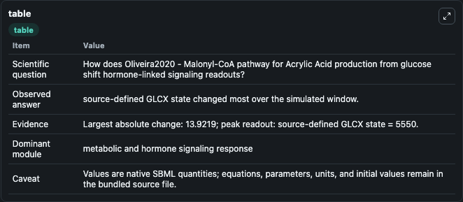
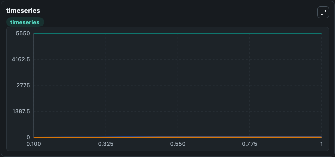
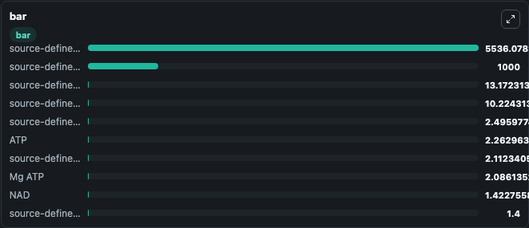

# Oliveira2020 - Malonyl-CoA pathway for Acrylic Acid production from glucose

This Biosimulant lab wraps `Oliveira2020 - Malonyl-CoA pathway for Acrylic Acid production from glucose` as a runnable signaling model with a companion visualization module.
Clean Biosimulant lab for metabolic and hormone-linked signaling. It can be used to explore second-messenger and pathway-signaling dynamics and compare scenario outcomes across configurations.

## What You'll See

The lab asks: How does Oliveira2020 - Malonyl-CoA pathway for Acrylic Acid production from glucose shift hormone-linked signaling readouts? It runs for 1.0 time units with a communication step of 0.1. The run uses the model defaults declared by the curated SBML wrapper. The generated visualizations focus on ACCOA, source-defined ACO state, source-defined ACP state, source-defined AKG state, source-defined BPG state, and source-defined CIT state, and related outputs, combining trajectory, endpoint-comparison, and summary-table views from one completed dark-mode run.

In this captured run, **source-defined GLCX state** moved from 5550.0 to 5536.1 across 1.0 simulation windows.

<!-- BIOSIMULANT_VISUALS_START -->
### Output Visualizations



*Summary table for Oliveira2020 - Malonyl-CoA pathway for Acrylic Acid production from glucose, reporting the scientific question, observed answer, dominant module, and caveat.*



*Trajectories of source-defined GLCX state, source-defined GLCP state, source-defined BAX state, aspartate ligand, source-defined GLYX state, and source-defined GLY state across the 1.0 simulation. In this run **source-defined GLCP state** climbed from 0.00101 to 13.172 and **source-defined GLCX state** fell from 5550.0 to 5536.1 — the largest movements among the focused observables.*



*Largest-excursion ranking of the focused observables — the absolute movement magnitude during the run. Top 3: **source-defined GLCX state** = 5536.1, **source-defined PX state** = 1000.0, **source-defined GLCP state** = 13.172, with 7 more observables below.*

<!-- BIOSIMULANT_VISUALS_END -->

## Model Context

- Core model: `models/core`
- Visualization model: `models/visualisation`
- Standard: `other`
- Upstream source: `biomodels_ebi:MODEL2010040006`
- License: `CC0`
- Visual scope: metabolic and hormone signaling response
- Caveat: Values are native SBML quantities; equations, parameters, units, and initial values remain in the bundled source file.

## Inputs

| Input | Maps To | Default | Notes |
|---|---|---|---|
| Initial coenzyme A | `signaling_sbml_oliveira2020_malonyl_coa_pathway_for_acrylic_aci_model2010040006_model.initial_coenzyme_a` |  | Initial level of coenzyme A. Maps to SBML symbol `COA`; exposed as a traceable initial-condition perturbation. |
| Initial cysteine | `signaling_sbml_oliveira2020_malonyl_coa_pathway_for_acrylic_aci_model2010040006_model.initial_cysteine` |  | Initial level of cysteine. Maps to SBML symbol `CYS`; exposed as a traceable initial-condition perturbation. |
| Initial H2O | `signaling_sbml_oliveira2020_malonyl_coa_pathway_for_acrylic_aci_model2010040006_model.initial_h2o` |  | Initial level of H2O. Maps to SBML symbol `H2O`; exposed as a traceable initial-condition perturbation. |

## Outputs

| Output | Maps To | Role |
|---|---|---|
| `camp` | `signaling_sbml_oliveira2020_malonyl_coa_pathway_for_acrylic_aci_model2010040006_model.camp` | cAMP. |
| `accoa` | `signaling_sbml_oliveira2020_malonyl_coa_pathway_for_acrylic_aci_model2010040006_model.accoa` | ACCOA. |
| `source_defined_aco_state` | `signaling_sbml_oliveira2020_malonyl_coa_pathway_for_acrylic_aci_model2010040006_model.source_defined_aco_state` | source-defined ACO state. |
| `state` | `signaling_sbml_oliveira2020_malonyl_coa_pathway_for_acrylic_aci_model2010040006_model.state` | Available to the visualization model and downstream workflows. |
| `summary` | `signaling_sbml_oliveira2020_malonyl_coa_pathway_for_acrylic_aci_model2010040006_model.summary` | Available to the visualization model and downstream workflows. |
| `species_labels` | `signaling_sbml_oliveira2020_malonyl_coa_pathway_for_acrylic_aci_model2010040006_model.species_labels` | Available to the visualization model and downstream workflows. |

## Runtime

- Duration: `1.0`
- Communication step: `0.1`

## Running Locally

```bash
biosimulant labs serve .
```
