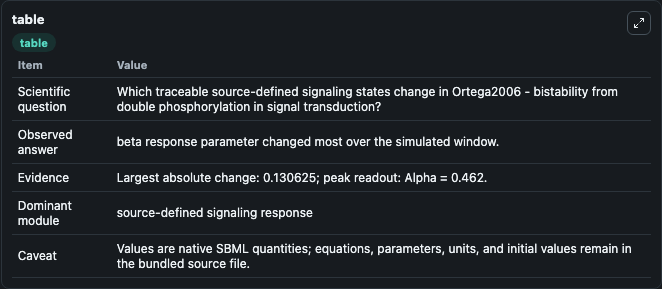
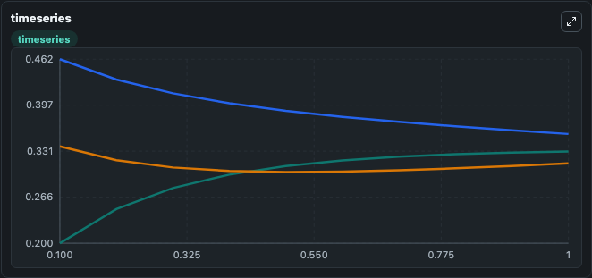
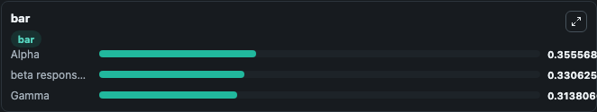

# Ortega2006 - bistability from double phosphorylation in signal transduction

This Biosimulant lab wraps `Ortega2006 - bistability from double phosphorylation in signal transduction` as a runnable signaling model with a companion visualization module.
Clean Biosimulant lab for systems signaling model: Ortega2006 - bistability from double phosphorylation in signal transduction. It can be used to explore second-messenger and pathway-signaling dynamics and compare scenario outcomes across configurations.

## What You'll See

The lab asks: How does Ortega2006 - bistability from double phosphorylation in signal transduction express its source-modeled signaling motif over the baseline run? It runs for 1.0 time units with a communication step of 0.1. The run uses the model defaults declared by the curated SBML wrapper. The generated visualizations focus on Alpha, beta response parameter, and Gamma, combining trajectory, endpoint-comparison, and summary-table views from one completed dark-mode run.

In this captured run, **beta response parameter** moved from 0.2000 to 0.3306 across 1.0 simulation windows.

<!-- BIOSIMULANT_VISUALS_START -->
### Output Visualizations



*Summary table for Ortega2006 - bistability from double phosphorylation in signal transduction, reporting the scientific question, observed answer, dominant module, and caveat.*



*Trajectories of beta response parameter, Alpha, and Gamma across the 1.0 simulation. In this run **beta response parameter** climbed from 0.2000 to 0.3306 and **Alpha** fell from 0.4620 to 0.3556 — the largest movements among the focused observables.*



*Largest-excursion ranking of the focused observables — the absolute movement magnitude during the run. Top 3: **Alpha** = 0.3556, **beta response parameter** = 0.3306, **Gamma** = 0.3138.*

<!-- BIOSIMULANT_VISUALS_END -->

## Model Context

- Core model: `models/core`
- Visualization model: `models/visualisation`
- Standard: `other`
- Upstream source: `biomodels_ebi:BIOMD0000000258`
- License: `CC0`
- Visual scope: phosphorylation and regulatory motif dynamics
- Caveat: Values are native SBML quantities; equations, parameters, units, and initial values remain in the bundled source file.

## Inputs

| Input | Maps To | Default | Notes |
|---|---|---|---|
| Initial Alpha | `signaling_sbml_ortega2006_bistability_from_double_phosphorylati_biomd0000000258_model.initial_alpha` |  | Initial level of Alpha. Maps to SBML symbol `alpha`; exposed as a traceable initial-condition perturbation. |

## Outputs

| Output | Maps To | Role |
|---|---|---|
| `alpha` | `signaling_sbml_ortega2006_bistability_from_double_phosphorylati_biomd0000000258_model.alpha` | Alpha. |
| `beta_response_parameter` | `signaling_sbml_ortega2006_bistability_from_double_phosphorylati_biomd0000000258_model.beta_response_parameter` | beta response parameter. |
| `gamma` | `signaling_sbml_ortega2006_bistability_from_double_phosphorylati_biomd0000000258_model.gamma` | Gamma. |
| `state` | `signaling_sbml_ortega2006_bistability_from_double_phosphorylati_biomd0000000258_model.state` | Available to the visualization model and downstream workflows. |
| `summary` | `signaling_sbml_ortega2006_bistability_from_double_phosphorylati_biomd0000000258_model.summary` | Available to the visualization model and downstream workflows. |
| `species_labels` | `signaling_sbml_ortega2006_bistability_from_double_phosphorylati_biomd0000000258_model.species_labels` | Available to the visualization model and downstream workflows. |

## Runtime

- Duration: `1.0`
- Communication step: `0.1`

## Running Locally

```bash
biosimulant labs serve .
```
