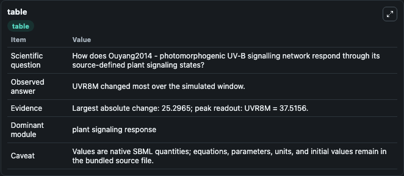
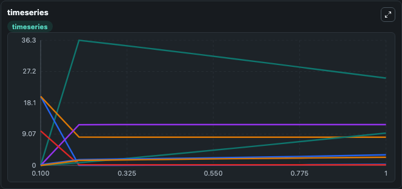
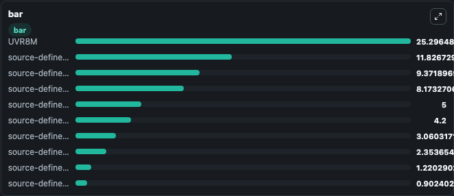

# Ouyang2014 - photomorphogenic UV-B signalling network

This Biosimulant lab wraps `Ouyang2014 - photomorphogenic UV-B signalling network` as a runnable signaling model with a companion visualization module.
Clean Biosimulant lab for systems signaling model: Ouyang2014 - photomorphogenic UV-B signalling network. It can be used to explore second-messenger and pathway-signaling dynamics and compare scenario outcomes across configurations.

## What You'll See

The lab asks: How does Ouyang2014 - photomorphogenic UV-B signalling network respond through its source-defined plant signaling states? It runs for 1.0 time units with a communication step of 0.1. The run uses the model defaults declared by the curated SBML wrapper. The generated visualizations focus on source-defined CS state, source-defined CD state, source-defined CDCS state, UVR8M, source-defined UCS state, and UVR8D, and related outputs, combining trajectory, endpoint-comparison, and summary-table views from one completed dark-mode run.

In this captured run, **UVR8M** moved from 0 to 25.296 across 1.0 simulation windows.

<!-- BIOSIMULANT_VISUALS_START -->
### Output Visualizations



*Summary table for Ouyang2014 - photomorphogenic UV-B signalling network, reporting the scientific question, observed answer, dominant module, and caveat.*



*Trajectories of UVR8M, UVR8D, source-defined DWD state, source-defined CDW state, source-defined CD state, and source-defined UR state across the 1.0 simulation. In this run **UVR8M** climbed from 0 to 25.296 and **UVR8D** fell from 20.000 to 0.3122 — the largest movements among the focused observables.*



*Largest-excursion ranking of the focused observables — the absolute movement magnitude during the run. Top 3: **UVR8M** = 25.296, **source-defined CDW state** = 11.827, **source-defined UR state** = 9.372, with 7 more observables below.*

<!-- BIOSIMULANT_VISUALS_END -->

## Model Context

- Core model: `models/core`
- Visualization model: `models/visualisation`
- Standard: `other`
- Upstream source: `biomodels_ebi:BIOMD0000000545`
- License: `CC0`
- Visual scope: plant signaling response
- Caveat: Values are native SBML quantities; equations, parameters, units, and initial values remain in the bundled source file.

## Inputs

| Input | Maps To | Default | Notes |
|---|---|---|---|
| source-defined UV state | `signaling_sbml_ouyang2014_photomorphogenic_uv_b_signalling_netw_biomd0000000545_model.initial_source_defined_uv_state_level` |  | source-defined UV state source parameter. Maps to SBML symbol `UV` and preserves the bundled default. |
| Initial UVR8 M | `signaling_sbml_ouyang2014_photomorphogenic_uv_b_signalling_netw_biomd0000000545_model.initial_uvr8_m` |  | Initial level of UVR8 M. Maps to SBML symbol `UVR8_M`; exposed as a traceable initial-condition perturbation. |
| Initial UVR8D | `signaling_sbml_ouyang2014_photomorphogenic_uv_b_signalling_netw_biomd0000000545_model.initial_uvr8d` |  | Initial level of UVR8D. Maps to SBML symbol `UVR8D`; exposed as a traceable initial-condition perturbation. |

## Outputs

| Output | Maps To | Role |
|---|---|---|
| `source_defined_cdcs_state` | `signaling_sbml_ouyang2014_photomorphogenic_uv_b_signalling_netw_biomd0000000545_model.source_defined_cdcs_state` | source-defined CDCS state. |
| `uvr8m` | `signaling_sbml_ouyang2014_photomorphogenic_uv_b_signalling_netw_biomd0000000545_model.uvr8m` | UVR8M. |
| `source_defined_ucs_state` | `signaling_sbml_ouyang2014_photomorphogenic_uv_b_signalling_netw_biomd0000000545_model.source_defined_ucs_state` | source-defined UCS state. |
| `state` | `signaling_sbml_ouyang2014_photomorphogenic_uv_b_signalling_netw_biomd0000000545_model.state` | Available to the visualization model and downstream workflows. |
| `summary` | `signaling_sbml_ouyang2014_photomorphogenic_uv_b_signalling_netw_biomd0000000545_model.summary` | Available to the visualization model and downstream workflows. |
| `species_labels` | `signaling_sbml_ouyang2014_photomorphogenic_uv_b_signalling_netw_biomd0000000545_model.species_labels` | Available to the visualization model and downstream workflows. |

## Runtime

- Duration: `1.0`
- Communication step: `0.1`

## Running Locally

```bash
biosimulant labs serve .
```
