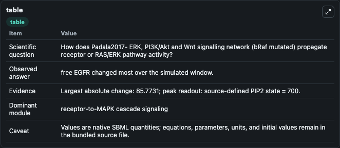
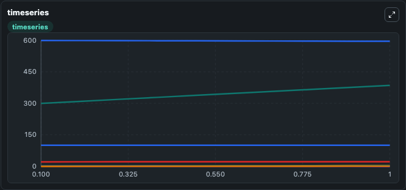
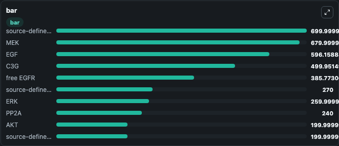

# Padala2017- ERK, PI3K/Akt and Wnt signalling network (bRaf mutated)

This Biosimulant lab wraps `Padala2017- ERK, PI3K/Akt and Wnt signalling network (bRaf mutated)` as a runnable signaling model with a companion visualization module.
Clean Biosimulant lab for MAPK/ERK receptor signaling. It can be used to explore second-messenger and pathway-signaling dynamics and compare scenario outcomes across configurations.

## What You'll See

The lab asks: How does Padala2017- ERK, PI3K/Akt and Wnt signalling network (bRaf mutated) propagate receptor or RAS/ERK pathway activity? It runs for 1.0 time units with a communication step of 0.1. The run uses the model defaults declared by the curated SBML wrapper. The generated visualizations focus on source-defined APC state, APC Axin, APC Axin Gsk3b, APC B Catenin, AKT, and source-defined AXIN state, and related outputs, combining trajectory, endpoint-comparison, and summary-table views from one completed dark-mode run.

In this captured run, **free EGFR** moved from 300.0 to 385.8 across 1.0 simulation windows.

<!-- BIOSIMULANT_VISUALS_START -->
### Output Visualizations



*Summary table for Padala2017- ERK, PI3K/Akt and Wnt signalling network (bRaf mutated), reporting the scientific question, observed answer, dominant module, and caveat.*



*Trajectories of free EGFR, EGF, bound EGFR, P RKIP, source-defined RKIP state, and source-defined NULL state across the 1.0 simulation. In this run **free EGFR** climbed from 300.0 to 385.8 and **EGF** fell from 600.0 to 596.2 — the largest movements among the focused observables.*



*Largest-excursion ranking of the focused observables — the absolute movement magnitude during the run. Top 3: **source-defined PIP2 state** = 700.0, **MEK** = 680.0, **EGF** = 596.2, with 7 more observables below.*

<!-- BIOSIMULANT_VISUALS_END -->

## Model Context

- Core model: `models/core`
- Visualization model: `models/visualisation`
- Standard: `other`
- Upstream source: `biomodels_ebi:BIOMD0000000653`
- License: `CC0`
- Visual scope: receptor-to-MAPK cascade signaling
- Caveat: Values are native SBML quantities; equations, parameters, units, and initial values remain in the bundled source file.

## Inputs

| Input | Maps To | Default | Notes |
|---|---|---|---|
| Initial P EGFR | `signaling_sbml_padala2017_erk_pi3k_akt_and_wnt_signalling_netwo_biomd0000000653_model.initial_p_egfr` |  | Initial level of P EGFR. Maps to SBML symbol `pEGFR`; exposed as a traceable initial-condition perturbation. |
| Initial bound EGFR | `signaling_sbml_padala2017_erk_pi3k_akt_and_wnt_signalling_netwo_biomd0000000653_model.initial_bound_egfr` |  | Initial level of bound EGFR. Maps to SBML symbol `bEGFR`; exposed as a traceable initial-condition perturbation. |
| Initial EGF | `signaling_sbml_padala2017_erk_pi3k_akt_and_wnt_signalling_netwo_biomd0000000653_model.initial_egf` |  | Initial level of EGF. Maps to SBML symbol `EGF`; exposed as a traceable initial-condition perturbation. |

## Outputs

| Output | Maps To | Role |
|---|---|---|
| `apc_axin` | `signaling_sbml_padala2017_erk_pi3k_akt_and_wnt_signalling_netwo_biomd0000000653_model.apc_axin` | APC Axin. |
| `apc_axin_gsk3b` | `signaling_sbml_padala2017_erk_pi3k_akt_and_wnt_signalling_netwo_biomd0000000653_model.apc_axin_gsk3b` | APC Axin Gsk3b. |
| `apc_b_catenin` | `signaling_sbml_padala2017_erk_pi3k_akt_and_wnt_signalling_netwo_biomd0000000653_model.apc_b_catenin` | APC B Catenin. |
| `state` | `signaling_sbml_padala2017_erk_pi3k_akt_and_wnt_signalling_netwo_biomd0000000653_model.state` | Available to the visualization model and downstream workflows. |
| `summary` | `signaling_sbml_padala2017_erk_pi3k_akt_and_wnt_signalling_netwo_biomd0000000653_model.summary` | Available to the visualization model and downstream workflows. |
| `species_labels` | `signaling_sbml_padala2017_erk_pi3k_akt_and_wnt_signalling_netwo_biomd0000000653_model.species_labels` | Available to the visualization model and downstream workflows. |

## Runtime

- Duration: `1.0`
- Communication step: `0.1`

## Running Locally

```bash
biosimulant labs serve .
```
