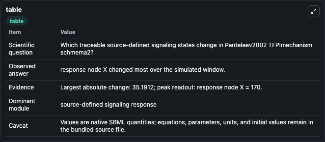
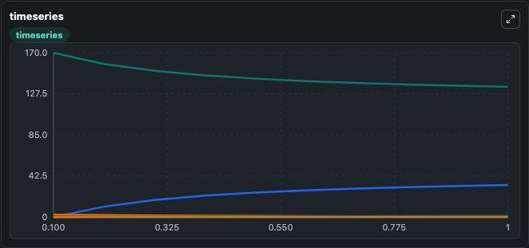
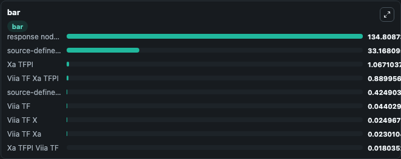

# Panteleev2002_TFPImechanism_schmema2

This Biosimulant lab wraps `Panteleev2002_TFPImechanism_schmema2` as a runnable signaling model with a companion visualization module.
Clean Biosimulant lab for systems signaling model: Panteleev2002_TFPImechanism_schmema2. It can be used to explore second-messenger and pathway-signaling dynamics and compare scenario outcomes across configurations.

## What You'll See

The lab asks: How does Panteleev2002 TFPImechanism schmema2 redistribute cascade activity across source-defined species? It runs for 1.0 time units with a communication step of 0.1. The run uses the model defaults declared by the curated SBML wrapper. The generated visualizations focus on Viia TF, response node X, Viia TF X, Viia TF Xa, source-defined XA state, and source-defined TFPI state, and related outputs, combining trajectory, endpoint-comparison, and summary-table views from one completed dark-mode run.

In this captured run, **response node X** moved from 170.0 to 134.8 across 1.0 simulation windows.

<!-- BIOSIMULANT_VISUALS_START -->
### Output Visualizations



*Summary table for Panteleev2002_TFPImechanism_schmema2, reporting the scientific question, observed answer, dominant module, and caveat.*



*Trajectories of response node X, source-defined XA state, source-defined TFPI state, Xa TFPI, Viia TF, and Viia TF Xa TFPI across the 1.0 simulation. In this run **source-defined XA state** climbed from 0 to 33.168 and **response node X** fell from 170.0 to 134.8 — the largest movements among the focused observables.*



*Largest-excursion ranking of the focused observables — the absolute movement magnitude during the run. Top 3: **response node X** = 134.8, **source-defined XA state** = 33.168, **Xa TFPI** = 1.067, with 6 more observables below.*

<!-- BIOSIMULANT_VISUALS_END -->

## Model Context

- Core model: `models/core`
- Visualization model: `models/visualisation`
- Standard: `other`
- Upstream source: `biomodels_ebi:BIOMD0000000360`
- License: `CC0`
- Visual scope: blood and immune cascade signaling
- Caveat: Values are native SBML quantities; equations, parameters, units, and initial values remain in the bundled source file.

## Inputs

| Input | Maps To | Default | Notes |
|---|---|---|---|
| Initial Viia TF | `signaling_sbml_panteleev2002_tfpimechanism_schmema2_biomd0000000360_model.initial_viia_tf` |  | Initial level of Viia TF. Maps to SBML symbol `VIIa_TF`; exposed as a traceable initial-condition perturbation. |

## Outputs

| Output | Maps To | Role |
|---|---|---|
| `viia_tf` | `signaling_sbml_panteleev2002_tfpimechanism_schmema2_biomd0000000360_model.viia_tf` | Viia TF. |
| `viia_tf_x` | `signaling_sbml_panteleev2002_tfpimechanism_schmema2_biomd0000000360_model.viia_tf_x` | Viia TF X. |
| `viia_tf_xa` | `signaling_sbml_panteleev2002_tfpimechanism_schmema2_biomd0000000360_model.viia_tf_xa` | Viia TF Xa. |
| `state` | `signaling_sbml_panteleev2002_tfpimechanism_schmema2_biomd0000000360_model.state` | Available to the visualization model and downstream workflows. |
| `summary` | `signaling_sbml_panteleev2002_tfpimechanism_schmema2_biomd0000000360_model.summary` | Available to the visualization model and downstream workflows. |
| `species_labels` | `signaling_sbml_panteleev2002_tfpimechanism_schmema2_biomd0000000360_model.species_labels` | Available to the visualization model and downstream workflows. |

## Runtime

- Duration: `1.0`
- Communication step: `0.1`

## Running Locally

```bash
biosimulant labs serve .
```
