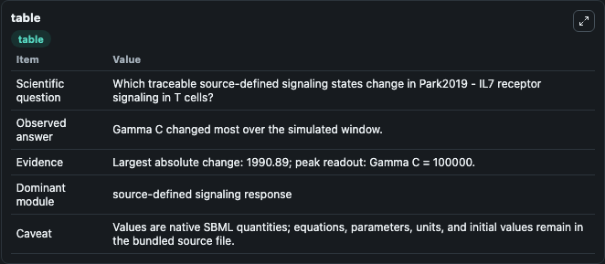
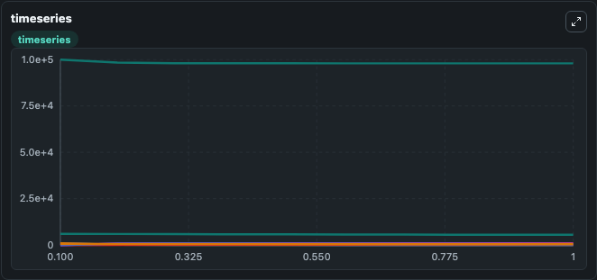
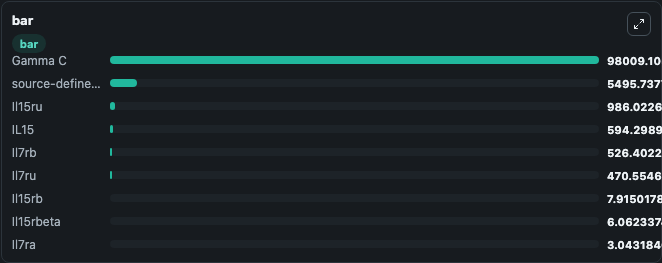

# Park2019 - IL7 receptor signaling in T cells

This Biosimulant lab wraps `Park2019 - IL7 receptor signaling in T cells` as a runnable signaling model with a companion visualization module.
Clean Biosimulant lab for immune signaling. It can be used to explore second-messenger and pathway-signaling dynamics and compare scenario outcomes across configurations.

## What You'll See

The lab asks: How does Park2019 - IL7 receptor signaling in T cells route receptor activity into cAMP/PKA-linked readouts? It runs for 1.0 time units with a communication step of 0.1. The run uses the model defaults declared by the curated SBML wrapper. The generated visualizations focus on Il7ra, Il15rbeta, Gamma C, Il7ru, Il15ru, and Il7rb, and related outputs, combining trajectory, endpoint-comparison, and summary-table views from one completed dark-mode run.

In this captured run, **Gamma C** moved from 1e+05 to 9.8e+04 across 1.0 simulation windows.

<!-- BIOSIMULANT_VISUALS_START -->
### Output Visualizations



*Summary table for Park2019 - IL7 receptor signaling in T cells, reporting the scientific question, observed answer, dominant module, and caveat.*



*Trajectories of Gamma C, Il7ra, Il15rbeta, Il15ru, Il7rb, and source-defined IL7 state across the 1.0 simulation. In this run **Il15ru** climbed from 0 to 986.0 and **Gamma C** fell from 1e+05 to 9.8e+04 — the largest movements among the focused observables.*



*Largest-excursion ranking of the focused observables — the absolute movement magnitude during the run. Top 3: **Gamma C** = 9.8e+04, **source-defined IL7 state** = 5495.7, **Il15ru** = 986.0, with 6 more observables below.*

<!-- BIOSIMULANT_VISUALS_END -->

## Model Context

- Core model: `models/core`
- Visualization model: `models/visualisation`
- Standard: `other`
- Upstream source: `biomodels_ebi:BIOMD0000000803`
- License: `CC0`
- Visual scope: GPCR and cAMP/PKA signaling
- Caveat: Values are native SBML quantities; equations, parameters, units, and initial values remain in the bundled source file.

## Inputs

| Input | Maps To | Default | Notes |
|---|---|---|---|
| Initial Il7ra | `signaling_sbml_park2019_il7_receptor_signaling_in_t_cells_biomd0000000803_model.initial_il7ra` |  | Initial level of Il7ra. Maps to SBML symbol `IL7Ra`; exposed as a traceable initial-condition perturbation. |

## Outputs

| Output | Maps To | Role |
|---|---|---|
| `il7ra` | `signaling_sbml_park2019_il7_receptor_signaling_in_t_cells_biomd0000000803_model.il7ra` | Il7ra. |
| `il15rbeta` | `signaling_sbml_park2019_il7_receptor_signaling_in_t_cells_biomd0000000803_model.il15rbeta` | Il15rbeta. |
| `gamma_c` | `signaling_sbml_park2019_il7_receptor_signaling_in_t_cells_biomd0000000803_model.gamma_c` | Gamma C. |
| `state` | `signaling_sbml_park2019_il7_receptor_signaling_in_t_cells_biomd0000000803_model.state` | Available to the visualization model and downstream workflows. |
| `summary` | `signaling_sbml_park2019_il7_receptor_signaling_in_t_cells_biomd0000000803_model.summary` | Available to the visualization model and downstream workflows. |
| `species_labels` | `signaling_sbml_park2019_il7_receptor_signaling_in_t_cells_biomd0000000803_model.species_labels` | Available to the visualization model and downstream workflows. |

## Runtime

- Duration: `1.0`
- Communication step: `0.1`

## Running Locally

```bash
biosimulant labs serve .
```
