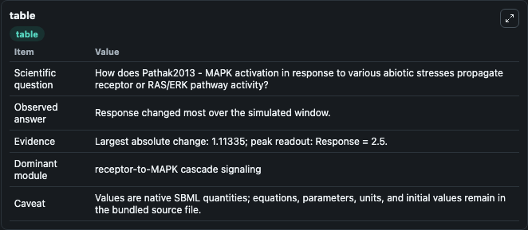
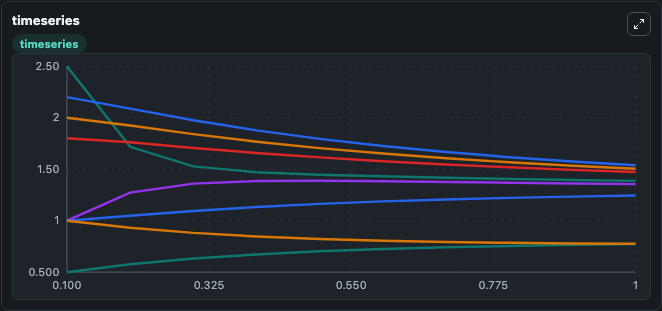
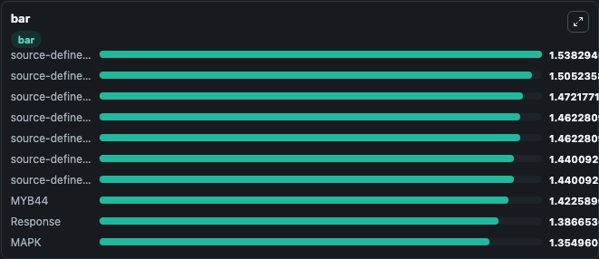

# Pathak2013 - MAPK activation in response to various abiotic stresses

This Biosimulant lab wraps `Pathak2013 - MAPK activation in response to various abiotic stresses` as a runnable signaling model with a companion visualization module.
Clean Biosimulant lab for MAPK/ERK receptor signaling. It can be used to explore second-messenger and pathway-signaling dynamics and compare scenario outcomes across configurations.

## What You'll See

The lab asks: How does Pathak2013 - MAPK activation in response to various abiotic stresses propagate receptor or RAS/ERK pathway activity? It runs for 1.0 time units with a communication step of 0.1. The run uses the model defaults declared by the curated SBML wrapper. The generated visualizations focus on cold stress input, source-defined SALT state, Drought, H2O2, Heavy Metal, and Ethylene, and related outputs, combining trajectory, endpoint-comparison, and summary-table views from one completed dark-mode run.

In this captured run, **Response** moved from 2.500 to 1.387 across 1.0 simulation windows.

<!-- BIOSIMULANT_VISUALS_START -->
### Output Visualizations



*Summary table for Pathak2013 - MAPK activation in response to various abiotic stresses, reporting the scientific question, observed answer, dominant module, and caveat.*



*Trajectories of Response, source-defined AP2 state, source-defined BZIP state, MAPK, source-defined NAC state, and Ethylene across the 1.0 simulation. In this run **MAPK** climbed from 1.000 to 1.355 and **Response** fell from 2.500 to 1.387 — the largest movements among the focused observables.*



*Largest-excursion ranking of the focused observables — the absolute movement magnitude during the run. Top 3: **source-defined AP2 state** = 1.538, **source-defined BZIP state** = 1.505, **source-defined NAC state** = 1.472, with 7 more observables below.*

<!-- BIOSIMULANT_VISUALS_END -->

## Model Context

- Core model: `models/core`
- Visualization model: `models/visualisation`
- Standard: `other`
- Upstream source: `biomodels_ebi:BIOMD0000000491`
- License: `CC0`
- Visual scope: receptor-to-MAPK cascade signaling
- Caveat: Values are native SBML quantities; equations, parameters, units, and initial values remain in the bundled source file.

## Inputs

| Input | Maps To | Default | Notes |
|---|---|---|---|
| Initial cold stress input | `signaling_sbml_pathak2013_mapk_activation_in_response_to_variou_biomd0000000491_model.initial_cold_stress_input` |  | Initial level of cold stress input. Maps to SBML symbol `s1`; exposed as a traceable initial-condition perturbation. |

## Outputs

| Output | Maps To | Role |
|---|---|---|
| `mapkkk` | `signaling_sbml_pathak2013_mapk_activation_in_response_to_variou_biomd0000000491_model.mapkkk` | MAPKKK. |
| `mapkkk_2` | `signaling_sbml_pathak2013_mapk_activation_in_response_to_variou_biomd0000000491_model.mapkkk_2` | MAPKKK. |
| `mapkkk1` | `signaling_sbml_pathak2013_mapk_activation_in_response_to_variou_biomd0000000491_model.mapkkk1` | MAPKKK1. |
| `state` | `signaling_sbml_pathak2013_mapk_activation_in_response_to_variou_biomd0000000491_model.state` | Available to the visualization model and downstream workflows. |
| `summary` | `signaling_sbml_pathak2013_mapk_activation_in_response_to_variou_biomd0000000491_model.summary` | Available to the visualization model and downstream workflows. |
| `species_labels` | `signaling_sbml_pathak2013_mapk_activation_in_response_to_variou_biomd0000000491_model.species_labels` | Available to the visualization model and downstream workflows. |

## Runtime

- Duration: `1.0`
- Communication step: `0.1`

## Running Locally

```bash
biosimulant labs serve .
```
