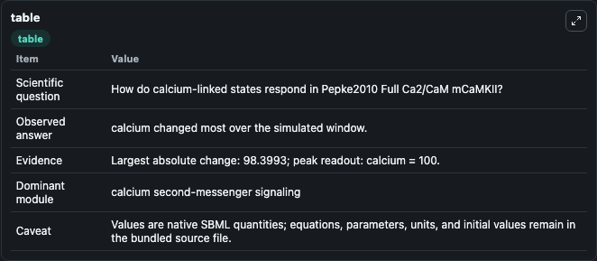
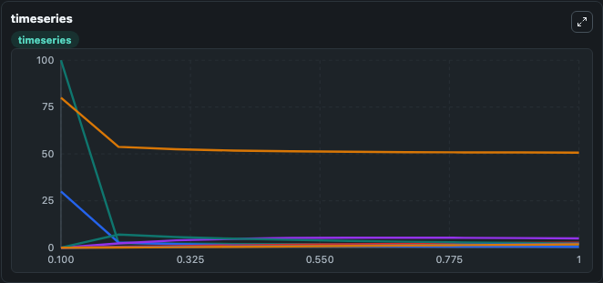
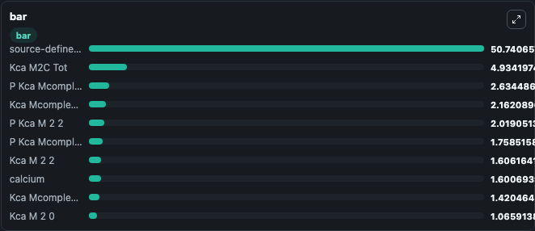

# Pepke2010_Full_Ca2/CaM_mCaMKII

This Biosimulant lab wraps `Pepke2010_Full_Ca2/CaM_mCaMKII` as a runnable signaling model with a companion visualization module.
Clean Biosimulant lab for calcium and second-messenger signaling. It can be used to explore second-messenger and pathway-signaling dynamics and compare scenario outcomes across configurations.

## What You'll See

The lab asks: How do calcium-linked states respond in Pepke2010 Full Ca2/CaM mCaMKII? It runs for 1.0 time units with a communication step of 0.1. The run uses the model defaults declared by the curated SBML wrapper. The generated visualizations focus on calcium M 0 1, calcium M 0 2, calcium M 1 0, calcium M 1 1, calcium M 1 2, and calcium M 2 0, and related outputs, combining trajectory, endpoint-comparison, and summary-table views from one completed dark-mode run.

In this captured run, **calcium** moved from 100.0 to 1.601 across 1.0 simulation windows.

<!-- BIOSIMULANT_VISUALS_START -->
### Output Visualizations



*Summary table for Pepke2010_Full_Ca2/CaM_mCaMKII, reporting the scientific question, observed answer, dominant module, and caveat.*



*Trajectories of calcium, calcium M 0 0, source-defined KAME state, Kca M2C Tot, P Kca Mcomplex 2 2 2 2, and Kca Mcomplex 2 2 2 2 across the 1.0 simulation. In this run **Kca M2C Tot** climbed from 0 to 4.934 and **calcium** fell from 100.0 to 1.601 — the largest movements among the focused observables.*



*Largest-excursion ranking of the focused observables — the absolute movement magnitude during the run. Top 3: **source-defined KAME state** = 50.741, **Kca M2C Tot** = 4.934, **P Kca Mcomplex 2 2 2 2** = 2.634, with 7 more observables below.*

<!-- BIOSIMULANT_VISUALS_END -->

## Model Context

- Core model: `models/core`
- Visualization model: `models/visualisation`
- Standard: `other`
- Upstream source: `biomodels_ebi:MODEL1001150000`
- License: `CC0`
- Visual scope: calcium second-messenger signaling
- Caveat: Values are native SBML quantities; equations, parameters, units, and initial values remain in the bundled source file.

## Inputs

| Input | Maps To | Default | Notes |
|---|---|---|---|
| Initial Kca M2C Tot | `signaling_sbml_pepke2010_full_ca2_cam_mcamkii_model1001150000_model.initial_kca_m2c_tot` |  | Initial level of Kca M2C Tot. Maps to SBML symbol `KCaM2C_tot`; exposed as a traceable initial-condition perturbation. |

## Outputs

| Output | Maps To | Role |
|---|---|---|
| `calcium_m_0_1` | `signaling_sbml_pepke2010_full_ca2_cam_mcamkii_model1001150000_model.calcium_m_0_1` | calcium M 0 1. |
| `calcium_m_0_2` | `signaling_sbml_pepke2010_full_ca2_cam_mcamkii_model1001150000_model.calcium_m_0_2` | calcium M 0 2. |
| `calcium_m_1_0` | `signaling_sbml_pepke2010_full_ca2_cam_mcamkii_model1001150000_model.calcium_m_1_0` | calcium M 1 0. |
| `state` | `signaling_sbml_pepke2010_full_ca2_cam_mcamkii_model1001150000_model.state` | Available to the visualization model and downstream workflows. |
| `summary` | `signaling_sbml_pepke2010_full_ca2_cam_mcamkii_model1001150000_model.summary` | Available to the visualization model and downstream workflows. |
| `species_labels` | `signaling_sbml_pepke2010_full_ca2_cam_mcamkii_model1001150000_model.species_labels` | Available to the visualization model and downstream workflows. |

## Runtime

- Duration: `1.0`
- Communication step: `0.1`

## Running Locally

```bash
biosimulant labs serve .
```
