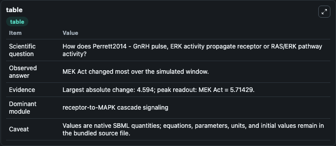
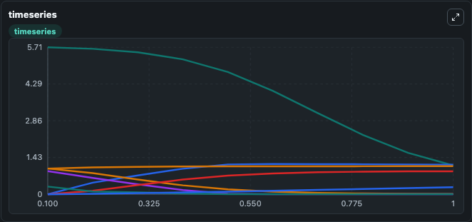
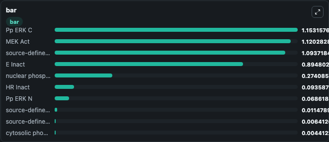

# Perrett2014 - GnRH pulse, ERK activity

This Biosimulant lab wraps `Perrett2014 - GnRH pulse, ERK activity` as a runnable signaling model with a companion visualization module.
Clean Biosimulant lab for MAPK/ERK receptor signaling. It can be used to explore second-messenger and pathway-signaling dynamics and compare scenario outcomes across configurations.

## What You'll See

The lab asks: How does Perrett2014 - GnRH pulse, ERK activity propagate receptor or RAS/ERK pathway activity? It runs for 1.0 time units with a communication step of 0.1. The run uses the model defaults declared by the curated SBML wrapper. The generated visualizations focus on nuclear phosphorylated ERK, Pp ERK N, source-defined TF1 state, TF1DT, source-defined E state, and cytosolic phosphorylated ERK, and related outputs, combining trajectory, endpoint-comparison, and summary-table views from one completed dark-mode run.

In this captured run, **MEK Act** moved from 5.714 to 1.120 across 1.0 simulation windows.

<!-- BIOSIMULANT_VISUALS_START -->
### Output Visualizations



*Summary table for Perrett2014 - GnRH pulse, ERK activity, reporting the scientific question, observed answer, dominant module, and caveat.*



*Trajectories of MEK Act, Pp ERK C, source-defined E state, cytosolic phosphorylated ERK, E Inact, and P ERK C across the 1.0 simulation. In this run **Pp ERK C** climbed from 0 to 1.153 and **MEK Act** fell from 5.714 to 1.120 — the largest movements among the focused observables.*



*Largest-excursion ranking of the focused observables — the absolute movement magnitude during the run. Top 3: **Pp ERK C** = 1.153, **MEK Act** = 1.120, **source-defined GQ state** = 1.094, with 7 more observables below.*

<!-- BIOSIMULANT_VISUALS_END -->

## Model Context

- Core model: `models/core`
- Visualization model: `models/visualisation`
- Standard: `other`
- Upstream source: `biomodels_ebi:MODEL1509050002`
- License: `CC0`
- Visual scope: receptor-to-MAPK cascade signaling
- Caveat: Values are native SBML quantities; equations, parameters, units, and initial values remain in the bundled source file.

## Inputs

| Input | Maps To | Default | Notes |
|---|---|---|---|
| Initial HR Inact | `signaling_sbml_perrett2014_gnrh_pulse_erk_activity_model1509050002_model.initial_hr_inact` |  | Initial level of HR Inact. Maps to SBML symbol `species_11`; exposed as a traceable initial-condition perturbation. |
| Initial MEK Act | `signaling_sbml_perrett2014_gnrh_pulse_erk_activity_model1509050002_model.initial_mek_act` |  | Initial level of MEK Act. Maps to SBML symbol `species_14`; exposed as a traceable initial-condition perturbation. |
| Initial P ERK C | `signaling_sbml_perrett2014_gnrh_pulse_erk_activity_model1509050002_model.initial_p_erk_c` |  | Initial level of P ERK C. Maps to SBML symbol `species_13`; exposed as a traceable initial-condition perturbation. |

## Outputs

| Output | Maps To | Role |
|---|---|---|
| `nuclear_phosphorylated_erk` | `signaling_sbml_perrett2014_gnrh_pulse_erk_activity_model1509050002_model.nuclear_phosphorylated_erk` | nuclear phosphorylated ERK. |
| `pp_erk_n` | `signaling_sbml_perrett2014_gnrh_pulse_erk_activity_model1509050002_model.pp_erk_n` | Pp ERK N. |
| `cytosolic_phosphorylated_erk` | `signaling_sbml_perrett2014_gnrh_pulse_erk_activity_model1509050002_model.cytosolic_phosphorylated_erk` | cytosolic phosphorylated ERK. |
| `state` | `signaling_sbml_perrett2014_gnrh_pulse_erk_activity_model1509050002_model.state` | Available to the visualization model and downstream workflows. |
| `summary` | `signaling_sbml_perrett2014_gnrh_pulse_erk_activity_model1509050002_model.summary` | Available to the visualization model and downstream workflows. |
| `species_labels` | `signaling_sbml_perrett2014_gnrh_pulse_erk_activity_model1509050002_model.species_labels` | Available to the visualization model and downstream workflows. |

## Runtime

- Duration: `1.0`
- Communication step: `0.1`

## Running Locally

```bash
biosimulant labs serve .
```
