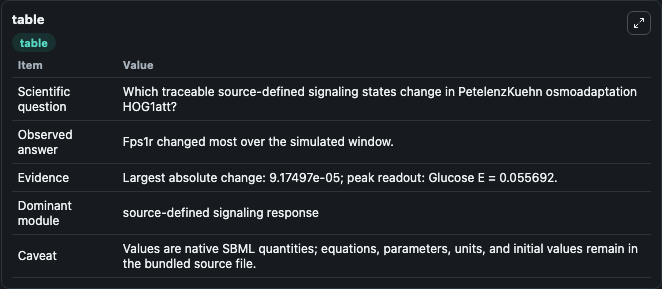
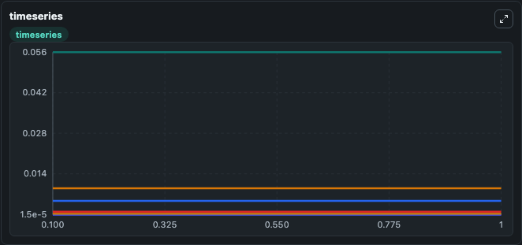
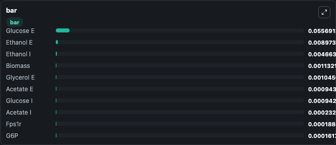

# PetelenzKuehn_osmoadaptation_HOG1att

This Biosimulant lab wraps `PetelenzKuehn_osmoadaptation_HOG1att` as a runnable signaling model with a companion visualization module.
Clean Biosimulant lab for systems signaling model: PetelenzKuehn_osmoadaptation_HOG1att. It can be used to explore second-messenger and pathway-signaling dynamics and compare scenario outcomes across configurations.

## What You'll See

The lab asks: How does PetelenzKuehn osmoadaptation HOG1att express its source-modeled signaling motif over the baseline run? It runs for 1.0 time units with a communication step of 0.1. The run uses the model defaults declared by the curated SBML wrapper. The generated visualizations focus on Glycerol I, intracellular concentration input, Glucose I, G6P, Trehalose, and F16DP, and related outputs, combining trajectory, endpoint-comparison, and summary-table views from one completed dark-mode run.

In this captured run, **Fps1r** moved from 9.69e-05 to 0.000189 across 1.0 simulation windows.

<!-- BIOSIMULANT_VISUALS_START -->
### Output Visualizations



*Summary table for PetelenzKuehn_osmoadaptation_HOG1att, reporting the scientific question, observed answer, dominant module, and caveat.*



*Trajectories of Fps1r, Ethanol I, Ethanol E, Pyruvate, Glucose I, and Glucose E across the 1.0 simulation. In this run **Fps1r** climbed from 9.69e-05 to 0.000189 and **Ethanol I** fell from 0.00467 to 0.00466 — the largest movements among the focused observables.*



*Largest-excursion ranking of the focused observables — the absolute movement magnitude during the run. Top 3: **Glucose E** = 0.0557, **Ethanol E** = 0.00897, **Ethanol I** = 0.00466, with 7 more observables below.*

<!-- BIOSIMULANT_VISUALS_END -->

## Model Context

- Core model: `models/core`
- Visualization model: `models/visualisation`
- Standard: `other`
- Upstream source: `biomodels_ebi:BIOMD0000000605`
- License: `CC0`
- Visual scope: phosphorylation and regulatory motif dynamics
- Caveat: Values are native SBML quantities; equations, parameters, units, and initial values remain in the bundled source file.

## Inputs

| Input | Maps To | Default | Notes |
|---|---|---|---|
| T Stress | `signaling_sbml_petelenzkuehn_osmoadaptation_hog1att_biomd0000000605_model.initial_t_stress_level` |  | T Stress source parameter. Maps to SBML symbol `t_stress` and preserves the bundled default. |
| Initial Glucose E | `signaling_sbml_petelenzkuehn_osmoadaptation_hog1att_biomd0000000605_model.initial_glucose_e` |  | Initial level of Glucose E. Maps to SBML symbol `glucose_e`; exposed as a traceable initial-condition perturbation. |
| Initial Glucose I | `signaling_sbml_petelenzkuehn_osmoadaptation_hog1att_biomd0000000605_model.initial_glucose_i` |  | Initial level of Glucose I. Maps to SBML symbol `glucose_i`; exposed as a traceable initial-condition perturbation. |

## Outputs

| Output | Maps To | Role |
|---|---|---|
| `glycerol_i` | `signaling_sbml_petelenzkuehn_osmoadaptation_hog1att_biomd0000000605_model.glycerol_i` | Glycerol I. |
| `intracellular_concentration_input` | `signaling_sbml_petelenzkuehn_osmoadaptation_hog1att_biomd0000000605_model.intracellular_concentration_input` | intracellular concentration input. |
| `glucose_i` | `signaling_sbml_petelenzkuehn_osmoadaptation_hog1att_biomd0000000605_model.glucose_i` | Glucose I. |
| `state` | `signaling_sbml_petelenzkuehn_osmoadaptation_hog1att_biomd0000000605_model.state` | Available to the visualization model and downstream workflows. |
| `summary` | `signaling_sbml_petelenzkuehn_osmoadaptation_hog1att_biomd0000000605_model.summary` | Available to the visualization model and downstream workflows. |
| `species_labels` | `signaling_sbml_petelenzkuehn_osmoadaptation_hog1att_biomd0000000605_model.species_labels` | Available to the visualization model and downstream workflows. |

## Runtime

- Duration: `1.0`
- Communication step: `0.1`

## Running Locally

```bash
biosimulant labs serve .
```
