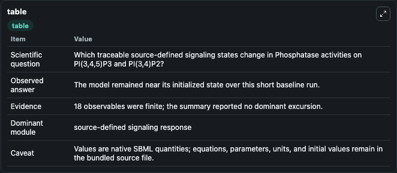
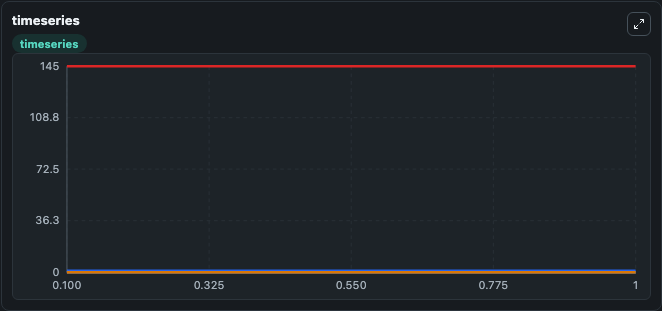
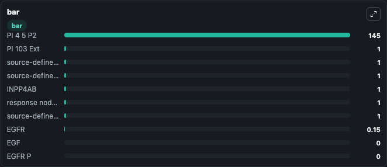

# Phosphatase activities on PI(3,4,5)P3 and PI(3,4)P2

This Biosimulant lab wraps `Phosphatase activities on PI(3,4,5)P3 and PI(3,4)P2` as a runnable signaling model with a companion visualization module.
Clean Biosimulant lab for systems signaling model: Phosphatase activities on PI(3,4,5)P3 and PI(3,4)P2. It can be used to explore second-messenger and pathway-signaling dynamics and compare scenario outcomes across configurations.

## What You'll See

The lab asks: How does Phosphatase activities on PI(3,4,5)P3 and PI(3,4)P2 express its source-modeled signaling motif over the baseline run? It runs for 1.0 time units with a communication step of 0.1. The run uses the model defaults declared by the curated SBML wrapper. The generated visualizations focus on EGF, EGFR, EGFR P, Pi3keff1, PI 4 5 P2, and PI 3 4 5 P3, and related outputs, combining trajectory, endpoint-comparison, and summary-table views from one completed dark-mode run.

In this captured run, **EGF** moved from 0 to 0 across 1.0 simulation windows.

<!-- BIOSIMULANT_VISUALS_START -->
### Output Visualizations



*Summary table for Phosphatase activities on PI(3,4,5)P3 and PI(3,4)P2, reporting the scientific question, observed answer, dominant module, and caveat.*



*Trajectories of EGF, EGFR, EGFR P, Pi3keff1, PI 4 5 P2, and PI 3 4 5 P3 across the 1.0 simulation. In this run EGF, EGFR, EGFR P, Pi3keff1 stayed near their initial values — no observable moved appreciably.*



*Largest-excursion ranking of the focused observables — the absolute movement magnitude during the run. Top 3: **PI 4 5 P2** = 145.0, **PI 103 Ext** = 1.000, **source-defined PTEN state** = 1.000, with 7 more observables below.*

<!-- BIOSIMULANT_VISUALS_END -->

## Model Context

- Core model: `models/core`
- Visualization model: `models/visualisation`
- Standard: `other`
- Upstream source: `biomodels_ebi:MODEL1704190000`
- License: `CC0`
- Visual scope: phosphorylation and regulatory motif dynamics
- Caveat: Values are native SBML quantities; equations, parameters, units, and initial values remain in the bundled source file.

## Inputs

| Input | Maps To | Default | Notes |
|---|---|---|---|
| EGF Sig | `signaling_sbml_phosphatase_activities_on_pi_3_4_5_p3_and_pi_3_4_model1704190000_model.initial_egf_sig_level` |  | EGF Sig source parameter. Maps to SBML symbol `EGF_sig` and preserves the bundled default. |
| Initial For EGF Sig | `signaling_sbml_phosphatase_activities_on_pi_3_4_5_p3_and_pi_3_4_model1704190000_model.initial_for_egf_sig_level` |  | Initial For EGF Sig source parameter. Maps to SBML symbol `ModelValue_13` and preserves the bundled default. |
| Initial INPP4AB | `signaling_sbml_phosphatase_activities_on_pi_3_4_5_p3_and_pi_3_4_model1704190000_model.initial_inpp4ab` |  | Initial level of INPP4AB. Maps to SBML symbol `INPP4AB`; exposed as a traceable initial-condition perturbation. |

## Outputs

| Output | Maps To | Role |
|---|---|---|
| `egf` | `signaling_sbml_phosphatase_activities_on_pi_3_4_5_p3_and_pi_3_4_model1704190000_model.egf` | EGF. |
| `egfr` | `signaling_sbml_phosphatase_activities_on_pi_3_4_5_p3_and_pi_3_4_model1704190000_model.egfr` | EGFR. |
| `egfr_p` | `signaling_sbml_phosphatase_activities_on_pi_3_4_5_p3_and_pi_3_4_model1704190000_model.egfr_p` | EGFR P. |
| `state` | `signaling_sbml_phosphatase_activities_on_pi_3_4_5_p3_and_pi_3_4_model1704190000_model.state` | Available to the visualization model and downstream workflows. |
| `summary` | `signaling_sbml_phosphatase_activities_on_pi_3_4_5_p3_and_pi_3_4_model1704190000_model.summary` | Available to the visualization model and downstream workflows. |
| `species_labels` | `signaling_sbml_phosphatase_activities_on_pi_3_4_5_p3_and_pi_3_4_model1704190000_model.species_labels` | Available to the visualization model and downstream workflows. |

## Runtime

- Duration: `1.0`
- Communication step: `0.1`

## Running Locally

```bash
biosimulant labs serve .
```
