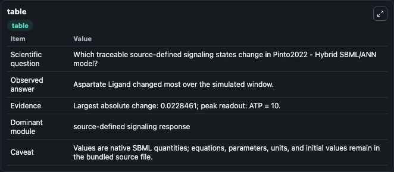
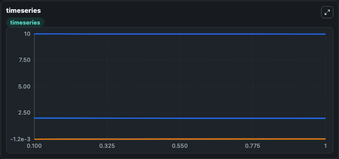
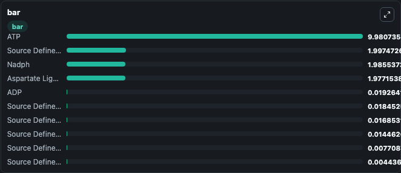

# Pinto2022 - Hybrid SBML/ANN model

This Biosimulant lab wraps `Pinto2022 - Hybrid SBML/ANN model` as a runnable signaling model with a companion visualization module.
Clean Biosimulant lab for systems signaling model: Pinto2022 - Hybrid SBML/ANN model. It can be used to explore second-messenger and pathway-signaling dynamics and compare scenario outcomes across configurations.

## What You'll See

The lab asks: What baseline signaling response is generated by Pinto2022 - Hybrid SBML/ANN model? It runs for 1.0 time units with a communication step of 0.1. The run uses the model defaults declared by the curated SBML wrapper. The generated visualizations focus on ADP, Source Defined ASA State, Aspartate Ligand, Source Defined ASPP State, ATP, and Source Defined HS State, and related outputs, combining trajectory, endpoint-comparison, and summary-table views from one completed dark-mode run.

In this captured run, **Aspartate Ligand** moved from 2.000 to 1.977 across 1.0 simulation windows.

<!-- BIOSIMULANT_VISUALS_START -->
### Output Visualizations



*Summary table for Pinto2022 - Hybrid SBML/ANN model, reporting the scientific question, observed answer, dominant module, and caveat.*



*Trajectories of Aspartate Ligand, ATP, ADP, Source Defined PHOS State, Source Defined ASA State, and Source Defined nuclear ADP State across the 1.0 simulation. In this run **ADP** climbed from 0 to 0.0193 and **Aspartate Ligand** fell from 2.000 to 1.977 — the largest movements among the focused observables.*



*Largest-excursion ranking of the focused observables — the absolute movement magnitude during the run. Top 3: **ATP** = 9.981, **Source Defined THR State** = 1.997, **Nadph** = 1.986, with 7 more observables below.*

<!-- BIOSIMULANT_VISUALS_END -->

## Model Context

- Core model: `models/core`
- Visualization model: `models/visualisation`
- Standard: `other`
- Upstream source: `biomodels_ebi:MODEL2207280001`
- License: `CC0`
- Visual scope: curated source-model signaling response
- Caveat: Values are native SBML quantities; equations, parameters, units, and initial values remain in the bundled source file.

## Inputs

| Input | Maps To | Default | Notes |
|---|---|---|---|
| Initial ADP | `signaling_sbml_pinto2022_hybrid_sbml_ann_model_model2207280001_model.initial_adp` |  | Initial level of ADP. Maps to SBML symbol `adp`; exposed as a traceable initial-condition perturbation. |

## Outputs

| Output | Maps To | Role |
|---|---|---|
| `adp` | `signaling_sbml_pinto2022_hybrid_sbml_ann_model_model2207280001_model.adp` | ADP. |
| `source_defined_asa_state` | `signaling_sbml_pinto2022_hybrid_sbml_ann_model_model2207280001_model.source_defined_asa_state` | Source Defined ASA State. |
| `aspartate_ligand` | `signaling_sbml_pinto2022_hybrid_sbml_ann_model_model2207280001_model.aspartate_ligand` | Aspartate Ligand. |
| `state` | `signaling_sbml_pinto2022_hybrid_sbml_ann_model_model2207280001_model.state` | Available to the visualization model and downstream workflows. |
| `summary` | `signaling_sbml_pinto2022_hybrid_sbml_ann_model_model2207280001_model.summary` | Available to the visualization model and downstream workflows. |
| `species_labels` | `signaling_sbml_pinto2022_hybrid_sbml_ann_model_model2207280001_model.species_labels` | Available to the visualization model and downstream workflows. |

## Runtime

- Duration: `1.0`
- Communication step: `0.1`

## Running Locally

```bash
biosimulant labs serve .
```
