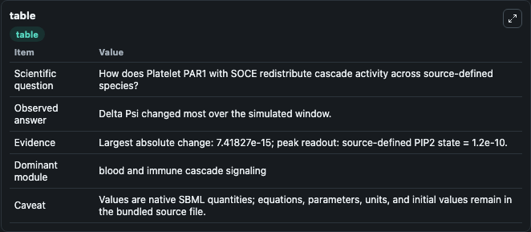
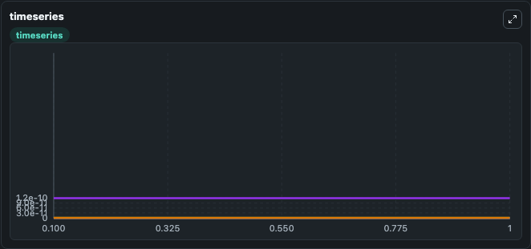
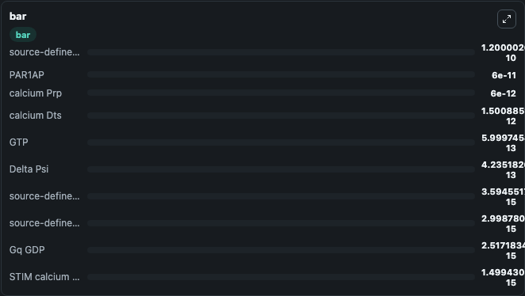

# Platelet PAR1 with SOCE

This Biosimulant lab wraps `Platelet PAR1 with SOCE` as a runnable signaling model with a companion visualization module.
Clean Biosimulant lab for systems signaling model: Platelet PAR1 with SOCE. It can be used to explore second-messenger and pathway-signaling dynamics and compare scenario outcomes across configurations.

## What You'll See

The lab asks: How does Platelet PAR1 with SOCE redistribute cascade activity across source-defined species? It runs for 1.0 time units with a communication step of 0.1. The run uses the model defaults declared by the curated SBML wrapper. The generated visualizations focus on calcium Cyt, IP3, Ip3ra, Ip3ri1, Ip3ri2, and Ip3rn, and related outputs, combining trajectory, endpoint-comparison, and summary-table views from one completed dark-mode run.

In this captured run, **Delta Psi** moved from 4.16e-13 to 4.24e-13 across 1.0 simulation windows.

<!-- BIOSIMULANT_VISUALS_START -->
### Output Visualizations



*Summary table for Platelet PAR1 with SOCE, reporting the scientific question, observed answer, dominant module, and caveat.*



*Trajectories of Delta Psi, source-defined PAR state, calcium Dts, source-defined PIP2 state, Ip3rn, and Ip3ro across the 1.0 simulation. In this run **Delta Psi** climbed from 4.16e-13 to 4.24e-13 and **source-defined PAR state** fell from 3.6e-15 to 4.22e-18 — the largest movements among the focused observables.*



*Largest-excursion ranking of the focused observables — the absolute movement magnitude during the run. Top 3: **source-defined PIP2 state** = 1.2e-10, **PAR1AP** = 6e-11, **calcium Prp** = 6e-12, with 7 more observables below.*

<!-- BIOSIMULANT_VISUALS_END -->

## Model Context

- Core model: `models/core`
- Visualization model: `models/visualisation`
- Standard: `other`
- Upstream source: `biomodels_ebi:MODEL1807190001`
- License: `CC0`
- Visual scope: blood and immune cascade signaling
- Caveat: Values are native SBML quantities; equations, parameters, units, and initial values remain in the bundled source file.

## Inputs

| Input | Maps To | Default | Notes |
|---|---|---|---|
| Initial calcium Prp | `signaling_sbml_platelet_par1_with_soce_model1807190001_model.initial_calcium_prp` |  | Initial level of calcium Prp. Maps to SBML symbol `species_9`; exposed as a traceable initial-condition perturbation. |
| Initial PAR1AP | `signaling_sbml_platelet_par1_with_soce_model1807190001_model.initial_par1ap` |  | Initial level of PAR1AP. Maps to SBML symbol `species_15`; exposed as a traceable initial-condition perturbation. |

## Outputs

| Output | Maps To | Role |
|---|---|---|
| `calcium_cyt` | `signaling_sbml_platelet_par1_with_soce_model1807190001_model.calcium_cyt` | calcium Cyt. |
| `calcium_prp` | `signaling_sbml_platelet_par1_with_soce_model1807190001_model.calcium_prp` | calcium Prp. |
| `calcium_dts` | `signaling_sbml_platelet_par1_with_soce_model1807190001_model.calcium_dts` | calcium Dts. |
| `state` | `signaling_sbml_platelet_par1_with_soce_model1807190001_model.state` | Available to the visualization model and downstream workflows. |
| `summary` | `signaling_sbml_platelet_par1_with_soce_model1807190001_model.summary` | Available to the visualization model and downstream workflows. |
| `species_labels` | `signaling_sbml_platelet_par1_with_soce_model1807190001_model.species_labels` | Available to the visualization model and downstream workflows. |

## Runtime

- Duration: `1.0`
- Communication step: `0.1`

## Running Locally

```bash
biosimulant labs serve .
```
