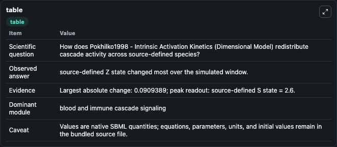
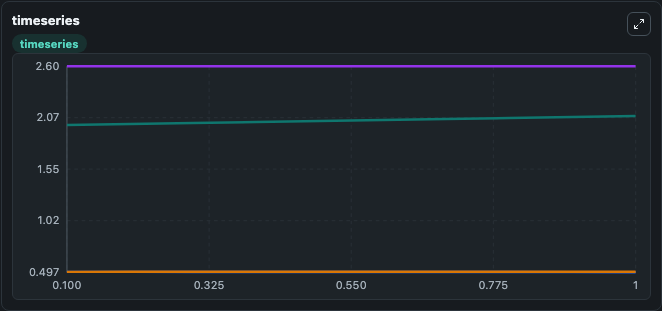
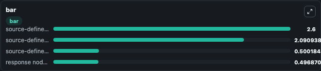

# Pokhilko1998 - Intrinsic Activation Kinetics (Dimensional Model)

This Biosimulant lab wraps `Pokhilko1998 - Intrinsic Activation Kinetics (Dimensional Model)` as a runnable signaling model with a companion visualization module.
Clean Biosimulant lab for systems signaling model: Pokhilko1998 - Intrinsic Activation Kinetics (Dimensional Model). It can be used to explore second-messenger and pathway-signaling dynamics and compare scenario outcomes across configurations.

## What You'll See

The lab asks: How does Pokhilko1998 - Intrinsic Activation Kinetics (Dimensional Model) redistribute cascade activity across source-defined species? It runs for 1.0 time units with a communication step of 0.1. The run uses the model defaults declared by the curated SBML wrapper. The generated visualizations focus on response node X, source-defined Y state, source-defined Z state, and source-defined S state, combining trajectory, endpoint-comparison, and summary-table views from one completed dark-mode run.

In this captured run, **source-defined Z state** moved from 2.000 to 2.091 across 1.0 simulation windows.

<!-- BIOSIMULANT_VISUALS_START -->
### Output Visualizations



*Summary table for Pokhilko1998 - Intrinsic Activation Kinetics (Dimensional Model), reporting the scientific question, observed answer, dominant module, and caveat.*



*Trajectories of source-defined Z state, response node X, source-defined Y state, and source-defined S state across the 1.0 simulation. In this run **source-defined Z state** climbed from 2.000 to 2.091 and **response node X** fell from 0.5000 to 0.4969 — the largest movements among the focused observables.*



*Largest-excursion ranking of the focused observables — the absolute movement magnitude during the run. Top 3: **source-defined S state** = 2.600, **source-defined Z state** = 2.091, **source-defined Y state** = 0.5002, with 1 more observable below.*

<!-- BIOSIMULANT_VISUALS_END -->

## Model Context

- Core model: `models/core`
- Visualization model: `models/visualisation`
- Standard: `other`
- Upstream source: `biomodels_ebi:MODEL1808210003`
- License: `CC0`
- Visual scope: blood and immune cascade signaling
- Caveat: Values are native SBML quantities; equations, parameters, units, and initial values remain in the bundled source file.

## Inputs

| Input | Maps To | Default | Notes |
|---|---|---|---|
| Initial response node X | `signaling_sbml_pokhilko1998_intrinsic_activation_kinetics_dimen_model1808210003_model.initial_response_node_x` |  | Initial level of response node X. Maps to SBML symbol `X`; exposed as a traceable initial-condition perturbation. |
| Initial source-defined Y state | `signaling_sbml_pokhilko1998_intrinsic_activation_kinetics_dimen_model1808210003_model.initial_source_defined_y_state` |  | Initial level of source-defined Y state. Maps to SBML symbol `Y`; exposed as a traceable initial-condition perturbation. |
| Initial source-defined Z state | `signaling_sbml_pokhilko1998_intrinsic_activation_kinetics_dimen_model1808210003_model.initial_source_defined_z_state` |  | Initial level of source-defined Z state. Maps to SBML symbol `Z`; exposed as a traceable initial-condition perturbation. |

## Outputs

| Output | Maps To | Role |
|---|---|---|
| `response_node_x` | `signaling_sbml_pokhilko1998_intrinsic_activation_kinetics_dimen_model1808210003_model.response_node_x` | response node X. |
| `source_defined_y_state` | `signaling_sbml_pokhilko1998_intrinsic_activation_kinetics_dimen_model1808210003_model.source_defined_y_state` | source-defined Y state. |
| `source_defined_z_state` | `signaling_sbml_pokhilko1998_intrinsic_activation_kinetics_dimen_model1808210003_model.source_defined_z_state` | source-defined Z state. |
| `state` | `signaling_sbml_pokhilko1998_intrinsic_activation_kinetics_dimen_model1808210003_model.state` | Available to the visualization model and downstream workflows. |
| `summary` | `signaling_sbml_pokhilko1998_intrinsic_activation_kinetics_dimen_model1808210003_model.summary` | Available to the visualization model and downstream workflows. |
| `species_labels` | `signaling_sbml_pokhilko1998_intrinsic_activation_kinetics_dimen_model1808210003_model.species_labels` | Available to the visualization model and downstream workflows. |

## Runtime

- Duration: `1.0`
- Communication step: `0.1`

## Running Locally

```bash
biosimulant labs serve .
```
