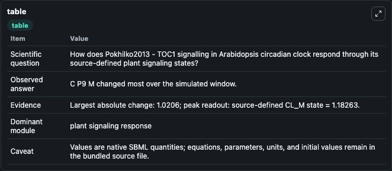
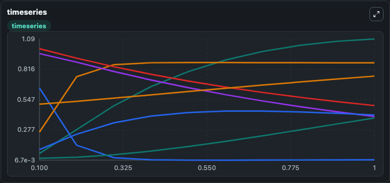
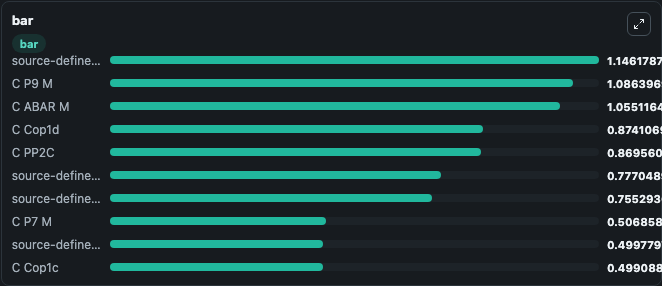

# Pokhilko2013 - TOC1 signalling in Arabidopsis circadian clock

This Biosimulant lab wraps `Pokhilko2013 - TOC1 signalling in Arabidopsis circadian clock` as a runnable signaling model with a companion visualization module.
Clean Biosimulant lab for circadian regulatory signaling. It can be used to explore second-messenger and pathway-signaling dynamics and compare scenario outcomes across configurations.

## What You'll See

The lab asks: How does Pokhilko2013 - TOC1 signalling in Arabidopsis circadian clock respond through its source-defined plant signaling states? It runs for 1.0 time units with a communication step of 0.1. The run uses the model defaults declared by the curated SBML wrapper. The generated visualizations focus on C ABAR M, C PP2C, C Sn RK2, source-defined CS state, C Cop1c, and C Cop1d, and related outputs, combining trajectory, endpoint-comparison, and summary-table views from one completed dark-mode run.

In this captured run, **C P9 M** moved from 0.0658 to 1.086 across 1.0 simulation windows.

<!-- BIOSIMULANT_VISUALS_START -->
### Output Visualizations



*Summary table for Pokhilko2013 - TOC1 signalling in Arabidopsis circadian clock, reporting the scientific question, observed answer, dominant module, and caveat.*



*Trajectories of C P9 M, C Cop1n, C Cop1d, source-defined CP state, C Sn RK2, and source-defined CP9 state across the 1.0 simulation. In this run **C P9 M** climbed from 0.0658 to 1.086 and **C Cop1n** fell from 0.6500 to 0.0105 — the largest movements among the focused observables.*



*Largest-excursion ranking of the focused observables — the absolute movement magnitude during the run. Top 3: **source-defined CL_M state** = 1.146, **C P9 M** = 1.086, **C ABAR M** = 1.055, with 7 more observables below.*

<!-- BIOSIMULANT_VISUALS_END -->

## Model Context

- Core model: `models/core`
- Visualization model: `models/visualisation`
- Standard: `other`
- Upstream source: `biomodels_ebi:BIOMD0000000445`
- License: `CC0`
- Visual scope: plant signaling response
- Caveat: Values are native SBML quantities; equations, parameters, units, and initial values remain in the bundled source file.

## Inputs

| Input | Maps To | Default | Notes |
|---|---|---|---|
| Initial C ABAR M | `signaling_sbml_pokhilko2013_toc1_signalling_in_arabidopsis_circ_biomd0000000445_model.initial_c_abar_m` |  | Initial level of C ABAR M. Maps to SBML symbol `species_1`; exposed as a traceable initial-condition perturbation. |

## Outputs

| Output | Maps To | Role |
|---|---|---|
| `c_abar_m` | `signaling_sbml_pokhilko2013_toc1_signalling_in_arabidopsis_circ_biomd0000000445_model.c_abar_m` | C ABAR M. |
| `c_pp2c` | `signaling_sbml_pokhilko2013_toc1_signalling_in_arabidopsis_circ_biomd0000000445_model.c_pp2c` | C PP2C. |
| `c_sn_rk2` | `signaling_sbml_pokhilko2013_toc1_signalling_in_arabidopsis_circ_biomd0000000445_model.c_sn_rk2` | C Sn RK2. |
| `state` | `signaling_sbml_pokhilko2013_toc1_signalling_in_arabidopsis_circ_biomd0000000445_model.state` | Available to the visualization model and downstream workflows. |
| `summary` | `signaling_sbml_pokhilko2013_toc1_signalling_in_arabidopsis_circ_biomd0000000445_model.summary` | Available to the visualization model and downstream workflows. |
| `species_labels` | `signaling_sbml_pokhilko2013_toc1_signalling_in_arabidopsis_circ_biomd0000000445_model.species_labels` | Available to the visualization model and downstream workflows. |

## Runtime

- Duration: `1.0`
- Communication step: `0.1`

## Running Locally

```bash
biosimulant labs serve .
```
