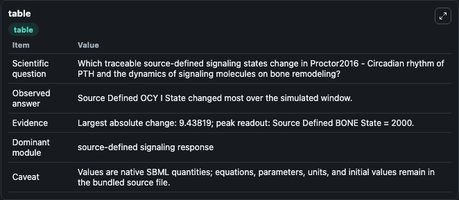
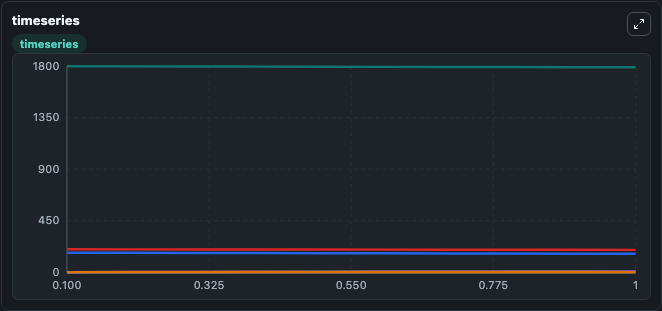
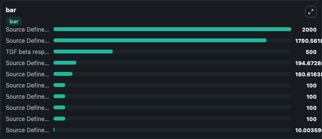

# Proctor2016 - Circadian rhythm of PTH and the dynamics of signaling molecules on bone remodeling

This Biosimulant lab wraps `Proctor2016 - Circadian rhythm of PTH and the dynamics of signaling molecules on bone remodeling` as a runnable signaling model with a companion visualization module.
Clean Biosimulant lab for circadian regulatory signaling. It can be used to explore second-messenger and pathway-signaling dynamics and compare scenario outcomes across configurations.

## What You'll See

The lab asks: How does Proctor2016 - Circadian rhythm of PTH and the dynamics of signaling molecules on bone remodeling shift hormone-linked signaling readouts? It runs for 1.0 time units with a communication step of 0.1. The run uses the model defaults declared by the curated SBML wrapper. The generated visualizations focus on Source Defined BONE State, Source Defined HSC State, Source Defined OB M State, Source Defined OB P State, Ob P TGF beta response parameter Response Parameter Response Parameter Response Parameter Response Parameter A, and Ob Pro, and related outputs, combining trajectory, endpoint-comparison, and summary-table views from one completed dark-mode run.

In this captured run, **Source Defined OCY I State** moved from 1800.0 to 1790.6 across 1.0 simulation windows.

<!-- BIOSIMULANT_VISUALS_START -->
### Output Visualizations



*Summary table for Proctor2016 - Circadian rhythm of PTH and the dynamics of signaling molecules on bone remodeling, reporting the scientific question, observed answer, dominant module, and caveat.*



*Trajectories of Source Defined OCY I State, Source Defined PTH State, Ocy I PTH, Source Defined WNT A State, Source Defined WNT I State, and Source Defined SOST State across the 1.0 simulation. In this run **Ocy I PTH** climbed from 0 to 9.104 and **Source Defined OCY I State** fell from 1800.0 to 1790.6 — the largest movements among the focused observables.*



*Largest-excursion ranking of the focused observables — the absolute movement magnitude during the run. Top 3: **Source Defined BONE State** = 2000.0, **Source Defined OCY I State** = 1790.6, **TGF beta response parameter Response Parameter I** = 500.0, with 7 more observables below.*

<!-- BIOSIMULANT_VISUALS_END -->

## Model Context

- Core model: `models/core`
- Visualization model: `models/visualisation`
- Standard: `other`
- Upstream source: `biomodels_ebi:BIOMD0000000612`
- License: `CC0`
- Visual scope: metabolic and hormone signaling response
- Caveat: Values are native SBML quantities; equations, parameters, units, and initial values remain in the bundled source file.

## Inputs

| Input | Maps To | Default | Notes |
|---|---|---|---|
| Kact TGF-beta | `signaling_sbml_proctor2016_circadian_rhythm_of_pth_and_the_dyna_biomd0000000612_model.initial_kact_tgf_beta_level` |  | Kact TGF-beta source parameter. Maps to SBML symbol `kactTgfb` and preserves the bundled default. |
| Initial sink species | `signaling_sbml_proctor2016_circadian_rhythm_of_pth_and_the_dyna_biomd0000000612_model.initial_sink_species` |  | Initial level of sink species. Maps to SBML symbol `Sink`; exposed as a traceable initial-condition perturbation. |
| Initial Source | `signaling_sbml_proctor2016_circadian_rhythm_of_pth_and_the_dyna_biomd0000000612_model.initial_source` |  | Initial level of Source. Maps to SBML symbol `Source`; exposed as a traceable initial-condition perturbation. |

## Outputs

| Output | Maps To | Role |
|---|---|---|
| `source_defined_bone_state` | `signaling_sbml_proctor2016_circadian_rhythm_of_pth_and_the_dyna_biomd0000000612_model.source_defined_bone_state` | Source Defined BONE State. |
| `source_defined_hsc_state` | `signaling_sbml_proctor2016_circadian_rhythm_of_pth_and_the_dyna_biomd0000000612_model.source_defined_hsc_state` | Source Defined HSC State. |
| `source_defined_ob_m_state` | `signaling_sbml_proctor2016_circadian_rhythm_of_pth_and_the_dyna_biomd0000000612_model.source_defined_ob_m_state` | Source Defined OB M State. |
| `state` | `signaling_sbml_proctor2016_circadian_rhythm_of_pth_and_the_dyna_biomd0000000612_model.state` | Available to the visualization model and downstream workflows. |
| `summary` | `signaling_sbml_proctor2016_circadian_rhythm_of_pth_and_the_dyna_biomd0000000612_model.summary` | Available to the visualization model and downstream workflows. |
| `species_labels` | `signaling_sbml_proctor2016_circadian_rhythm_of_pth_and_the_dyna_biomd0000000612_model.species_labels` | Available to the visualization model and downstream workflows. |

## Runtime

- Duration: `1.0`
- Communication step: `0.1`

## Running Locally

```bash
biosimulant labs serve .
```
